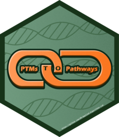

# PTMsToPathways <a href="https://um-applied-algorithms-lab.github.io/PTMsToPathways/"></a>

This is the supporting package for the projects in the papers listed below.

Please feel free to reach out with errors, critiques, or questions.

## Installation

Before proceeding, ensure you have R installed. You will also need the devtools package, which can be installed with:

```
install.packages("devtools")
```

Additionally, please check that you have R version 4.5. STRINGdb and RCy3 will also need to be installed before moving forward.

To install STRINGdb, use the following code (gathered from https://www.bioconductor.org/packages/release/bioc/html/STRINGdb.html):

```
if (!require("BiocManager", quietly = TRUE)) install.packages("BiocManager")
BiocManager::install("STRINGdb")
```

To install RCy3, use the following code (gathered from https://www.bioconductor.org/packages/release/bioc/html/RCy3.html):

```
if (!require("BiocManager", quietly = TRUE)) install.packages("BiocManager")
BiocManager::install("RCy3")
```

Once these are installed, you can install this package directly from GitHub using:

```
devtools::install_github("UM-Applied-Algorithms-Lab/PTMsToPathways")
```

## Usage

After installation, load the package in R with:

```
library(PTMsToPathways)
```

You can then use the available functions as described in the package documentation.

## Development & Contribution

If you wish to modify or contribute to the package, we provide instructions on how to clone our repository, as well as an in depth look at some our solutions on [our wiki](https://github.com/UM-Applied-Algorithms-Lab/PTMsToPathways/wiki)
