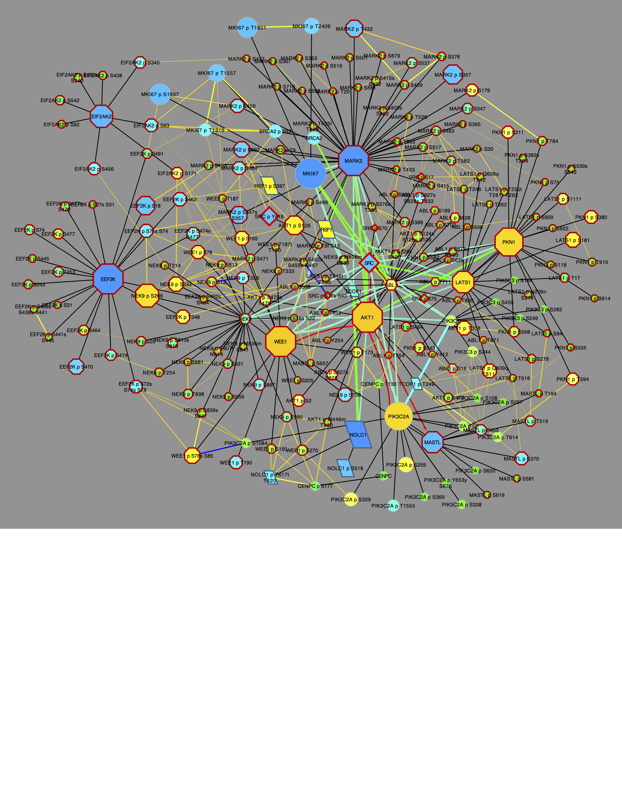
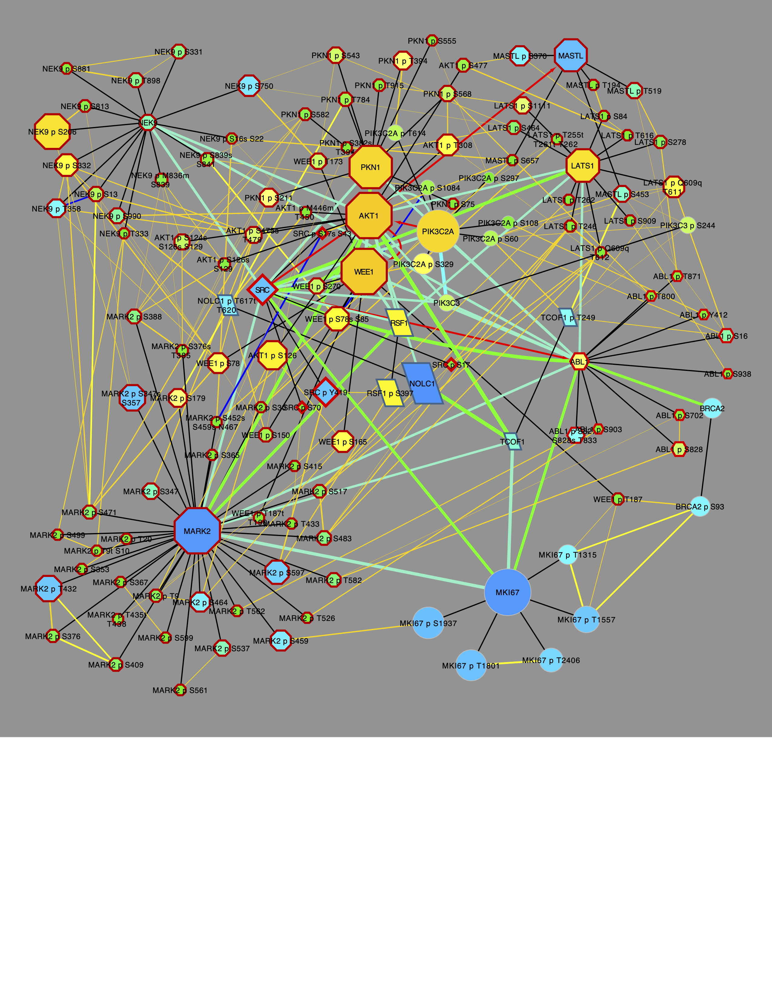

# BRCA Networks

This tutorial will load and create networks from the breast cancer
cohort (BRCA, N = 122), produced by

> **Proteogenomic landscape of breast cancer tumorigenesis and targeted
> therapy** Krug, K., Jaehnig, E. J., Satpathy, S., Blumenberg, L.,
> Karpova, A., Anurag, M., et al. *Cell* 183,
> 1436PTMsToPathways::name6.e31

And downloaded from Supplemental data S2 from

> **PhosphoDisco: A Toolkit for Co-regulated Phosphorylation Module
> Discovery in Phosphoproteomic Data** Schraink, T., Blumenberg, L.,
> Hussey, G., George, S., Miller, B., Mathew, N., Gonzalez-Robles, T.J.,
> Sviderskiy, V., Papagiannakopoulos, T., Possemato, R., et al. *Mol
> Cell Proteomics* 22, 100596. 10.1016/j.mcpro.2023.100596

First, let’s load the PTMsToPathways package so its functions are
available:

``` r

library(PTMsToPathways)
```

### Preprocess data for PTMsToPathways functions

The BRCA data table described above is provided with the PTMsToPathways
package and and can be read in as follows:

``` r

file_path <- system.file("extdata", "PhosphoDiscoData_mmc9.txt", package = "PTMsToPathways")
newphos <- utils::read.table(file_path, header = TRUE,
                               stringsAsFactors = FALSE, sep = "\t", comment.char = "#",
                               na.strings = "", quote = "", fill = TRUE)
```

It has 4237 rows and 124 columns representing 4237 phosphosites and 122
samples with phosphoproteomic data.

``` r
dim(newphos)
>> [1] 4237  124
```

The first two columns are `gene_symbol` and `variable_sites_names` which
we will use to create row names for the PTM table to match the expected
input format for the PTMsToPathways functions. The [Raw Data Processing
vignette](https://um-applied-algorithms-lab.github.io/PTMsToPathways/articles/RawDataProcessing.md)
gives another example of how to process raw data tables to create the
expected input format for the PTMsToPathways functions. Here are the
first few rows and columns of the data frame:

``` r
head(newphos[, 1:5])
>>   gene_symbol variable_sites_names X11BR047 X11BR043 X11BR049
>> 1       ACTN1                 S6s    0.2936  -1.9643  -0.9256
>> 2       BAZ2A              S1783s   -1.2947   1.5820  -0.4770
>> 3       BRCA2                S93s   -1.5739   0.5702  -1.1614
>> 4    C12orf45               S178s   -3.6418   0.3764  -1.4522
>> 5    C17orf49                S96s   -1.1685   0.2572   0.1649
>> 6    C6orf106               S215s   -2.7001   0.2895  -2.7325
```

Now we will process the first two columns to create row names for the
PTM table. We extract the amino acid and the site number from the
`variable_sites_names` column and remove trailing letters from the site
number if they exist.

``` r
 newphos$Amino.Acid <- sapply(newphos$variable_sites_names, function(x) substring (x, 1, 1))
 newphos$Site <- trimws(substring(newphos$variable_sites_names, 2))
 newphos$Site <- sub("[a-z]$", "", newphos$Site)
 head(newphos[, c("gene_symbol", "variable_sites_names", "Amino.Acid", "Site")])
>>   gene_symbol variable_sites_names Amino.Acid Site
>> 1       ACTN1                 S6s           S    6
>> 2       BAZ2A              S1783s           S 1783
>> 3       BRCA2                S93s           S   93
>> 4    C12orf45               S178s           S  178
>> 5    C17orf49                S96s           S   96
>> 6    C6orf106               S215s           S  215
```

Now use the PTMsToPathways function `name.peptide` to create peptide
names for the row names of the PTM table.

``` r

 newphos$Peptide.Name <- mapply(
   name.peptide, genes = newphos$gene_symbol,
   sites =  newphos$Site, aa = newphos$Amino.Acid)
```

Create `ptmtable` with PTMs as rows and samples as columns for use in
the next steps, and remove the columns we used to create the row names.

``` r
phosdata <- newphos[, 3:ncol(newphos), ]
rownames(phosdata) <- newphos$Peptide.Name
phosdata <- phosdata[, !(names(phosdata) %in% c("gene_symbol", "variable_sites_names", "Amino.Acid", "Site", "Peptide.Name"))]
ptmtable <- phosdata
head(ptmtable[, 1:5])
>>                 X11BR047 X11BR043 X11BR049 X11BR023 X18BR010
>> ACTN1 p S6        0.2936  -1.9643  -0.9256  -2.6409  -0.8071
>> BAZ2A p S1783    -1.2947   1.5820  -0.4770   1.5900  -1.0283
>> BRCA2 p S93      -1.5739   0.5702  -1.1614   0.5241  -0.3049
>> C12orf45 p S178  -3.6418   0.3764  -1.4522   0.1373  -0.2151
>> C17orf49 p S96   -1.1685   0.2572   0.1649   1.8283  -1.0399
>> C6orf106 p S215  -2.7001   0.2895  -2.7325   1.6096  -1.7117
```

### Create Clusters and Co-Cluster Correlation Networks (CCCNs)

Next, we create clusters and networks from those clusters as in the
[Creating Networks
vignette](https://um-applied-algorithms-lab.github.io/PTMsToPathways/articles/CreatingNetworks.md).
This takes about 10 minutes on a laptop, so we provide both the code and
the pre-computed results for this step. To re-run the analysis, run, the
following:

``` r

set.seed(88)
clusterlist.data <- MakeClusterList(ptmtable,
                                    keeplength = 3, toolong = 3.5)
```

Or load in pre-computed results from within the PTMsToPathways package:

``` r

clusterlist.data <- brca_clusterlist_data
CCCN.data <- brca_CCCN_data
```

Whether computed or loaded, the `cluster.data` and `CCCN.data` are lists
that contain the following elements:

``` r

common.clusters <- clusterlist.data[[1]]
adj.consensus.matrix <- clusterlist.data[[2]]
ptm.correlation.matrix <- clusterlist.data[[3]]
```

These are required for the next step.

``` r
CCCN.data <- MakeCorrelationNetwork(adj.consensus.matrix,
                                    ptm.correlation.matrix)
>> Making PTM CCCN
>> PTM CCCN complete after 0.88 secs total.
>> Making Gene CCCN
>> Gene CCCN complete after 18.21 secs total.
ptm.cccn.edges <- CCCN.data[[1]]
gene.cccn.edges <- CCCN.data[[2]]
gene.cccn.nodes <- CCCN.data[[3]]
```

We expect \>200 common clusters:

``` r
length(common.clusters)
>> [1] 231
```

If desired, the clusters can be trimmed to those \> 4. This reduces the
number of clusters from 231 to 204.

``` r
cclength <- sapply(common.clusters, length)
common.clusters4 <- common.clusters[which(cclength>3)]
length(common.clusters4)
>> [1] 204
```

We can use
[graph.ptm.by.cluster](https://um-applied-algorithms-lab.github.io/PTMsToPathways/articles/references/graph.ptm.by.cluster.md)
to visualize these in a heatmap. To demonstrate, let’s look at the
output for the first 3 clusters. PTMs are rows and samples are columns,
and color represents the value of the PTM in that sample. Black
indicates missing values.

``` r
dir.create(fig_dir, recursive = TRUE, showWarnings = FALSE)
output <- file.path(fig_dir, "ptm_all_clusters_l4.pdf")
res <- graph.ptm.by.cluster(
     ptmtable         = ptmtable,
     common.clusters  = common.clusters4[1:3],          # use all clusters > 4, only first 3
     filename         = output,
     order.rows       = "slope",
     zlim             = 3,
     show.row.labels  = FALSE,
     show.col.labels  = TRUE,
     col_cex          = 0.7
   )
>> Heatmap written to: plots//ptm_all_clusters_l4.pdf
knitr::include_graphics(output)
```

PTMsToPathways provides the function
[`EvaluateClusters`](https://um-applied-algorithms-lab.github.io/PTMsToPathways/articles/references/EvaluateClusters.md)
which computes the following for each cluster:

- `intensity` = total signal after removing the NA fraction of samples
  for this cluster
- `realsamples` = samples that are not single-gene/PTM samples for this
  cluster
- `cleargenes` = genes/PTMs that fit a pattern that ranks by decreasing
  total signal
- `percent.NA` = percentage of missing values in the cluster sub-table

It also computes an `index` value for every cluster, which is a
composite value computed from the above. The output is ordered by this
`index` value, so we examine the top 10 clusters here:

``` r
eval_brca <- EvaluateClusters(
   common.clusters4, ptmtable,
   data.type  = "ratio",
   use.slope  = FALSE,
   index.mode = "density",
   verbose    = FALSE
 )
eval_brca[1:10, ]

>>     Group no.genes culled.by.slope percent.singlesamplegenes no.samples
>> 201   201        5               0                         0        122
>> 204   204        5               0                         0        122
>> 130   130       11               0                         0        122
>> 13     13        4               0                         0        105
>> 194   194        4               0                         0        105
>> 145   145       13               0                         0        122
>> 103   103       17               0                         0        122
>> 86     86       20               0                         0        122
>> 71     71       52               0                         0        122
>> 59     59       10               0                         0        122
>>     percent.singlegenesamples total.signal percent.NA intensity    Index
>> 201                         0     407.1629 0.00000000  407.1629 147.6000
>> 204                         0     630.5927 0.00000000  630.5927 147.6000
>> 130                         0     785.0943 0.00000000  785.0943 134.1818
>> 13                          0     565.5595 0.00000000  565.5595 132.5000
>> 194                         0     532.2606 0.00000000  532.2606 132.5000
>> 145                         0    1453.0472 0.00000000 1453.0472 132.4615
>> 103                         0    1769.5302 0.00000000 1769.5302 130.2353
>> 86                          0    1807.7815 0.00000000 1807.7815 129.1500
>> 71                          0    4704.2481 0.00000000 4704.2481 125.3654
>> 59                          0    1388.7363 0.08196721 1387.5980 125.0500
```

### Build Cluster Filtered Networks (CFNs) and Pathway Crosstalk Networks (PCNs)

For PPI edges, the code below demonstrates how to get the STRING-db and
GeneMANIA edges from the static human PPI data downloaded as local
files. \[todo: instructions to download once these are available.\]
Alternatively, the PPI data can be obtained from STRINGdb and GeneMANIA
websites as demonstrated in the [Creating Networks
vignette](https://um-applied-algorithms-lab.github.io/PTMsToPathways/articles/CreatingNetworks.md).

``` r

string_db_filepath <- "your/filepath/here.tsv"

# optional check that the nodenames are consistent with STRINGdb
sym.map <- StandardizeGeneSymbols(gene.cccn.nodes)
identical (unique(sym.map$standard_symbol), gene.cccn.nodes) 
# TRUE so no further action is required.
# If there were differences, replace symbol.map = NULL with symbol.map = sym.map
 
stringdb.edges <- GetSTRINGdb.edges(        gene.cccn.edges,
                                            gene.cccn.nodes,
                                            local = TRUE,
                                            string.local.path = string_db_filepath,
                                            combined.score.threshold = 400,
                                            include.transferred = TRUE,
                                            symbol.map = NULL)
```

To avoid downloading the large STRINGdb edge file, edges from the BRCA
gene set can be loaded from within the package:

``` r
stringdb.edges <- BRCA_stringdb.edges
head(stringdb.edges)
>>   source target             interaction Weight
>> 1   AAK1  AGFG1                database    500
>> 2   AAK1    GAK             experiments    411
>> 3   AAK1  ITSN1                database    500
>> 4   AAK1  NUMBL experiments_transferred    322
>> 5   AAK1  STK11 experiments_transferred     46
>> 6   ABL1   ABL2             experiments   1431
```

The GeneMANIA human PPI edge file contains the following types of
interactions: “Genetic Interactions”, “Pathway”, “Physical
Interactions”, and “Predicted.”

We choose all but “Genetic Interactions” to include using
gm.interaction.types in the following function.

``` r

genemania_db_filepath <- "your/filepath/here.tsv"

genemania.edges <- GetGeneMANIA.edges (gm.all.edges.path,
                                gene.cccn.nodes,
                                local                = TRUE,
                                genemania.local.path = genemania_db_filepath,
                                gm.interaction.types = c("Pathway", "Physical Interactions", "Predicted"))
```

And again, to avoid downloading the large GeneMANIA edge file, BRCA gene
edges can be loaded from within the package:

``` r
genemania.edges <- BRCA_genemania.edges
head(genemania.edges)
>>          source  target interaction Weight
>> 4815149  CAMK2B  CAMK2D     Pathway   0.50
>> 4815150  CAMK2B  MAP3K7     Pathway   0.50
>> 4815191 CSNK2A1  CSNK2B     Pathway   0.42
>> 4815192 CSNK2A2 CSNK2A1     Pathway   0.55
>> 4815193 CSNK2A2  CSNK2B     Pathway   0.42
>> 4815223    EGFR  MAP2K1     Pathway   0.13
```

Next, we retrieve kinase-substrate edges, then obain the cluster
filtered network, retaining PPIs only for proteins whose PTMs
co-cluster, as demonstrated in the [Creating Networks
vignette](https://um-applied-algorithms-lab.github.io/PTMsToPathways/articles/CreatingNetworks.md).

``` r
file_path <- system.file("extdata", "Kinase_Substrate_Dataset.txt", package = "PTMsToPathways")
kinsub.edges <- GetKinsub.edges(file_path, gene.cccn.nodes)

# Now we can build the CFN.
network.list <- BuildClusterFilteredNetwork(gene.cccn.edges,
                                            stringdb.edges,
                                            genemania.edges,
                                            kinsub.edges,
                                            db.filepaths = c())

combined.PPIs <- network.list[[1]]
cfn <- network.list[[2]]
dim(cfn)

cfn.merged <- mergeEdges(cfn)
dim(cfn.merged)
>> [1] 9965    4
>> [1] 2810    4
```

We build the PCN from the BioPlanet pathways as done previously. This
takes about a few minutes, so we provide both the code and the
pre-computed results for this step. To re-run the analysis, run the
following:

``` r

bioplanet.file <- system.file("extdata", "bioplanet_pathway_June2025.csv", package = "PTMsToPathways")
PCN.data <- BuildPathwayCrosstalkNetwork(common.clusters, bioplanet.file,
                                         createfile = FALSE)
```

Or load in pre-computed results from within the PTMsToPathways package:

``` r
PCN.data <- BRCA_PCN.data
pathway.crosstalk.network <- PCN.data[[1]] # 679707 edges
PCNedgelist <- PCN.data[[2]]
pathways.list <- PCN.data[[3]]
dim(pathway.crosstalk.network)
>> [1] 680540      4
```

Now we can explore these networks.

### Preprocess modules from Shraink et al.

We will examine the modules from Schraink, et al., 2023, Supplemental
Table S4. Per their description, the `HDBSCAN;min_cluster_size-4` column
assigns a module number to each phosphosite.

``` r
PD_module.file <- system.file("extdata", "PhosDiscoModules_mmc11.txt", package = "PTMsToPathways")

PD_module.df <- utils::read.table(PD_module.file, header = TRUE,
                  stringsAsFactors = FALSE, sep = "\t", comment.char = "#",
                  na.strings = "", quote = "", fill = TRUE)
dim(PD_module.df) # should be 1017 rows
head(PD_module.df)
>> [1] 1017    3
>>   geneSymbol variableSites HDBSCAN.min_cluster_size.4
>> 1      ABCC1        S930s                          66
>> 2      ACBD3        S316s                          54
>> 3      ACIN1  S655s S657s                          61
>> 4      ACIN1        S863s                          36
>> 5      ACTN1          S6s                          12
>> 6       ADD1  N462n S465s                          13
```

We note that there are differences from the PTM table imported above. We
will work with those sites that match between ptmtable and PD_module.df

``` r
length(intersect(newphos$variable_sites_names, PD_module.df$variableSites)) # 530
>> [1] 530
```

``` r
length(intersect(newphos$gene_symbol, PD_module.df$geneSymbol)) # 161
>> [1] 161
```

Make peptide names as above:

``` r

PD_module.df$Amino.Acid <- sapply(PD_module.df$variableSites, function(x) substring (x, 1, 1))
PD_module.df$Site <- trimws(substring(PD_module.df$variableSites, 2))
PD_module.df$Site <- sub("[a-z]$", "", PD_module.df$Site)

PD_module.df$Peptide.Name <- mapply(
  name.peptide, genes = PD_module.df$geneSymbol,
  sites =  PD_module.df$Site, aa = PD_module.df$Amino.Acid)
head(PD_module.df)
>>   geneSymbol variableSites HDBSCAN.min_cluster_size.4 Amino.Acid      Site
>> 1      ABCC1        S930s                          66          S       930
>> 2      ACBD3        S316s                          54          S       316
>> 3      ACIN1  S655s S657s                          61          S 655s S657
>> 4      ACIN1        S863s                          36          S       863
>> 5      ACTN1          S6s                          12          S         6
>> 6       ADD1  N462n S465s                          13          N 462n S465
>>         Peptide.Name
>> 1       ABCC1 p S930
>> 2       ACBD3 p S316
>> 3 ACIN1 p S655s S657
>> 4       ACIN1 p S863
>> 5         ACTN1 p S6
>> 6  ADD1 p N462n S465
```

Treat modules like our clusters:

``` r
PD.module.list <- split(PD_module.df$Peptide.Name, PD_module.df$HDBSCAN.min_cluster_size.4)
length(PD.module.list)
PD.module.list$`68` 
>> [1] 69
>>  [1] "ARHGAP5 p S1218"           "C2CD5 p S295"             
>>  [3] "CHAMP1 p S282s S284s S286" "CHAMP1 p S286s S297"      
>>  [5] "CHAMP1 p S378s S379s S382" "CHAMP1 p S603"            
>>  [7] "EIF2S2 p S105"             "EIF2S2 p T111"            
>>  [9] "KIAA0930 p S309"           "LIG1 p S36s S46"          
>> [11] "NIPBL p S350"              "PKP3 p S253"              
>> [13] "PSIP1 p T141"              "RBM15B p T551"            
>> [15] "RRAGC p S2s S15"           "SCAF11 p S796s S802"      
>> [17] "SF3B1 p S129s T142"        "TOP1 p S112"              
>> [19] "WIZ p S180"                "WIZ p S196s S201"
```

Let’s get the unique genes in each module to compare to the unique genes
in our clusters.

``` r
PD.module.genes.unique <- lapply(
  PD.module.list,
  function(x) unique(sub(" .*", "", x)))
PD.module.genes.unique$`68`
>>  [1] "ARHGAP5"  "C2CD5"    "CHAMP1"   "EIF2S2"   "KIAA0930" "LIG1"    
>>  [7] "NIPBL"    "PKP3"     "PSIP1"    "RBM15B"   "RRAGC"    "SCAF11"  
>> [13] "SF3B1"    "TOP1"     "WIZ"
```

### Compare P2P clusters and Schraink, et al. modules

Let’s see which of our clusters have intersections with module 63. We
will use this as an example to show how to explore the networks around a
particular module of interest.

``` r
mod63.intersect <- Filter(length, Map(intersect, common.clusters, list(PD.module.list$`63`)))
mod63.intersect
>> $ConsensusCluster1
>> [1] "BRCA2 p S93"
>> 
>> $ConsensusCluster2
>> [1] "C12orf45 p S178" "MICAL3 p S1704"  "RANBP2 p S2606" 
>> 
>> $ConsensusCluster3
>> [1] "CENPC p S177"       "DPF2 p T176"        "FKBP3 p S152"      
>> [4] "NOLC1 p T617t T620"
>> 
>> $ConsensusCluster4
>> [1] "CENPC p T130" "WRN p S1133" 
>> 
>> $ConsensusCluster5
>> [1] "FLNB p S983"        "FOXK1 p S213s S223" "HEBP2 p S181"      
>> [4] "HIST1H1E p T4"      "MEPCE p S254"       "RSF1 p S397"       
>> 
>> $ConsensusCluster6
>> [1] "DOT1L p S834" "EHD1 p T468"  "ILF3 p T592"  "TCOF1 p T249" "XRCC6 p T455"
>> 
>> $ConsensusCluster7
>> [1] "HMGA1 p T39t T53" "TPR p T1672"     
>> 
>> $ConsensusCluster9
>> [1] "HMGA1 p T42"
>> 
>> $ConsensusCluster10
>> [1] "HNRNPK p S216" "MBD2 p S181"  
>> 
>> $ConsensusCluster11
>> [1] "LIG3 p T209"
>> 
>> $ConsensusCluster14
>> [1] "NOLC1 p S518"
>> 
>> $ConsensusCluster15
>> [1] "NUP98 p S822"
>> 
>> $ConsensusCluster16
>> [1] "ZC3HC1 p S24s T28"
```

Interesctions of more than one PTM were found in several
ConsensusClusters.

There are \>200 PTMs in the P2P clusters that intersect with module 63:

``` r
mod63.clust.ptms <- unlist(c(common.clusters$ConsensusCluster1, common.clusters$ConsensusCluster3, common.clusters$ConsensusCluster4, common.clusters$ConsensusCluster5, common.clusters$ConsensusCluster6))
length(mod63.clust.ptms)
>> [1] 204
```

P2P provides functions to prepare visualizations of these PTMs in
Cytoscape. This code graphs the CFN/CCCN from all these PTMs:

``` r

 funckey <- function_key
cfn.cccn <- ptms_to_cfn(mod63.clust.ptms, cfn = cfn.merged, pepsep = ";")
cfn_cccn.nodes <- make.cytoscape.node.file(cfn.cccn, funckey, ptmtable,
                                           include.gene.data = TRUE,
                                           include.coclustered.PTMs = TRUE)
```

To graph in Cytoscape:

``` r

g1 <- GraphCfn(cfn.edges = cfn.cccn, cfn.nodes = cfn_cccn.nodes,
               Network.title = "CFN/CCCN All PTMs 1", Network.collection = "PTMsToPathways")
 
```

The above would create a graph using Cytoscape, which would look like:


This is a complex graph that shows PTMs clusters as cliques connected by
yellow correlation edges surrounding a CFN of interconnected gene nodes.

Let’s focus on CDK1 substrates to complement the work done in Schraink,
et al., 2023. There are 82 CDK1 edges.

``` r
cdk1.kinsub <- filter.edges.1("CDK1", kinsub.edges)
dim(cdk1.kinsub)
head(cdk1.kinsub)
>> [1] 82  4
>>     source  target interaction Weight
>> 483   CDK1   CHEK1          pp      1
>> 484   CDK1  CLASP2          pp      1
>> 485   CDK1   NOLC1          pp      1
>> 486   CDK1   SRRM2          pp      1
>> 487   CDK1    PAK1          pp      1
>> 488   CDK1 RPS6KB1          pp      1
```

Now let’s get the needed information about these edges:

``` r

cdk1.substrates <- cdk1.kinsub [which(cdk1.kinsub$source=="CDK1"), "target"]
cfn_cccn.nodes.cdksubs <- cfn_cccn.nodes[cfn_cccn.nodes$Gene.Name %in% cdk1.substrates, ]
```

Two ways to select for CDK1 substrates are presented. Method 1: Using
RCy3.

``` r

library(RCy3)
selectNodes(cfn_cccn.nodes.cdksubs$id, by = "id", preserve=FALSE)
selectEdgesConnectingSelectedNodes()
createSubnetwork(nodes = getSelectedNodes(), edges = getSelectedEdges(), nodes.by.col = "id", edges.by.col = "name")
```

Method 2: Using P2P functions.

``` r

cfn_cccn.nodes.cdksubs.edges <- filter.edges.0(nodenames = cfn_cccn.nodes.cdksubs$id, edge.file = cfn.cccn)

g2 <- GraphCfn(cfn.edges = cfn_cccn.nodes.cdksubs.edges, cfn.nodes = cfn_cccn.nodes.cdksubs,
               Network.title = "CFN/CCCN All PTMs 5", Network.collection = "PTMsToPathways")
```

Both methods give the same result, which looks like this:



Now further simplify the graph to show only CCCN PTMs.

``` r

cdksubs.genes <- unique(cfn_cccn.nodes.cdksubs$id)
cdksubs.cfn <- filter.edges.0(cdksubs.genes, cfn.merged)
cdksubs.cfn.cccn <- get.co.clustered.ptms(cdksubs.cfn, ptm.cccn.edges=ptm.cccn.edges)
cdksubs.cfn.cccn.nodes <- make.cytoscape.node.file(cdksubs.cfn.cccn, funckey, ptmtable,
                                           include.gene.data = TRUE,
                                           include.coclustered.PTMs = TRUE)
g3 <- GraphCfn(cfn.edges = cdksubs.cfn.cccn, cfn.nodes = cdksubs.cfn.cccn.nodes,
               Network.title = "CFN/CCCN All PTMs 6", Network.collection = "PTMsToPathways")
```

This gives the following graph:



Each of these graphs can be modified to set node size and shape using
the following P2P functions that act on the front window in Cytoscape.
Note the differences that reflect activation of different cell signaling
pathways in tumors with different mutations: X02BR011 (AKT1 missense
mutant); X21BR010 (PIK3CA missense mutant); and X05BR045 (TP53 nonsense
and MLLT4 frameshift mutants).

``` r

library(RCy3)
setNodeColorToRatios(plotcol="X03BR011")
setNodeColorToRowz(plotcol="X03BR011")  # This exaggerates the node size and shape somewhat. 
setNodeColorToRatios(plotcol="X21BR010")
setNodeColorToRowz(plotcol="X21BR010")    
setNodeColorToRatios(plotcol="X05BR045")
setNodeColorToRowz(plotcol="X05BR045")
```

Note that different samples have dramatically different differences in
PTMs that are up or down, which is reflected also in total in gene
nodes.
