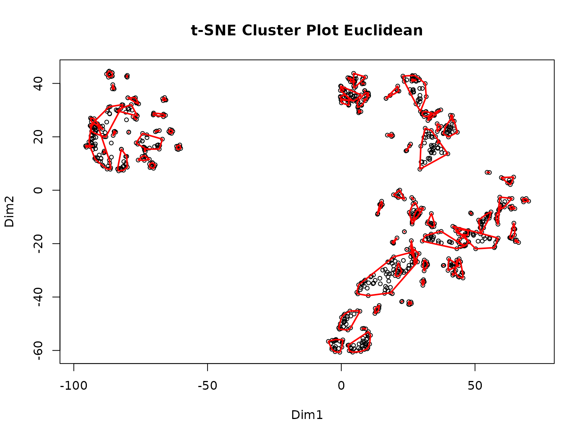
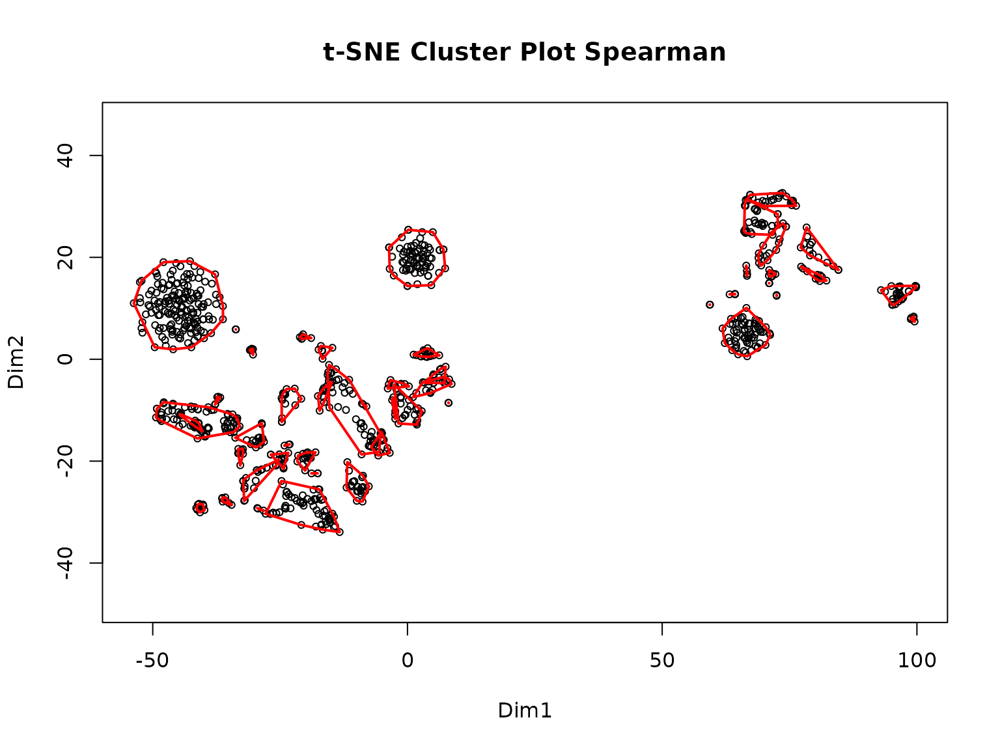
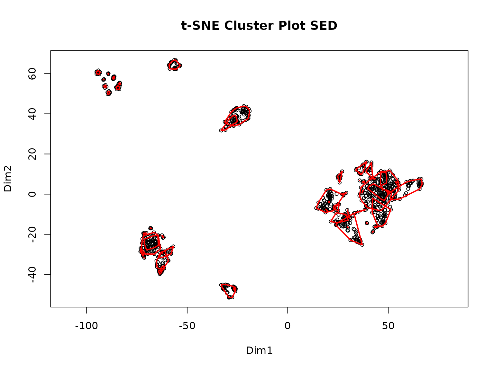
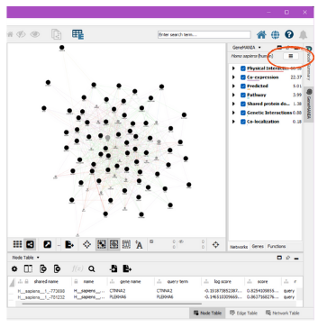
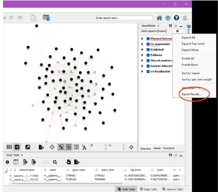

# Using the P2P Package: A Step-by-Step Tutorial

This tutorial is intended to be a step-by-step guide to walk users
through the process of using the P2P package. It includes descriptions
of each function and must be run in order as subsequent steps require
the data produced in previous steps. Example code and example outputs as
well as estimated run-times are included with each description and are
based on a preliminary dataset of ~9000 PTMs and 69 experimental
conditions processed with a 12th Gen i7 processor and 16GB of RAM.

**An important note:** The returned outputs from the functions are data
that may be saved in an RData object so that the user may reload the
data, which may take a while to generate, and pick up where they left
off later. See the bottom of this document for code to save your data
efficiently.

## Installing the Package

You will need to install the devtools package, which can be installed
with:

``` r

install.packages("devtools")
```

Next, install the package with:

``` r

devtools::install_github("UM-Applied-Algorithms-Lab/PTMsToPathways")
```

And load the package:

``` r

library(PTMsToPathways)
data_names <- data(package = "PTMsToPathways")$results[, "Item"]
data(list = data_names, package = "PTMsToPathways")
```

## Starting Data

For the tutorial, we will be using two example datasets: a smaller
dataset consisting of 933 PTMs and 18 experimental conditions (the
example used in the [Raw Data Processing
vignette](https://um-applied-algorithms-lab.github.io/PTMsToPathways/articles/RawDataProcessing.md))
and a larger dataset containing around 9000 PTMs and 69 experimental
conditions. These datasets are available with the package.
Alternatively, the larger dataset can be downloaded
[here](https://github.com/UM-Applied-Algorithms-Lab/PTMsToPathways/raw/refs/heads/main/inst/extdata/AlldataPTMs.txt)
to be inspected locally.

To see all data that is provided with the package, run:

``` r

data(package = "PTMsToPathways")
```

| Dataset Name | Description |
|:---|:---|
| BRCA_PCN.data | BRCA PCN Data |
| BRCA_genemania.edges | BRCA Genemania Edges |
| BRCA_stringdb.edges | BRCA STRINGdb Edges |
| brca_CCCN_data | Output of MakeCorrelationNetwork on the BRCA data |
| brca_clusterlist_data | BRCA Cluster List Data |
| ex_PCNedgelist | PCN Edge List |
| ex_adj_consensus | Adjacency Consensus Matrix |
| ex_bioplanet | Bioplanet |
| ex_cfn | Cfn |
| ex_combined_ppi | Combined PPIs |
| ex_common_clusters | Common Clusters |
| ex_full_ptm_table | Full PTM Table Example |
| ex_gene_cccn_edges | Gene CCCN Edgelist |
| ex_gene_cccn_nodes | Gene list (nodes) |
| ex_genemania_edges | Genemania Edges |
| ex_pathway_crosstalk_network | Pathway Crosstalk Network |
| ex_pathways_list | Pathways list |
| ex_ptm_cccn_edges | PTM CCCN Edgelist |
| ex_ptm_correlation_matrix | Correlation Matrix |
| ex_small_ptm_table | Small PTM Table Example |
| ex_stringdb_edges | STRINGdb Edges |
| ex_tiny_ptm_table | Tiny PTM Table Example |
| function_key | Function Key Example |

If you are using the smaller dataset, use the following code to view the
dimensions of the dataset and a small portion of it:

``` r
dim(ex_small_ptm_table)
ex_small_ptm_table[38:50, 1:2]
>> [1] 908  18
>>                            H3122SEPTM_pTyr.C1 H3122SEPTM_pTyr.C2
>> HNRNPA3 p S358                             NA                 NA
>> EPHB4 p S575                               NA                 NA
>> BCAR1 p S407                           163730             159600
>> MAGOH p S38; MAGOHB p S40             1824100                 NA
>> DYNLL1 p S64; DYNLL2 p S64                 NA                 NA
>> PRKCD p S304                               NA                 NA
>> PCDH1 p S1018                              NA             563220
>> AHNAK p S5832                              NA                 NA
>> AHNAK p S5841                              NA                 NA
>> ARHGEF5 p S1139                            NA                 NA
>> SRSF9 p S178                               NA                 NA
>> RIPK1 p S389                               NA                 NA
>> URB2 p S18                                 NA                 NA
```

If you want to use the bigger dataset, the following code shows the
dimensions and a snippet of the dataset:

``` r
dim(ex_full_ptm_table)
ex_full_ptm_table[38:50, 1:2]
>> [1] 9215   69
>>                                H3122SEPTM.C1 H3122SEPTM.C2
>> ABCC4 ubi K540                      20.03456            NA
>> ABCC4 ubi K622                            NA            NA
>> ABCC4 ubi K695                            NA            NA
>> ABCC4 ubi K77                             NA            NA
>> ABCC5 p Y10                               NA            NA
>> ABCD1 ubi K407; ABCD2 ubi K411            NA            NA
>> ABCD3 ack K260                            NA            NA
>> ABCD3 ubi K260                            NA            NA
>> ABCD3 ubi K576                            NA            NA
>> ABCE1 ubi K121                      17.62671      17.65533
>> ABCE1 ubi K210                            NA            NA
>> ABCE1 ubi K250                            NA            NA
>> ABCE1 ubi K93                             NA            NA
```

If you have downloaded the larger dataset locally, you can read it into
R using the following code:

``` r

allptmtable <- utils::read.table("AlldataPTMs.txt", sep = "\t", skip = 0,
                                 fill = T, quote = "\"", dec = ".",
                                 comment.char = "", stringsAsFactors = F)
```

### Using Your Own Data

To use your own MS data, you will need to transform it into a dataframe
with PTMs and row names, experimental conditions as column names, and
numeric data as the entries. Please refer to the [Raw Data Processing
vignette](https://um-applied-algorithms-lab.github.io/PTMsToPathways/articles/RawDataProcessing.md)
for a tutorial showing all steps needed to transform an MS output file
into a P2P package input dataframe.

## Step 1: Make Cluster List

`MakeClusterList` is the first step in the P2P process. This function
takes the dataframe `ptmtable` and runs it through three calculations of
statistical measures of distance: Euclidean Distance, Spearman
Dissimilarity (1- \|Spearman Correlation\|), and SED (the average of
both Spearman Dissimilarity (1- Spearman Correlation) and Euclidean
Distance). Combining the two dissimilarities leads to better resolution
of the data and is useful in pattern recognition. A correlation table—
`ptm.correlation.matrix`—is generated based on the distances calculated
for each pair of PTMs. The function then runs the matrices through t-SNE
to generate clusters based on the previously calculated distance and
provides you with a cluster list, `common.clusters`. The returned
`adj.consensus.matrix` (which identifies which PTMs cluster together
with a ‘short distance’ between them) and `ptm.correlation.matrix` are
also used in the next step to create co-cluster correlation networks
(CCCNs). These three outputs are returned as a list.

The `keeplength` paramter defines the minimum number of PTMs that must
be in a cluster for it to be retained in the final output. The `toolong`
parameter defines the maximum distance between two PTMs for them to be
considered as clustering together.

`MakeClusterList` can be run like so:

``` r
set.seed(88)
clusterlist.data <- MakeClusterList(ex_small_ptm_table,
                                    keeplength = 2, toolong = 3.5)
>> Starting correlation calculations and t-SNE.
>> This may take a few minutes or hours for large data sets.
>> Warning in stats::cor(t(ptmtable), use = "pairwise.complete.obs", method =
>> "spearman"): the standard deviation is zero
>> Warning in stats::cor(t(ptmtable), use = "pairwise.complete.obs", method =
>> "spearman"): the standard deviation is zero
>> Warning in stats::cor(t(ptmtable), use = "pairwise.complete.obs", method =
>> "spearman"): the standard deviation is zero
>> Warning in stats::cor(t(ptmtable), use = "pairwise.complete.obs", method =
>> "spearman"): the standard deviation is zero
>> Warning in stats::cor(t(ptmtable), use = "pairwise.complete.obs", method =
>> "spearman"): the standard deviation is zero
>> Warning in stats::cor(t(ptmtable), use = "pairwise.complete.obs", method =
>> "spearman"): the standard deviation is zero
>> Warning in stats::cor(t(ptmtable), use = "pairwise.complete.obs", method =
>> "spearman"): the standard deviation is zero
>> Warning in stats::cor(t(ptmtable), use = "pairwise.complete.obs", method =
>> "spearman"): the standard deviation is zero
>> Spearman correlation calculation complete after 16.92 secs total.
>> Spearman t-SNE calculation complete after 43.73 secs total.
>> Euclidean distance calculation complete after 43.76 secs total.
>> Euclidean t-SNE calculation complete after 1.15 mins total.
>> Combined distance calculation complete after 1.15 mins total.
>> SED t-SNE calculation complete after 1.58 mins total.
```



    >> Clustering for Euclidean complete after 1.6 mins total.



    >> Clustering for Spearman complete after 1.6 mins total.



    >> Clustering for SED complete after 1.6 mins total.
    >> Consensus clustering complete after 1.61 mins total.
    >> MakeClusterList complete after 1.61 mins total.

The following unpacks the output into the separate objects discussed
above:

``` r

common.clusters <- clusterlist.data[[1]]
adj.consensus.matrix <- clusterlist.data[[2]]
ptm.correlation.matrix <- clusterlist.data[[3]]
```

Now we can view the objects. First, here is an example of a cluster:

``` r
common.clusters[1]
>> $ConsensusCluster1
>> [1] "KRT7 p S37"                              
>> [2] "CALM3 p Y100; CALM2 p Y100; CALM1 p Y100"
>> [3] "ERP29 p Y66"                             
>> [4] "MYH9 p Y1408"                            
>> [5] "PTK2 p Y925"                             
>> [6] "TNK2 p Y827"                             
>> [7] "ITSN2 p Y553"                            
>> [8] "PRRC2C p Y1218"
```

Next, we look at a piece of the adjacency matrix. Ones represent a pair
that cluster and zeroes represent a pair that doesn’t:

``` r
adj.consensus.matrix[7:10, 7:10]
>>               CTNND1 p S225 CTNND1 p S230 STAM2 p S375 EGFR p S1166
>> CTNND1 p S225             0             0            0            0
>> CTNND1 p S230             0             0            0            0
>> STAM2 p S375              0             0            0            0
>> EGFR p S1166              0             0            0            0
```

Here is a part of the PTM correlation matrix. Values for pairs of PTMs
are Spearman correlation coefficients ranging from -1 to 1. If two PTMs
had no experimental conditions in common, their correlation value will
be NA.

``` r
ptm.correlation.matrix[38:43, 1:2]
>>                            KRT7 p S37 KRT7 p S38
>> HNRNPA3 p S358                     NA         NA
>> EPHB4 p S575                       NA         NA
>> BCAR1 p S407                0.5868132        0.5
>> MAGOH p S38; MAGOHB p S40   1.0000000         NA
>> DYNLL1 p S64; DYNLL2 p S64 -0.8000000         NA
>> PRKCD p S304                0.8571429         NA
```

##### Estimated run-time (for large dataset)

~60min

## Step 2: Make Co-Cluster Correlation Networks (PTM and Gene)

The data generated in the previous step is next used to create a new
network of PTMs that have strong associations called the Co-cluster
Correlation Network (CCCN). The Spearman correlations between
co-clustered PTMs are used as edge-weights in this network. The
MakeCorrelationNetwork function groups the PTM correlation matrices by
PTMs that co-cluster together to create a PTM CCCN. It then defines a
relationship between proteins modified by PTMs and creates a gene CCCN
with sum of the PTM correlations serving as edge weights.

``` r
CCCN.data <- MakeCorrelationNetwork(adj.consensus.matrix,
                                    ptm.correlation.matrix)
>> Making PTM CCCN
>> PTM CCCN complete after 0.05 secs total.
>> Making Gene CCCN
>> Gene CCCN complete after 3.11 secs total.
ptm.cccn.edges <- CCCN.data[[1]]
gene.cccn.edges <- CCCN.data[[2]]
gene.cccn.nodes <- CCCN.data[[3]]
```

We can view a portion of the PTM CCCN edges:

``` r
ptm.cccn.edges[18:22,]
>>           source        target     Weight          interaction
>> 18 EIF2B1 p S131   PKP4 p S273 -0.6833333 negative correlation
>> 19   LDHB p S238   EML4 p S242 -1.0000000 negative correlation
>> 20 S100A16 p S27   EML4 p S242 -0.5000000 negative correlation
>> 21     PXN p S90 S100A14 p S33 -0.3571429          correlation
>> 22    URB2 p S18 SHANK2 p S589  0.5428571 positive correlation
```

And a portion of the gene CCCN edges:

``` r
gene.cccn.edges[1:5,]
>>   source target     Weight          interaction
>> 1 ADGRL2  ALDOA -0.4535714          correlation
>> 2   ACP1    ALK  0.6000000 positive correlation
>> 3  AHNAK   ANO1  1.5428571 positive correlation
>> 4   ACP1  ANXA2 -0.2571429          correlation
>> 5 ADAM10  ANXA2  0.1702786          correlation
```

Finally, we can view a portion of the gene CCCN nodes, which are used to
map to external PPI databases in the next step:

``` r
gene.cccn.nodes[1:5]
>> [1] "ADGRL2" "ACP1"   "AHNAK"  "ADAM10" "ALDOA"
```

Because this step can take a long time to run on larger datasets, the
output may be saved as an RData object for later use.

``` r

save.image(file = "filepath/name.RData")
# All objects in the environment are saved
```

##### Estimated run-time (for large dataset)

~10min

## Step 3: Retrieve Database Edgefiles

The third step of the P2P package is to gather data from multiple
existing protein-protein interaction (PPI) databases which will be
integrated with the data generated in steps 1 and 2. The P2P package
explicitly allows the users to integrate data from three external
databases: STRING, GeneMANIA, and PhosphoSite Plus. Other databases can
also be downloaded and added to the PPI network. All three external
databases have different interfaces for downloading data, so we show how
to retrieve data from each of them below.

For this tutorial, we query STRINGdb and GeneMANIA directly. We also
provide the option (using the switch local = TRUE) to retrive edges from
human PPIs from these sources in pre-assembled files; the [BRCANetworks
vignette](https://um-applied-algorithms-lab.github.io/PTMsToPathways/articles/BCRANetworks.md)
demonstrates how to get the STRING-db and GeneMANIA edges from the
static downloaded networks.

#### 1. STRINGdb

[STRINGdb](https://string-db.org/) can be queried directly from R using
the `STRINGdb` package. We wrap this query in a function called
`GetSTRINGdb.edges`, which queries only for the genes found in clusters
in previous steps, and filters the returned by interaction type so only
`experimental`, `database`, `experimental_transferred`, and
`database_transferred` are retained. This ensures that only interactions
with more substantial evidence are used in this analysis.

``` r
stringdb.edges <- GetSTRINGdb.edges(gene.cccn.edges, gene.cccn.nodes)
>> Querying STRINGdb for interactions between 390 genes...
>> Mapping genes to STRING IDs...
>> Retrieving interactions for mapped genes...
>> Formatting...
stringdb.edges[1:5,]
>> Warning:  we couldn't map to STRING 0% of your identifiers    source target interaction Weight
>> 1   MAPK13 MAPK12 experiments   1128
>> 2   MAPK12  MAPK1 experiments   1182
>> 3 BAIAP2L1   WASL experiments    866
>> 4      VCL   PFN1 experiments   1024
>> 5     WASL   PFN1 experiments    619
```

#### 2. GeneMANIA

To our knowledge, no R package exists to programmatically query
[GeneMANIA](https://genemania.org/). Thus, we recommend using the
GeneMANIA Cytoscape App to retrieve PPI data as follows.

First, create an input file for GeneMANIA using the `MakeDBInput`
function provided within P2P (note that this creates a text file in your
working directory):

``` r

MakeDBInput(gene.cccn.nodes, file.path.name = "db_nodes.txt")
```

Next, ensure that you have
[Cystoscape](https://cytoscape.org/download.html) and the [GeneMANIA
extension](https://apps.cytoscape.org/apps/genemania) installed.

Copy the contents of the `db_nodes.txt` file into the GeneMANIA App’s
“Genes of Interest” box and run query.

To save the results, click on the three lines in the upper right corner.
This should be under the GeneMANIA side window beside the species. Click
“Export Results”. The path to this file is the gm.results.path:

  


The `GetGeneMANIA.edges` function then processes the output file
produced by GeneMANIA itself. For example, we have saved
`ex_gm_results.txt` as an example output file from GeneMANIA within the
package. The following code shows how to use this file as input to the
function.

``` r

gm.results.path <- system.file("extdata", "ex_gm_results.txt",
                               package = "PTMsToPathways")
genemania.edges <- GetGeneMANIA.edges(gm.results.path, gene.cccn.nodes)
```

We can see an example of the GeneMANIA edges below:

``` r
genemania.edges[1:5,]
>>   source target           interaction      Weight
>> 1    LCK PTPN11               Pathway 0.001251833
>> 2    MET PTPN11               Pathway 0.001559102
>> 3   VAV1    LCK               Pathway 0.002001705
>> 4   VAV1 PTPN11               Pathway 0.001928108
>> 5    LCK  PTPRK Physical Interactions 0.253717814
```

#### 3. Phosphosite Plus

The kinase-substrate data can be downloaded from [Phosphosite
Plus](https://www.phosphosite.org/staticDownloads) database. The users
will be required to create an account and sign in to download the data.
The `GetKinsub.edges` function reads this downloaded data in and formats
it so that all the PPI edge data frames are in the same format for the
next step.

``` r

input.filename <- system.file("extdata", "Kinase_Substrate_Dataset.txt",
                              package = "PTMsToPathways")
```

``` r

kinsub.edges <- GetKinsub.edges(input.filename,
                                  gene.cccn.nodes)
```

## Step 4: Build PPI Network and Cluster Filtered Network

The `BuildClusterFilteredNetwork` function allows the users to filter
protein-protein interaction networks using the previously generated
co-cluster correlation networks. PPIs are retained in the cluster
filtered network (CFN) only if the interacting proteins share
statistically correlated PTMs identified via t-SNE clusters. The
`BuildClusterFilteredNetwork` function combines all the PPI data
downloaded in step 3 as efficiently as possible while retaining the
desired edge weights. It then normalizes the weights on a scale of 0-1
and gives an output cluster filter network that will only retain
interacting proteins whose genes are within the co-cluster correlation
network created in step 2.

We first run the function:

``` r

network.list <- BuildClusterFilteredNetwork(gene.cccn.edges,
                                            stringdb.edges,
                                            genemania.edges,
                                            kinsub.edges,
                                            db.filepaths = c())
```

And then unpack the outputs into separate variables:

``` r

combined.PPIs <- network.list[[1]]
cfn <- network.list[[2]]
```

We can view a portion of the CFN below:

``` r
cfn[1:5,]
>>   source target             interaction    Weight
>> 1   ABL1   IRS2 experiments_transferred  3.589744
>> 2 AKR1B1  PRKCD experiments_transferred  1.684982
>> 3   ANK3  HDAC1 experiments_transferred  3.443223
>> 4   ATIC   EML4                database 27.326007
>> 5   ATIC   ITPA                database 32.967033
```

To reduce clutter on graphs, the CFN edges can be merged. This collapses
two or more edges between two nodes into a single edge, combining edge
names:

``` r

cfn.merged <- mergeEdges(cfn)
```

## Step 5: Pathway Crosstalk Network

The final step is the creation of the Pathway Crosstalk Network (PCN),
which creates a set of pathway-pathway edges that have two weights: a
Jaccard similarity and a Cluster-Pathway Evidence score. This step
requires input of an external database from [NCATS
BioPlanet](https://tripod.nih.gov/bioplanet/download/pathway.csv) that
contains groups of genes (proteins) involved in various cellular
processes known as pathways. P2P provides a function
[`ReadBioplanetFile`](https://um-applied-algorithms-lab.github.io/PTMsToPathways/articles/references/ReadBioplanetFile.md)
that reads in the BioPlanet file and converts it into a list of
pathways. The first pathways is displayed below:

``` r
bioplanet.file <- system.file("extdata", "pathway.csv",
                              package = "PTMsToPathways")
pathways.list <- ReadBioplanetFile(bioplanet.file)
pathways.list[[5]]
>>  [1] "ACADL"    "ACADM"    "ACADS"    "ACADVL"   "SLC25A20" "CPT1A"   
>>  [7] "CPT2"     "ECI1"     "DECR1"    "ECHS1"    "EHHADH"   "ACSL1"   
>> [13] "ACSL3"    "ACSL4"    "HADHA"    "HADHB"    "HADH"     "MUT"     
>> [19] "PCCA"     "PCCB"     "SCP2"     "PECR"     "MCEE"
```

The function
[`BuildPathwayCrosstalkNetwork`](https://um-applied-algorithms-lab.github.io/PTMsToPathways/articles/references/BuildPathwayCrosstalkNetwork.md)
takes the list of pathways (or a path to the pathway file) and the list
of clusters generated in step 1 and returns the relationships between
pathways in two forms: a dataframe of edges that can be uploaded to
Cytoscape (the first element of the returned list) and a dataframe with
columns for the two edge weights (the second element of the returned
list). The third element of the returned list is the list of pathways
(in case the user provided a path to the pathway file rather than a list
of pathways). The function can be run as follows:

``` r
PCN.data <- BuildPathwayCrosstalkNetwork(common.clusters, bioplanet.file,
                                         createfile = FALSE)
>> Making PCN
>> 2026-06-17 23:57:26.408805
>> 2026-06-17 23:57:26.523413
>> Total time: 0.114607572555542
pathway.crosstalk.network <- PCN.data[[1]]
PCNedgelist <- PCN.data[[2]]
pathways.list <- PCN.data[[3]]
```

The required columns for Cytoscape are:

``` r
names(pathway.crosstalk.network)
>> [1] "source"      "target"      "Weight"      "interaction"
```

And we can see some of the pathway crosstalk network edges below:

``` r

pathway.crosstalk.network[1:5,]
```

|  | source | target | Weight | interaction |
|:---|:---|:---|:---|:---|
| 4 | Axon guidance | Validated nuclear estrogen receptor alpha network | 1.27898550724638 | PTM_cluster_evidence |
| 2 | Axon guidance | ERBB signaling pathway | 9.50912807669002 | PTM_cluster_evidence |
| 3 | Axon guidance | Lipid and lipoprotein metabolism | 4.63387820142684 | PTM_cluster_evidence |
| 5 | ERBB signaling pathway | Lipid and lipoprotein metabolism | 2.96007824348337 | PTM_cluster_evidence |
| 18 | Selenium pathway | Vitamin B12 metabolism | 0.866666666666667 | PTM_cluster_evidence |

To understand the edge weights calculations, let’s consider a pair of
pathways, `Axon Guidance` and `ERBB signaling pathway`. We’ll look at
the `PCNedgelist` dataframe this time.

``` r

PCNedgelist[PCNedgelist$source == "Axon guidance" & PCNedgelist$target == "ERBB signaling pathway", ]
```

|  | source | target | pathway_Jaccard_similarity | PTM_cluster_evidence |
|:---|:---|:---|:---|:---|
| 2 | Axon guidance | ERBB signaling pathway | 0.07 | 9.51 |

### Metric calculations

#### Jaccard Similarity

The Jaccard similarity is defined as the size of the intersection of the
two pathways (the number of genes that are in both pathways) divided by
the size of the union of the two pathways (the total number of unique
genes that are in either pathway).

``` r
size_union <- length(union(pathways.list[["Axon guidance"]], pathways.list[["ERBB signaling pathway"]]))
size_union
size_intersection <- length(intersect(pathways.list[["Axon guidance"]], pathways.list[["ERBB signaling pathway"]]))
size_intersection
jaccard_similarity <- size_intersection / size_union
jaccard_similarity
>> [1] 391
>> [1] 28
>> [1] 0.07161125
```

Notice that the found value is the same as the
`pathway_Jaccard_similarity` value in the `PCNedgelist` dataframe.

#### Cluster-Pathway Evidence (CPE) Score

For a given pathway $`j`$ ($`pw_j`$) and a given cluster $`i`$
($`cl_i`$), we define the Cluster-Pathway Evidence (CPE),
``` math
CPE(i,j) = \Sigma_{pro_k \in pw_j} \frac{|\{PTM_x: PTM_x \in pro_k \land PTM_x \in cl_i\}|}{|\{pw_y : pro_k \in pw_y\}| \cdot |cl_i|}
```
where $`pro_k`$ is a protein in pathway $`j`$ and $`PTM_x`$ is a PTM.

(Note that $`\in`$ means “in” and $`\land`$ means “and”.)

Let’s break down the CPE calculation single cluster $`i`$, the first
cluster found, and a single pathway $`j`$, the `Axon guidance` pathway.

``` r
c_i <- common.clusters[[1]]
p_j <- pathways.list[["Axon guidance"]]
length(c_i)
length(p_j)
>> [1] 8
>> [1] 325
```

Notice that the numerator of the summands in $`CPE(i,j)`$ counts the
number of PTMs that are in both the protein and the cluster.
Intuitively, if a pathway contains many proteins that have PTMs in this
cluster, then this sum will be larger. Of the 325 proteins in the
`Axon guidance` pathway, only `MYH9` and `PTK2` have PTMs that occur in
the first cluster, so out of the 325 summands in $`CPE(i,j)`$, only two
are non-zero. And in fact, both numerators are 1, since there is only
one PTM on `MYH9` in our cluster:

``` r
c_i[grepl("MYH9", c_i)]
>> [1] "MYH9 p Y1408"
```

And also only one PTM on`PTK2`:

``` r
c_i[grepl("PTK2", c_i)]
>> [1] "PTK2 p Y925"
```

The denominators of the summands in $`CPE(i,j)`$ are the product of the
number of pathways that the protein is in and the number of PTMs in the
cluster. From above, there are 8 PTMs in this cluster. `MYH9` is in 1
pathway and `PTK2` is in 2 pathways, as seen below:

``` r
sum(sapply(pathways.list, function(x) "MYH9" %in% x))
sum(sapply(pathways.list, function(x) "PTK2" %in% x))
>> [1] 1
>> [1] 2
```

(Note that the `pathways.list` here is a smaller version of the full
BioPlanet pathways list.)

So CPE for the first cluster and the `Axon guidance` pathway is:

``` r
1/(1*8) + 1/(2*8)
>> [1] 0.1875
```

Overall, two pathways are considered to be related if they both have
positive CPE with the same cluster. In that case, the CPE score for the
edge between those two pathways is the sum of the CPE scores for all
clusters that contain

For example, here are the number of clusters that contain PTMs on one or
more proteins in the `Axon guidance` pathway:

``` r
ag_clusts <- sapply(common.clusters, function(x) any(sapply(pathways.list[["Axon guidance"]], grepl,x=x)))
sum(ag_clusts)
>> [1] 66
```

And here are the number of clusters that contain PTMs on one or more
proteins in the `ERBB signaling pathway`:

``` r
erbb_clusts <- sapply(common.clusters, function(x) any(sapply(pathways.list[["ERBB signaling pathway"]], grepl,x=x)))
sum(erbb_clusts)
>> [1] 49
```

And overall, here are the number of clustesr that contain PTMs on at
least one protein from both the `Axon guidance` pathway and the
`ERBB signaling pathway`:

``` r
sum(ag_clusts & erbb_clusts)
>> [1] 43
```

The CPE scores from these clusters to the two pathways would be summed
to get the final CPE score for the edge between the two pathways.

For more detail on the CPE calculation, see [“Ross et al.,
2023”](https://journals.plos.org/ploscompbiol/article?id=10.1371/journal.pcbi.1010690).

## Saving Data

If you want to save your data to a file, all data structures can either
be exported with the save function and loaded later or saved to a csv
file with the write.csv function.

To save one object:

``` r

save(object, filename = "filepath/name.rda") # Saves object as an .rda
load("filepath/name.rda")                    # Loads object saved to a file
```

For multiple objects: Note the objects are saved as an .RData rather
than an .rda

``` r

save(object1, object2, object.ect, filename="NewFile.RData")
```

To save one object as a csv:

``` r

utils::write.csv(object, file = "filepath/name.csv") # Saves object as a .csv
utils::read.csv(file = "filepath/name.csv")          # Loads object from .csv
```

You may also save your entire Global Environment namespace using the
save.image function as shown below:

``` r

save.image(file = "filepath/name.RData")
# All objects in the environment are saved
```
