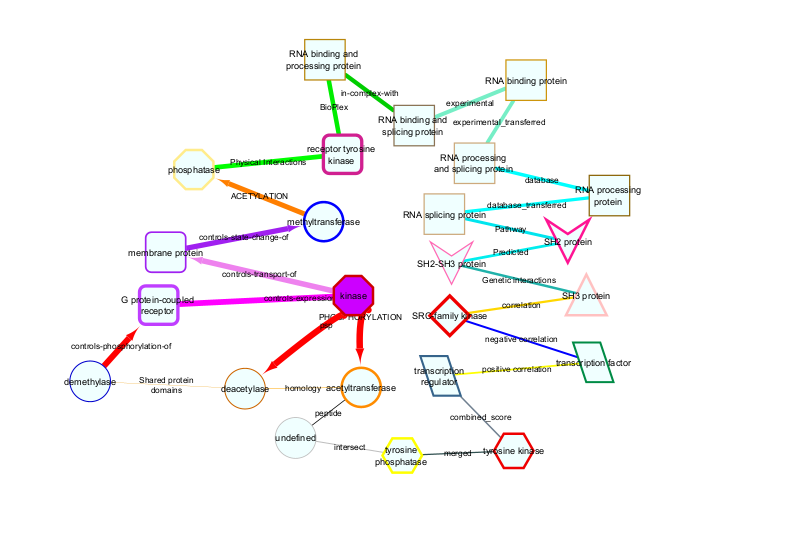
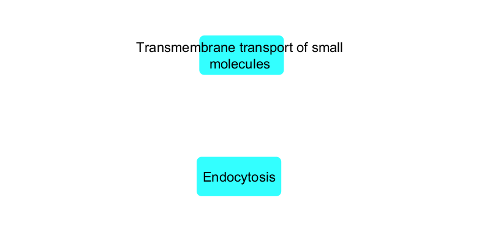

# Cytoscape Graphing

The PTMsToPathways Package provides functions to aid in exploration of
the resulting networks using the Cytoscape interface. If you have
already run the steps in the [Creating
Networks](https://um-applied-algorithms-lab.github.io/PTMsToPathways/articles/%22/GettingStarted.html%22),
you should already have all the data you need to visualize your
networks. If not, we show how to access precomputed networks below.
First, we describe some visualization choices and then give examples of
using Cytoscape to explore data using a top down approach and a bottom
up approach.

If you have not already libraried the package, do so now.

``` r

library(PTMsToPathways)
```

## Visualization Options

Cytoscape allows us to encode information in the visual network
attributes node size, color, shape, and border and edge color, size, and
arrow type. In this vignette, we use node attributes to represent the
type of protein this gene is and edge attributes to represent different
types of interactions from PPI databases, correlations, or links between
proteins and their PTMs. Further details can be found by clicking to
expand the following table.

Show Detailed Network Attribute Table

[TABLE]

  
To visualize the information in this table,
[NodeEdgeKey](https://um-applied-algorithms-lab.github.io/PTMsToPathways/reference/NodeEdgeKey.md)
function generates an example network in Cytoscape like the one shown
below.



Node information is based on a function key that maps gene names to a
table of information regarding the gene. This may be provided by the
user or PTMsToPathways provides an example dataset as
[function_key](https://um-applied-algorithms-lab.github.io/PTMsToPathways/reference/function_key.md).

``` r

head(function_key[1:3])
```

| Gene.Name | Approved.Name | Hugo.Gene.Family |
|:---|:---|:---|
| A1BG | alpha-1-B glycoprotein | Immunoglobulin-like domain containing |
| A1CF | APOBEC1 complementation factor | RNA binding motif containing |
| A2LD1 | undefined | undefined |
| A2M | alpha-2-macroglobulin | undefined |
| A2ML1 | alpha-2-macroglobulin-like 1 | undefined |
| A3GALT2 | alpha 1,3-galactosyltransferase 2 | Glycosyltransferase family 6 |

## Top-Down Approach

It is possible to graph the entire PCN, CFN, and CCCNs in their
entirety, though very large graphs take a long time to graph. One
approach to navigating these data structures is to select nodes from the
large networks in Cytoscape (or in R using
[`RCy3::selectNodes`](https://rdrr.io/pkg/RCy3/man/selectNodes.html))
and select nearest neighbors or shortest paths and create a subnetwork
in a new window (see the [Cytoscape
Manual](https://manual.cytoscape.org/en/stable/)).

The alternative approach described below is to identify pathways, genes,
and PTMs of interest in the R data objects, then make smaller, more
interpretable graphs in Cytoscape using RCy3.

First, we read in Bioplanet pathways into `pathways.list` using the P2P
function `ReadBioplanetFile`. Here, the name of each liist element is
the name of a Bioplanet pathway that maps to a list of genes in that
pathway.

``` r

bioplanet.path <- system.file("extdata", "bioplanet_pathway_June2025.csv", package = "PTMsToPathways")
pathways.list <- ReadBioplanetFile(bioplanet.file = bioplanet.path)
```

Next, we filter to the pathways that contain epidermal growth factor
receptors (EGFRs).

``` r

egfr_pathways <- names(pathways.list)[sapply(1:length(pathways.list), function(x)
  {"EGFR" %in% pathways.list[[x]]})]
```

We expect 83 pathways that contain EGFR, so let’s check:

``` r
length(egfr_pathways)
>> [1] 83
```

Then, we want to find interactions between the pathway “Transmembrane
transport of small molecules” and those pathways. For now, we are
manually adding an entry to `ex_pathway_crosstalk_network` so that the
resulting filtered PCN has a row to work with.

``` r

tempPcn = rbind(ex_pathway_crosstalk_network, data.frame(source = "Transmembrane transport of small molecules", target= "Endocytosis", Weight = 1, interaction = "PTM_cluster_evidence"))
egfr_transporter_pcn <- filter.edges.between(
  "Transmembrane transport of small molecules",
  egfr_pathways, tempPcn)
```

This filtered PCN can be passed into the function
`cytoscape.graph.PCN.pathways` to visualize the resultant network.  
Note that this can go into Cytoscape because it has the Jaccard
Similarity and Cluster Pathway Evidence (CPE) scores as distinct edges
(rows). If you have Cytoscape installed and open, you can run the
following code to visualize this new network.

``` r

# Graph PCN
pcn.graph <- cytoscape.graph.PCN.pathways(
  PCN = egfr_transporter_pcn,
  net.name = "EGFR signaling and transmembrane transporters",
  Jaccard.edges = TRUE)
```



Let’s zero in on interactions between proteins in the two pathways
“EGF/EGFR signaling pathway” and “Transmembrane transport of small
molecules” because they have no genes in common, yet the cluster
evidence for their interaction is strong.

``` r
subset(tempPcn,
       source=="Transmembrane transport of small molecules" & target=="EGF/EGFR signaling pathway")
# should we check other direction?
>> [1] source      target      Weight      interaction
>> <0 rows> (or 0-length row.names)
```

First we extract a network of interactions between the genes in the two
pathways. Then we generate a node file for Cytoscape. In the following
case we include the data extracted from the ptmtable. This is optional,
useful if node size and color is used later to indicate values in data.

``` r

egfr_transporter.cfn <- filter.edges.0(c(
  pathways_list[["EGF/EGFR signaling pathway"]],
  pathways_list[["Transmembrane transport of small molecules"]]), cfn)

egfr_transporter.nodes <- make.cytoscape.node.file(
  egfr_transporter.cfn, function_key, ptmtable, include.gene.data = TRUE) 
```

The function GraphCfn creates a graph using the cluster filtered network
in the Cytoscape app. When graphed, Cytoscape provides an interactive
interface to view the data. This function requires the edge list file
(egfr_transporter.cfn in the example), and node data file
(egfr_transporter.nodes).

##### Generating the graph and setting node size and color

``` r

GraphCfn(cfn.edges = egfr_transporter.cfn, cfn.nodes = egfr_transporter.nodes,
         Network.title = "CFN", Network.collection = "PTMsToPathways")

# Choose a ratio data column to show which proteins' PTMs were inhibited by a drug
setNodeColorToRatios(plotcol="PC9_ErlotinibRatio")

# There are a lot of edges! To simplify the graph, use the mergeEdges() function.
# This can be done to the entire cfn:
cfn.merged <- mergeEdges(cfn)

# Or just to the cfn made above:
egfr_transporter.cfn.merged <- mergeEdges(egfr_transporter.cfn)

# Graph to compare:
GraphCfn(cfn.edges = egfr_transporter.cfn.merged,
         cfn.nodes = egfr_transporter.nodes,  Network.title = "CFN",
         Network.collection = "PTMsToPathways")

# Choose a ratio data column to show which proteins' PTMs were inhibited by a drug
setNodeColorToRatios(plotcol="PC9_ErlotinibRatio")

# Note that within Cytoscape you can change the column for node size and color
# (two separate tings) in the "Styles" tab

head(egfr_transporter.cfn.merged)
```

##### Asking questions about signaling pathways that connect proteins

Another example of how to use the network is to ask: What are the paths
between two nodes (two proteins)? We use the function connectNodes.all()
to identify all shortest paths between two nodes.

Having identified the pathways, let’s also zoom in further on PTMs to
examine which PTMs co-cluster, as indicated by yellow edges between
them.

``` r

sp1 <- connectNodes.all(c("FYN", 'MET'), ig.graph=NULL,
                        edgefile = cfn.merged, newgraph = TRUE) #. ***

# To include co-clustered PTMs in the network an extra step is necessary:
sp1_plus <- get.co.clustered.ptms(sp1)
sp1_plus.nodes <- make.cytoscape.node.file(sp1_plus, function_key, ptmtable,
                                           include.gene.data = TRUE,
                                           include.coclustered.PTMs = TRUE) 

# Now, graph in cytoscape
GraphCfn(cfn.edges = sp1_plus, cfn.nodes = sp1_plus.nodes,
         Network.title = "CFN/CCCN", Network.collection = "PTMsToPathways")

# Choose a ratio data column to show which proteins' PTMs were inhibited by a drug
setNodeColorToRatios(plotcol = "H3122CrizotinibRatio")

head(sp1_plus)
```

## Bottom-Up Approach

#### Example - Investigating how dasatinib affects proteins involved in focal adhesion

Dasatinib exhibits strong binding and inhibitory effects on multiple
focal adhesion-associated genes from the BioPlanet list:

• SRC (proto-oncogene tyrosine-protein kinase Src)

• FYN (tyrosine-protein kinase Fyn)

• EGFR (epidermal growth factor receptor)

• ERBB2 (receptor tyrosine-protein kinase erbB-2)

All these genes are directly implicated in focal adhesion signaling
regulation. We hypothesize that ptms on proteins involved in focal
adhesion will be downregulated by dasatinib.

``` r

pt.sub <- ptmtable[, grep("DasatinibRatio", names (ptmtable))]
pt.sub$Sum.Dasat <- rowSums(pt.sub, na.rm = TRUE)
pt.sub <- pt.sub[order(pt.sub$Sum.Dasat, decreasing = FALSE), ]

pt.sub$Gene.Name <- sapply(rownames(pt.sub), function(x){
  unlist(strsplit(x, " ",  fixed=TRUE))[1]})

fa.genes <- pathways.list[["Focal adhesion"]]
pt.sub.fa <- pt.sub[pt.sub$Gene.Name %in% fa.genes,]
pt.sub.fa.topz <- pt.sub.fa[pt.sub.fa$Sum.Dasat < -2,]
ptms = rownames(pt.sub.fa.topz)

# Employ a helper function to derive a CFN starting with a list of PTMs
cfn.cccn <- ptms_to_cfn(ptms, cfn = cfn.merged, pepsep = ";")
cfn_cccn.nodes <- make.cytoscape.node.file(cfn.cccn, function_key, ptmtable,
                                           include.gene.data = TRUE,
                                           include.coclustered.PTMs = TRUE)

# Let's see what it looks like.
GraphCfn(cfn.edges = cfn.cccn, cfn.nodes = cfn_cccn.nodes,
         Network.title = "CFN/CCCN", Network.collection = "PTMsToPathways")

# Choose a ratio data column to show which proteins' PTMs were inhibited by a dasatinib
setNodeColorToRatios(plotcol="H366_DasatinibRatio")
setNodeColorToRatios(plotcol="H2286_DasatinibRatio")

# Note that within Cytoscape you can change the column for node size and color
# (two separate things) in the "Styles" tab
```
