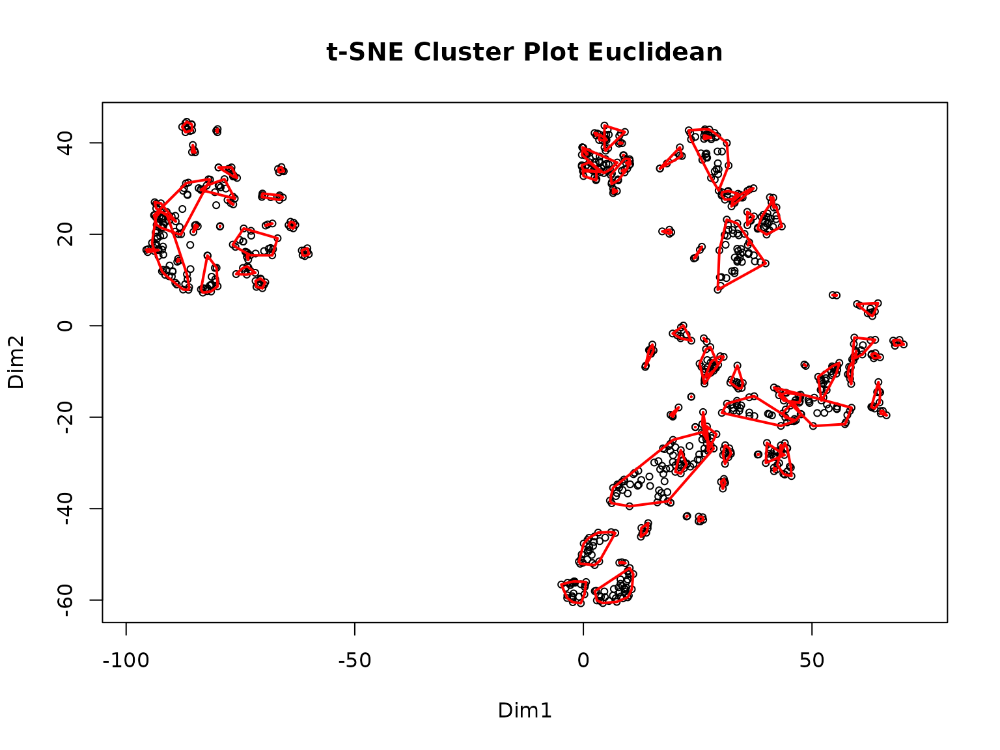
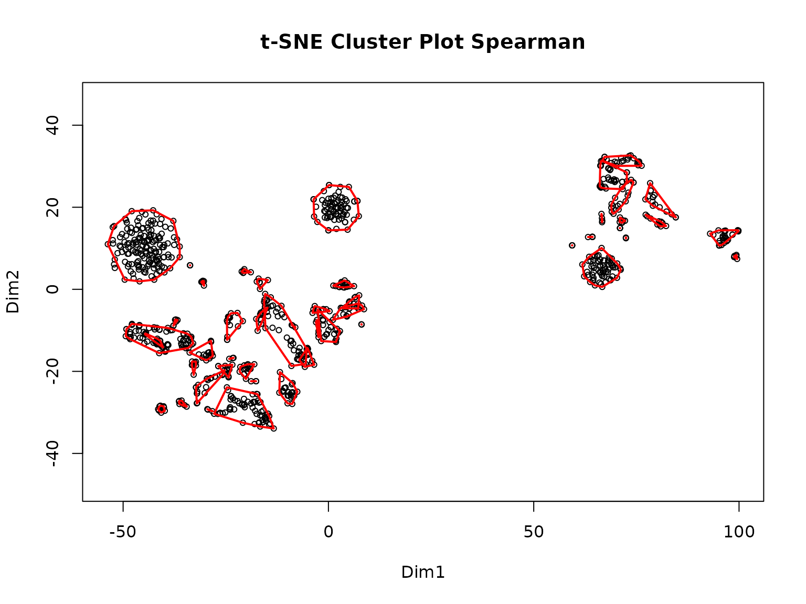
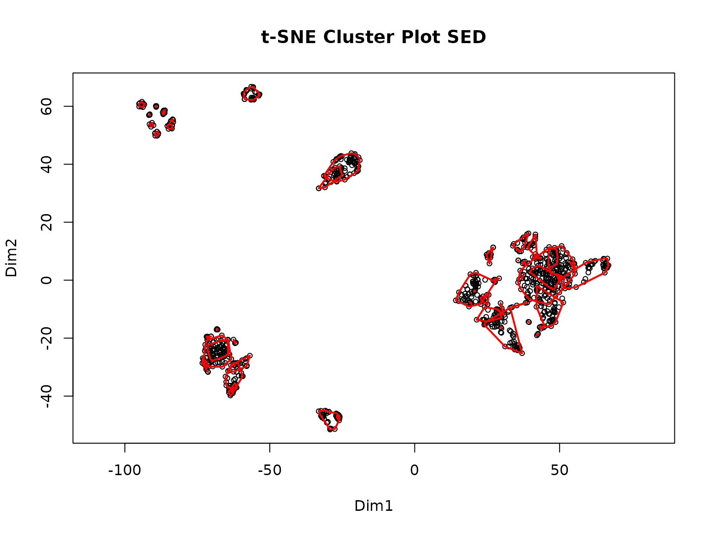

# Analyzing Pathways from PTMs: A Guide

The PTMsToPathways (P2P) package takes Mass Spectrometry (MS) data of
protein post-translational modifications under different experimental
conditions and uses machine learning to identify PTM clusters that
represent functional modules in cell signaling. The clusters created
initially are then used to identify protein-protein interactions as well
as interactions between cell signaling pathways. This tutorial is
intended to be a step-by-step guide to walk users through the process of
using the PTMsToPathways (P2P) package. It includes descriptions of each
function and must be run in order as subsequent steps require the data
produced in previous steps. Example code and example outputs as well as
estimated run-times are included with each description and are based on
a preliminary dataset of ~9000 PTMs and 69 experimental conditions
processed with a 12th Gen i7 processor and 16GB of RAM.

**An important note:** The returned outputs from the functions are data
that may be saved in an RData object so that the user may reload the
data, which may take a while to generate, and pick up where they left
off later. See the bottom of this document for code to save your data
efficiently.

## Installing the package

Ensure you have the latest version of RStudio and base R installed. You
will also need to install the devtools package, which can be installed
with:

``` r
install.packages("devtools")
```

Next, install the package with:

``` r
devtools::install_github("UM-Applied-Algorithms-Lab/PTMsToPathways")
```

## Starting Data

For the tutorial, we will be using two example datasets: a smaller
dataset consisting of 933 PTMs and 18 experimental conditions (the
example used in the RawDataProcessing vignette) and a larger dataset
containing around 9000 PTMs and 69 experimental conditions. These
datasets are available with the package as a variable or can be
downloaded from our GitHub page
[PTMsToPathways](https://github.com/UM-Applied-Algorithms-Lab/PTMsToPathways)
to the user’s working directory and imported.

If you are using a smaller dataset, use the following code to view the
dimensions of the dataset and a small portion of it:

``` r
dim(ex_small_ptm_table)
ex_small_ptm_table[38:50, 1:2]
>> [1] 908  18
>>                            H3122SEPTM_pTyr.C1 H3122SEPTM_pTyr.C2
>> HNRNPA3 p S358                             NA                 NA
>> EPHB4 p S575                               NA                 NA
>> BCAR1 p S407                           163730             159600
>> MAGOH p S38; MAGOHB p S40             1824100                 NA
>> DYNLL1 p S64; DYNLL2 p S64                 NA                 NA
>> PRKCD p S304                               NA                 NA
>> PCDH1 p S1018                              NA             563220
>> AHNAK p S5832                              NA                 NA
>> AHNAK p S5841                              NA                 NA
>> ARHGEF5 p S1139                            NA                 NA
>> SRSF9 p S178                               NA                 NA
>> RIPK1 p S389                               NA                 NA
>> URB2 p S18                                 NA                 NA
```

If you want to use the bigger dataset, the following code shows the
dimensions and a snippet of the dataset:

``` r
dim(ex_full_ptm_table)
ex_full_ptm_table[38:50, 1:2]
>> [1] 9215   69
>>                                H3122SEPTM.C1 H3122SEPTM.C2
>> ABCC4 ubi K540                      20.03456            NA
>> ABCC4 ubi K622                            NA            NA
>> ABCC4 ubi K695                            NA            NA
>> ABCC4 ubi K77                             NA            NA
>> ABCC5 p Y10                               NA            NA
>> ABCD1 ubi K407; ABCD2 ubi K411            NA            NA
>> ABCD3 ack K260                            NA            NA
>> ABCD3 ubi K260                            NA            NA
>> ABCD3 ubi K576                            NA            NA
>> ABCE1 ubi K121                      17.62671      17.65533
>> ABCE1 ubi K210                            NA            NA
>> ABCE1 ubi K250                            NA            NA
>> ABCE1 ubi K93                             NA            NA
```

If you want to download the
[data](https://github.com/UM-Applied-Algorithms-Lab/PTMsToPathways/blob/main/inst/extdata/AlldataPTMs.txt)
and then import the dataset use the following code:

``` r
# TO DO FIX THIS!!!!!
allptmtable <- read.table("AlldataPTMs.txt", sep = "\t", skip = 0, header = TRUE,
                          blank.lines.skip = T, fill = T, quote = "\"", dec = ".",
                          comment.char = "", stringsAsFactors = F)
```

## Processing the data

The MS data needs to be transformed into a data frame with PTMs as row
names, experimental condition as column names, and numeric data as the
entries to carry out the analysis using P2P vignette. Please refer to
the RawDataProcessing Vignette for a tutorial showing all steps needed
to transform an MS output file into a P2P package input dataframe.

### Step 1: Make Cluster List

MakeClusterList is the first step in the P2P process. This function
takes the dataframe PTM table and runs it through three calculations of
statistical measures of distance: Euclidean Distance, Spearman
Dissimilarity (1- \|Spearman Correlation\|), and SED (the average of
both Spearman Dissimilarity (1- Spearman Correlation) and Euclidean
Distance). Combining the two dissimilarities leads to better resolution
of the data and is useful in pattern recognition. A correlation table –
*ptm.correlation.matrix* – is generated based on the distances
calculated for each pair of PTMs. The function then runs the matrices
through t-SNE to generate clusters based on the previously calculated
distance and provides you with a cluster list, *common.clusters*. The
returned *adj.consensus* (which identifies which PTMs cluster together
with a ‘short distance’ between them) and *ptm.correlation.matrix* are
also used in the next step to create co-cluster correlation networks
(CCCNs).

``` r
set.seed(88)
clusterlist.data <- MakeClusterList(ex_small_ptm_table, keeplength = 2, toolong = 3.5)
>> Starting correlation calculations and t-SNE.
>> This may take a few minutes or hours for large data sets.
>> Spearman correlation calculation complete after 13.6 secs total.
>> Spearman t-SNE calculation complete after 42.84 secs total.
>> Euclidean distance calculation complete after 42.88 secs total.
>> Euclidean t-SNE calculation complete after 1.16 mins total.
>> Combined distance calculation complete after 1.16 mins total.
>> SED t-SNE calculation complete after 1.61 mins total.
```



    >> Clustering for Euclidean complete after 1.62 mins total.



    >> Clustering for Spearman complete after 1.63 mins total.



    >> Clustering for SED complete after 1.63 mins total.
    >> Consensus clustering complete after 1.63 mins total.
    >> MakeClusterList complete after 1.63 mins total.

The following code unpacks the output into separate objects:

``` r
common.clusters <- clusterlist.data[[1]]
adj.consensus <- clusterlist.data[[2]]
ptm.correlation.matrix <- clusterlist.data[[3]]
```

Now we can view the objects. First, here is an example of a cluster”

``` r
common.clusters[1]
>> $ConsensusCluster1
>> [1] "KRT7 p S37"                              
>> [2] "CALM3 p Y100; CALM2 p Y100; CALM1 p Y100"
>> [3] "ERP29 p Y66"                             
>> [4] "MYH9 p Y1408"                            
>> [5] "PTK2 p Y925"                             
>> [6] "TNK2 p Y827"                             
>> [7] "ITSN2 p Y553"                            
>> [8] "PRRC2C p Y1218"
```

Next, we look at a piece of the `adj.consensus` table. Ones represent a
pair that cluster and zeroes represent a pair that doesn’t:

``` r
adj.consensus[1:5, 1:2]
>>               KRT7 p S37 KRT7 p S38
>> KRT7 p S37             0          0
>> KRT7 p S38             0          0
>> INPPL1 p S890          0          0
>> KDM6A p S388           0          0
>> DIAPH1 p S373          0          0
```

Here is a part of the `ptm.correlation.matrix`.

``` r
ptm.correlation.matrix[38:43, 1:2]
>>                            KRT7 p S37 KRT7 p S38
>> HNRNPA3 p S358                     NA         NA
>> EPHB4 p S575                       NA         NA
>> BCAR1 p S407                0.5868132        0.5
>> MAGOH p S38; MAGOHB p S40   1.0000000         NA
>> DYNLL1 p S64; DYNLL2 p S64 -0.8000000         NA
>> PRKCD p S304                0.8571429         NA
```

##### Estimated run-time

~60min

### Step 2: Make Co-Cluster Correlation Networks (PTM and Gene)

The cluster list generated in the previous step is next used to create a
new network of PTMs that have strong associations called the Co-cluster
Correlation Network (CCCN). The Spearman correlations between
co-clustered PTMs are used as edge-weights in this network. The
MakeCorrelationNetwork function groups the PTM correlation matrices by
PTMs that co-cluster together to create a PTM CCCN. It then defines a
relationship between proteins modified by PTMs and creates a gene CCCN
with sum of the PTM correlations serving as edge weights. The output of
this function can be saved as an RData object.

In addition to CCCN edge lists, this function also returns igraph object
gene.cccn.g. This object can be used later to plot, extract edge lists
or adjacency matrices, and accomplish many other functions available
from the igraph package.

``` r
CCCN.data <- MakeCorrelationNetwork(adj.consensus, ptm.correlation.matrix)
ptm.cccn.edges <- CCCN.data[[1]]  # PTM CCCN edge list
gene.cccn.edges <- CCCN.data[[2]] # Gene CCCN edge list
gene.cccn.nodes <- CCCN.data[[3]] # List of nodes in the CCCN
                                  # used to gather PPI data from external databases
ptm.cccn.edges[18:22,]
gene.cccn.edges[1:5,]
gene.cccn.nodes[1:5]
>> [1] "Making PTM CCCN"
>> [1] "2025-11-12 04:20:31 UTC"
>> [1] Total time: 0.0383641719818115
>> [1] "Making Gene CCCN"
>> [1] "2025-11-12 04:20:31 UTC"
>> [1] "2025-11-12 04:20:33 UTC"
>> [1] Total time: 1.79358959197998
>>           source        target     Weight          interaction
>> 18 EIF2B1 p S131   PKP4 p S273 -0.6833333 negative correlation
>> 19   LDHB p S238   EML4 p S242 -1.0000000 negative correlation
>> 20 S100A16 p S27   EML4 p S242 -0.5000000 negative correlation
>> 21     PXN p S90 S100A14 p S33 -0.3571429          correlation
>> 22    URB2 p S18 SHANK2 p S589  0.5428571 positive correlation
>>   source target     Weight          interaction
>> 1 ADGRL2  ALDOA -0.4535714          correlation
>> 2   ACP1    ALK  0.6000000 positive correlation
>> 3  AHNAK   ANO1  1.5428571 positive correlation
>> 4   ACP1  ANXA2 -0.2571429          correlation
>> 5 ADAM10  ANXA2  0.1702786          correlation
>> [1] "ADGRL2" "ACP1"   "AHNAK"  "ADAM10" "ALDOA"
```

##### Estimated run-time

~10min

### Step 3: Retrieve Database Edgefiles

The third step of the P2P package requires the use of multiple
protein-protein interaction (PPI) databases. The data is used to
generate a PPI network where proteins are nodes, and their interactions
are edges and represent all known interactions observed in a wide range
of cell types, disease states, and environmental conditions. The P2P
package explicitly allows the users to integrate data from three
external databases: STRING, GeneMANIA, and PhosphoSite Plus. Other
databases can also be downloaded and added to the PPI network. All three
external databases have different interfaces for downloading data.

#### 1. STRINGdb

STRINGdb has its own R package, making this the easiest database to pull
from. The database will automatically be queried by the GetSTRINGdb
function. Its output is then filtered by interaction type so only
experimental, database, and experimental_transferred and
database_transferred are retained. This ensures that only interactions
with more substantial evidence are used in this analysis.

``` r
stringdb.edges <- GetSTRINGdb(gene.cccn.edges, gene.cccn.nodes)
stringdb.edges[1:5,]
>> Warning:  we couldn't map to STRING 0% of your identifiers   source target              interaction Weight
>> 21 MAPK13 MAPK12                 database   1128
>> 31 MAPK12  MAPK1                 database   1182
>> 35 GPRC5A   MYH9             experimental    164
>> 41   MISP   MYH9             experimental    148
>> 71   MYH9 PIK3R2 experimental_transferred    216
```

#### 2. GeneMANIA

To our knowledge, no R package exists to programmatically query
GeneMANIA. Thus, utilizing the data from GeneMANIA involves two steps:
first generating the input the file and then processing the output file.
Please be aware that this requires downloading the [Cytoscape
app](https://cytoscape.org/download.html) and then installing the
[GeneMANIA extension](https://apps.cytoscape.org/apps/genemania). The
MakeDBInput function allows us to automatically generate an input file
that can be copy and pasted into the query box in GeneMANIA from within
the Cytoscape app.

``` r
MakeDBInput(gene.cccn.nodes, file.path.name = "db_nodes.txt")
```

The ProcessGMEdgefile function then processes the output files produced
by GeneMANIA itself.

``` r
genemania.edges <- ProcessGMEdgefile(gm.edgefile.path, gm.nodetable.path,
                                     db_nodes.path)
```

#### 3. Phosphosite Plus

The kinase-substrate data can be downloaded from [Phosphosite
Plus](https://www.phosphosite.org/staticDownloads) database. The users
will be required to create an account and sign in to download the data.
The format.kinsub.table function reads this downloaded data in and
formats it so that all the PPI edge data frames are in the same format
for the next step.

``` r
kinsub.edges <- format.kinsub.table(kinasesubstrate.filename =
                                      "Kinase_Substrate_Dataset.txt",
                                    gene.cccn.nodes)
```

### Step 4: Build PPI Network and Cluster Filtered Network

The BuildClusterFilteredNetwork function allows the users to filter
protein-protein interaction networks using the previously generated
cocluster correlation networks. PPIs are retained in the cluster
filtered network (cfn) only if the interacting proteins share
statistically correlated PTMs identified via t-SNE clusters. The
BuildClusterFilteredNetwork function combines all the PPI data
downloaded in step 3 as efficiently as possible while retaining the
desired edge weights. It then normalizes the weights on a scale of 0-1
and gives an output cluster filter network that will only retain
interacting proteins whose genes are within the co-cluster correlation
network created in step 2.

``` r
network.list <- BuildClusterFilteredNetwork(stringdb.edges, genemania.edges,
                                            kinsub.edges, gene.cccn.edges,
                                            db.filepaths = c())
combined.PPIs <- network.list[[1]]
cfn <- network.list[[2]]

# To reduce clutter on graphs, the cfn edges can be merged:
cfn.merged <- mergeEdges(cfn)
```

### Step 5: Pathway Crosstalk Network

**Note:** This step is directory sensitive. The user can check and set
the working directory in R using getwd() and setwd(“yourdirectoryhere”)
respectively. It needs a path to the bioplanet file and will put an
edgelist file in the working directory or the otherwise given path. If
the file cannot be found, please check the working directory first.

Our final analysis step is the Pathway Crosstalk Network (PCN). This
step requires input of an external database from [NCATS
BioPlanet](https://tripod.nih.gov/bioplanet/download/pathway.csv), that
contains groups of genes (proteins) involved in various cellular
processes known as pathways. PCN turns this data file into a list of
pathways and converts those pathways into a pathway x pathway edgelist
(PCNedgelist) that possesses multiple weights, a jaccard similarity, and
a score. The score is derived from Cluster-Pathway Evidence using the
common clusters found in Make Correlation Network. Info about the
Cluster-Pathway Evidence score can be found
[here](https://journals.plos.org/ploscompbiol/article?id=10.1371/journal.pcbi.1010690)
For graphing in Cytoscape, the Cluster-Pathway Evidence and Jaccard
similarity edges are listed separately in the edgelist called
pathway.crosstalk.network.

``` r
PCN.data <- PathwayCrosstalkNetwork(common.clusters, bioplanet.file = "pathway.csv",
                                    createfile = getwd())
pathway.crosstalk.network <- PCN.data[[1]]
PCNedgelist <- PCN.data[[2]]
pathways.list <- PCN.data[[3]]
```

## Saving Data

If you want to save your data to a file, all data structures can either
be exported with the save function and loaded later or saved to a csv
file with the write.csv function.

``` r
# For one object
save(object, filename = "filepath/name.rda") # Saves object as an .rda
load("filepath/name.rda")                    # Loads object saved to a file

# For multiple objects: Note the objects are saved as an .RData rather than an .rda
save(object1, object2, object.ect, filename="NewFile.RData")

# One object as a csv
utils::write.csv(object, file = "filepath/name.csv") # Saves object as a .csv
utils::read.csv(file = "filepath/name.csv")          # Loads object from .csv
```

You may also save your entire Global Environment namespace using the
save.image function as shown below:

``` r
save.image(file = "filepath/name.RData") # All objects in the environment are saved
```
