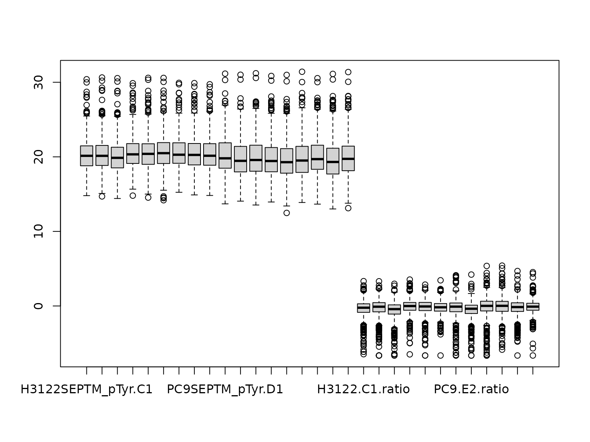

# Analyzing Pathways from PTMs: A Guide

## Purpose

This vignette intends to help users produce a matrix with PTM names as
row names (e.g. FYN p Y411) and numeric data in all the columns, which
can be used as input to the PTMsToPathways functions.

Mass spectrometry data output will vary depending on the experimental
design, source of data, and software used to process the raw spectra. R
supports many file types and can automatically convert them into a data
frame. For example,
[`read.csv()`](https://rdrr.io/r/utils/read.table.html) will take a csv
file and convert it into a data frame
([`read.csv()`](https://rdrr.io/r/utils/read.table.html) is a variation
of [`read.table()`](https://rdrr.io/r/utils/read.table.html)). We start
with data in tab-delimited spreadsheet format.

## Naming conventions

In this vignette, we use the following shorthand conventions when
describing PTMs based on the modifications present in the example data
set. Your data will dictate the names of modifications.

- *Gene.Name* = The HUGO Gene Name is used to identify the protein/gene
- *Phosphorylation* = “p”
- *Lysine acetylation* = “ack”
- *Lysine methylation* = “kme”
- *Arginine methylation* = “rme”
- *Ubiquitination* = “ubi”

## Data input

Investigators will need to identify which columns contain key
information for analysis of PTMs. The example raw data file for this
vignette (downloadable
[here](https://github.com/UM-Applied-Algorithms-Lab/PTMsToPathways/raw/refs/heads/main/inst/extdata/phospho_cleaned_mapped.txt),
or load directly into R using the commands below) contains only
phosphorylation sites.

The key columns are:

- `Amino Acid`: the modified amino acid, such as S or T
- `Positions Within Proteins`: the amino acid number in the protein
  sequence
- Ambiguous modification sites: multiple possible positions separated by
  `;`
- `Modification Type`: the PTM class, such as phosphorylation

R converts spaces in column names to periods, so the relevant columns
after import are:

- `genes` = `"AllGeneSymbols"`
- `positions` = `"Positions.Within.Proteins"`
- `aa` = `"Amino.Acid"`
- `modification` = `"Modification.Type"`

For input to PTMsToPathways, it important that the row names are PTM
identifiers and that the columns represent experimental conditions. The
numeric values are the mass spectrometer output, and NAs represent
missing data rather than zeroes. Ambiguous PTMs, where a PTM could match
several proteins, are separated by semicolons (for example,
`"AARS ubi k747; AMBLIL p U123"`).

To prepare data for input to PTMsTo pathways, we first read in the data
file. To use your own data file, replace `file_path` variable with your
own path to file, as in the commented line below.

``` r
# file_path <- "path/to/your/file.txt"
file_path <- system.file("extdata", "phospho_cleaned_mapped.txt",
                         package = "PTMsToPathways")

newphos <- utils::read.table(file_path, sep = "\t", skip = 0, header = TRUE,
                             blank.lines.skip = T, fill = T, quote = "\"", dec = ".",
                             comment.char = "", stringsAsFactors = F)
dim(newphos)
>> [1] 933 170
```

First remove internal control rows (reverse sequences).

``` r
newphos <- newphos[!is.na(newphos$AllGeneSymbols),]
dim(newphos)
>> [1] 908 170
```

Many investigators inspect data in Microsoft Excel, which can export
tab- or comma-delimited files. Unfortunately, Excel can silently convert
some gene names into dates when they appear in a cell by themselves. We
reverse that with the helper function
[`fix.excel()`](https://um-applied-algorithms-lab.github.io/PTMsToPathways/articles/reference/fix.excel.md).
If there are dates in the `AllGeneSymbols` column, use:

``` r

newphos$AllGeneSymbols <- sapply(newphos$AllGeneSymbols, fix.excel)
```

Next, identify the columns that will be used to name the PTM

``` r

headercols <- c("AllGeneSymbols", "Amino.Acid",
                "Positions.Within.Proteins", "Modification.Type")
```

Make a separate data frame using these columns.

``` r

newphos.head <- newphos[,headercols]
```

We provide another helper function,
[`name.peptide()`](https://um-applied-algorithms-lab.github.io/PTMsToPathways/articles/reference/name.peptide.md),
to handle ambiguous modification sites (a modification site whose
peptide sequence is the same in more than one protein) separated by “;”
or another separator.

``` r

newphos.head$Peptide.Name <- mapply(
  name.peptide, genes = newphos.head$AllGeneSymbols,
  sites =  newphos.head$Positions.Within.Proteins, aa = newphos.head$Amino.Acid)
```

#### Replacing Patterns

If the list of PTMs possesses symbols that are unnecessary such as “AARS
~K ubi K747”, this command will remove all strings included in the
“patterns” vector from the rownames. Any pattern can be chosen so long
as the user ensures that any special character (such as \$ or @) have a
“\\ in front of them.

``` r

patterns <- c("\\~", "\\#", "/", "\\$", "\\@", "\\|")
patterns <- patterns[order(nchar(patterns), patterns, decreasing = TRUE)]

rownames(newphos) <- sapply(rownames(newphos), function(x){
  for(p in patterns) x <- gsub(p, "", x); return(x)
  })
```

#### Data columns

Next we identify the data columns, which contain the string “Intensity.”
The example data file is from a multi-PTM study and the data in this
table are from just the phosphorylation pulldown (other tables are for
other PTM types). The optimal pulldown columns are straightforward to
identify by the pulldown strings present in the sample names, “pTyr” in
this case. They are also identifiable by zooming out and looking at the
patterns of missing data, the optimal pulldowns, as a group, have the
least missing data. The second step is to select colums that have
“pTyr.”

These data have technical replicates, which means that the same samples
were run twice. Due to the stochastic selection of peptides for
detection, the pattern of missing values is slightly different between
technical replicates. We therefore merge the technical replicates taking
the value of either replicate where it’s missing in the other, and
averaging values detected in both, using the PTMsToPathways function
[merge2cols()](https://um-applied-algorithms-lab.github.io/PTMsToPathways/articles/reference/merge2cols.md).

## Key for column names

**C** = Crizotinib

**D** = DMSO

**E** = Erlotinib

**Pr** = PR171

***For Intensity columns***

*C1-1*: Crizotinib biological replicate 1- technical replicate 1

*C1-2*: Crizotinib biological replicate 1- technical replicate 2

*C2-1*: Crizotinib biological replicate 2- technical replicate 1

*C2-2*: Crizotinib biological replicate 2- technical replicate 2

*C3-1*: Crizotinib biological replicate 3- technical replicate 1

*C3-2*: Crizotinib biological replicate 3- technical replicate 2

… & similar for other drugs

``` r

phosdata <- newphos[,grep("Intensity", names(newphos))]
phosdata <- phosdata[,grep("pTyr", names(phosdata))]
```

Now simplify column names:

``` r

names(phosdata) <- sapply(names(phosdata), function(x){
  unlist(strsplit(x, "Intensity."))[2]
  })
```

Make zero into NA, which it is. (Note that this may not apply if you are
confident that zero means actual zero, which is possible with certain
technical advances like DIA.)

``` r

zer0 <- which(phosdata==0, arr.ind = TRUE)
phosdata <- replace (phosdata, zer0, NA)
```

Define technical replicates:

``` r

tr1.opt <- names(phosdata)[grep(".1", names(phosdata), fixed=TRUE)]
tr2.opt <- names(phosdata)[grep(".2", names(phosdata), fixed=TRUE)]
```

Use
[`merge2cols()`](https://um-applied-algorithms-lab.github.io/PTMsToPathways/reference/merge2cols.md)
to average technical replicates. This function ignores NA values in
either column and takes the average in the case where there are two
values.

``` r

phosdata.merged <- data.frame(matrix(nrow=nrow(phosdata), ncol=18))
for(i in 1:length(tr1.opt)) {
  phosdata.merged[,i] <- mapply(merge2cols,
                                colv1 = as.numeric(phosdata[, tr1.opt[i]]),
                                colv2=as.numeric(phosdata[,tr2.opt[i]]))}

names(phosdata.merged) <- sapply(tr1.opt, function(x){
  substr(x, start=1, stop=nchar(x)-2)
  })
```

Merge with header:

``` r

phosdatafile <- cbind(newphos.head, phosdata.merged)
```

This file could be saved for reference using
[`write.table()`](https://rdrr.io/r/utils/write.table.html):

``` r

write.table(phosdatafile, file = "phosdatafile.txt",
            row.names = FALSE, sep = "\t")
```

For subsequent steps, we make a dataframe withjust the data with
individual PTMs as rownames:

``` r

rownames(phosdatafile) <- phosdatafile$Peptide.Name
phosdata.df <- phosdatafile[,6:23]
```

Log base 2 transformation improves clustering.

``` r

log2phosdata <- log2(phosdata.df)
```

The [Creating Networks
vignette](https://um-applied-algorithms-lab.github.io/PTMsToPathways/articles/vignettes/CreatingNetworks.md)
show how to use the functions provided in PTMsToPathways to analyze data
stored in a variable called `ptmtable`.

``` r

ptmtable <- log2phosdata
```

## Optional data processing steps

For experiments where treatment with drugs is compared to control
samples, adding treatment/control ratios as additional data column can
improve clustering. This optional step adds dimensions to the data set
that enhance focus on the changes in response to drug treatments.

Simplify column names first:

``` r

names(phosdata.df) <- sapply(names(phosdata.df), function(x){
  paste(unlist(strsplit(x, "SEPTM_pTyr"))[1],
        unlist(strsplit(x, "SEPTM_pTyr"))[2], sep = "")
  })
```

Explore using ratios where control=rowMeans (D1, D2, D3):

``` r

H3122control <- rowMeans(phosdata.df[, names(phosdata.df)
                                     [grep("H3122.D", names(phosdata.df))]],
                         na.rm=TRUE)
```

Change NaN to NA

``` r

H3122control[is.nan(H3122control)] <- NA

PC9control <- rowMeans(phosdata.df[, names(phosdata.df)
                                   [grep("PC9.D", names(phosdata.df))]],
                       na.rm=TRUE)

PC9control[is.nan(PC9control)] <- NA
```

Calculate treatment/control ratios

``` r

# H3122 cells
H3122.C1.ratio <- phosdata.df$H3122.C1/H3122control
H3122.C2.ratio <- phosdata.df$H3122.C2/H3122control
H3122.C3.ratio <- phosdata.df$H3122.C3/H3122control
H3122.PR1.ratio <- phosdata.df$H3122.PR1/H3122control
H3122.PR2.ratio <- phosdata.df$H3122.PR2/H3122control
H3122.PR3.ratio <- phosdata.df$H3122.PR3/H3122control

# PC9 cells
PC9.E1.ratio <- phosdata.df$PC9.E1/PC9control
PC9.E2.ratio <- phosdata.df$PC9.E2/PC9control
PC9.E3.ratio <- phosdata.df$PC9.E3/PC9control
PC9.PR1.ratio <- phosdata.df$PC9.PR1/PC9control
PC9.PR2.ratio <- phosdata.df$PC9.PR2/PC9control
PC9.PR3.ratio <- phosdata.df$PC9.PR3/PC9control
```

Put these columns in a data frame:

``` r

phos_ratios <- data.frame(H3122.C1.ratio, H3122.C2.ratio, H3122.C3.ratio,
                          H3122.PR1.ratio, H3122.PR2.ratio, H3122.PR3.ratio,
                          PC9.E1.ratio, PC9.E2.ratio, PC9.E3.ratio,
                          PC9.PR1.ratio, PC9.PR2.ratio, PC9.PR3.ratio)
```

Check (should be `TRUE`):

``` r
identical(rownames(phosdata.df), rownames(phos_ratios))
>> [1] TRUE
```

Make limits to unweight extreme values. This has been shown to improve
clustering, and a ratio of 1000 is biologically not really functional
different than a ratio of 100.

``` r

hi.ratio <- which(phos_ratios >= 100, arr.ind = TRUE)
low.ratio <- which(phos_ratios <= 1/100, arr.ind = TRUE)
phos_ratios.lim <- replace (phos_ratios, hi.ratio, 100) 
phos_ratios.lim <- replace (phos_ratios.lim, low.ratio, 1/100) 
```

log2 transformation improves clustering:

``` r

phos_ratios.lim.log2 <- log2(phos_ratios.lim)
phosdata_plus_ratios <- cbind(log2phosdata, phos_ratios.lim.log2)
```

And plot to check:

``` r

boxplot(phosdata_plus_ratios)
```

 And do one more check:

``` r
identical(rownames(phos_ratios.lim.log2), rownames(log2phosdata)) 
>> [1] TRUE
```

This can be used as the example ptmtable for subsequent testing.

``` r

# ptmtable <- phosdata_plus_ratios
```

## Combining data from multiple PTM experiments

For experiments involving multiple PTMs, or if investigators wish to
combine several data sets, the data can be combined. For example,
pulldowns were made to isolate acetylated and ubiquitinated peptides
from the same experimental samples. Combining the data is simply
repeating the above steps using the correct optimum data columns, then
making the column names the same, and binding all the rows together.

Suppose you had acetylation data in `ackdata.df` and ubiquitination data
in `ubidata.df`, both formatted as above for phosphorylation data in
`phosdata.df`. You could combine them as follows.

First, make sure the column names are the same:

``` r

kgp <- phosdata.df
kga <- ackdata.df
kgu <- ubidata.df

names(kgp) <- sapply(names(kgp), function(x){
  paste(unlist(strsplit(x, "_pTyr"))[1], unlist(strsplit(x, "_pTyr"))[2],
        sep = "")
  })

names(kga) <- sapply(names(kga), function(x){
  paste(unlist(strsplit(x, "_AcK"))[1], unlist(strsplit(x, "_AcK"))[2],
        sep = "")
  })

names(kgu) <- sapply(names(kgu), function(x){
  paste(unlist(strsplit(x, "_Ubi"))[1], unlist(strsplit(x, "_Ubi"))[2],
        sep = "")
  })

identical(names(kgp), names(kga)) # Check TRUE
```

Then `rbind` them:

``` r

ptmdata <- rbind (kgp, kga, kgu) 
```

Reorder:

``` r

ptmdata <- ptmdata[order(rownames(ptmdata)),]
```

This optional step improves clustering in our hands:

``` r

log2ptmdata <- log2(ptmdata)
```

Finally, this dataframe could be used as the example `ptmtable` for the
P2P functions.

``` r

# ptmtable <- log2ptmdata
```
