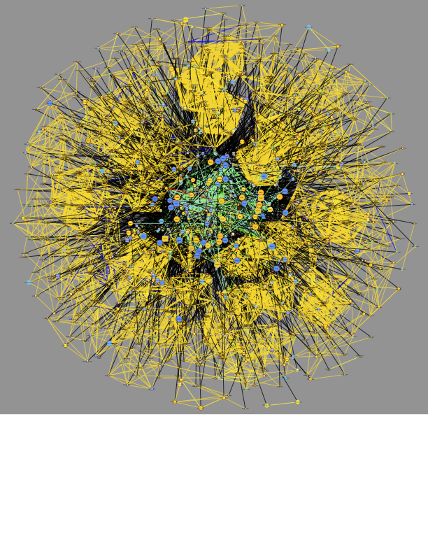

```{r setup, echo = FALSE}

knitr::opts_chunk$set(
  collapse = TRUE,
  comment = ">>",
  fig.align = "center",
  fig.path = "plots/",
  fig.width = 8,
  fig.height = 6,
  out.width = "100%",
  results = "hold"
)
```

This tutorial will load and create networks from the breast cancer
cohort (BRCA, N = 122), produced by

> **Proteogenomic landscape of breast cancer tumorigenesis and targeted
> therapy** Krug, K., Jaehnig, E. J., Satpathy, S., Blumenberg, L.,
> Karpova, A., Anurag, M., et al. *Cell* 183,
> 1436PTMsToPathways::name6.e31

And downloaded from Supplemental data S2 from

> **PhosphoDisco: A Toolkit for Co-regulated Phosphorylation Module
> Discovery in Phosphoproteomic Data** Schraink, T., Blumenberg, L.,
> Hussey, G., George, S., Miller, B., Mathew, N., Gonzalez-Robles, T.J.,
> Sviderskiy, V., Papagiannakopoulos, T., Possemato, R., et al. *Mol
> Cell Proteomics* 22, 100596. 10.1016/j.mcpro.2023.100596

First, let's load the PTMsToPathways package so its functions are
available:

```{r eval = TRUE}
library(PTMsToPathways)
```

### Preprocess data for PTMsToPathways functions

The BRCA data table described above is provided with the PTMsToPathways
package and and can be read in as follows:

```{r eval = TRUE}
file_path <- system.file("extdata", "PhosphoDiscoData_mmc9.txt", package = "PTMsToPathways")
newphos <- utils::read.table(file_path, header = TRUE,
                               stringsAsFactors = FALSE, sep = "\t", comment.char = "#",
                               na.strings = "", quote = "", fill = TRUE)
```

It has 4237 rows and 124 columns representing 4237 phosphosites and 122
samples with phosphoproteomic data.

```{r eval = TRUE}
dim(newphos)
```

The first two columns are `gene_symbol` and `variable_sites_names` which
we will use to create row names for the PTM table to match the expected
input format for the PTMsToPathways functions. The [Raw Data Processing
vignette](RawDataProcessing.html) gives another example of how to
process raw data tables to create the expected input format for the
PTMsToPathways functions. Here are the first few rows and columns of the
data frame:

```{r eval = TRUE}
head(newphos[, 1:5])
```

Now we will process the first two columns to create row names for the
PTM table. We extract the amino acid and the site number from the
`variable_sites_names` column and remove trailing letters from the site
number if they exist.

```{r eval = TRUE}
 newphos$Amino.Acid <- sapply(newphos$variable_sites_names, function(x) substring (x, 1, 1))
 newphos$Site <- trimws(substring(newphos$variable_sites_names, 2))
 newphos$Site <- sub("[a-z]$", "", newphos$Site)
 head(newphos[, c("gene_symbol", "variable_sites_names", "Amino.Acid", "Site")])
```

Now use the PTMsToPathways function `name.peptide` to create peptide
names for the row names of the PTM table.

```{r eval = TRUE}
 newphos$Peptide.Name <- mapply(
   name.peptide, genes = newphos$gene_symbol,
   sites =  newphos$Site, aa = newphos$Amino.Acid)
```

Create `ptmtable` with PTMs as rows and samples as columns for use in
the next steps, and remove the columns we used to create the row names.

```{r eval = TRUE}
phosdata <- newphos[, 3:ncol(newphos), ]
rownames(phosdata) <- newphos$Peptide.Name
phosdata <- phosdata[, !(names(phosdata) %in% c("gene_symbol", "variable_sites_names", "Amino.Acid", "Site", "Peptide.Name"))]
ptmtable <- phosdata
head(ptmtable[, 1:5])
```

### Create Clusters and Co-Cluster Correlation Networks (CCCNs)

Next, we create clusters and networks from those clusters as in the
[Creating Networks vignette](GettingStarted.html). This takes about 10
minutes on a laptop, so we provide both the code and the pre-computed
results for this step. To re-run the analysis, run, the following:

```{r eval = FALSE}
set.seed(88)
clusterlist.data <- MakeClusterList(ptmtable,
                                    keeplength = 3, toolong = 3.5)

```

Or load in pre-computed results from within the PTMsToPathways package:

```{r eval = TRUE}
clusterlist.data <- brca_clusterlist_data
CCCN.data <- brca_CCCN_data
```

Whether computed or loaded, the `cluster.data` and `CCCN.data` are lists
that contain the following elements:

```{r eval = TRUE}
common.clusters <- clusterlist.data[[1]]
adj.consensus.matrix <- clusterlist.data[[2]]
ptm.correlation.matrix <- clusterlist.data[[3]]
```

These are required to create the PTM and Gene co-cluster correlation networks.

```{r eval = TRUE}
CCCN.data <- MakeCorrelationNetwork(adj.consensus.matrix,
                                    ptm.correlation.matrix)
ptm.cccn.edges <- CCCN.data[[1]]
gene.cccn.edges <- CCCN.data[[2]]
gene.cccn.nodes <- CCCN.data[[3]]
```

We expect >200 common clusters:

```{r eval = TRUE}
length(common.clusters)
```

If desired, the clusters can be trimmed to those \> 4. This reduces the
number of clusters from 231 to 204.

```{r eval = TRUE}
cclength <- sapply(common.clusters, length)
common.clusters4 <- common.clusters[which(cclength>3)]
length(common.clusters4)
```

We can use [graph.ptm.by.cluster](references/graph.ptm.by.cluster.html)
to visualize these in a heatmap. To demonstrate, let's look at the
output for the first 3 clusters. PTMs are rows and samples are columns,
and color represents the value of the PTM in that sample. Black
indicates missing values.

```{r eval = TRUE, echo = FALSE}
fig_dir <- knitr::opts_current$get("fig.path")
```

```{r eval = TRUE}
dir.create(fig_dir, recursive = TRUE, showWarnings = FALSE)
output <- file.path(fig_dir, "ptm_all_clusters_l4.pdf")
res <- graph.ptm.by.cluster(
     ptmtable         = ptmtable,
     common.clusters  = common.clusters4[1:3],          # use all clusters > 4, only first 3
     filename         = output,
     order.rows       = "slope",
     zlim             = 3,
     show.row.labels  = FALSE,
     show.col.labels  = TRUE,
     col_cex          = 0.7
   )
knitr::include_graphics(output)
```

PTMsToPathways provides the function
[`EvaluateClusters`](references/EvaluateClusters.html) which computes
the following for each cluster:

- `intensity` = total signal after removing the NA fraction of samples
  for this cluster
- `realsamples` = samples that are not single-gene/PTM samples for this
  cluster
- `cleargenes` = genes/PTMs that fit a pattern that ranks by decreasing
  total signal
- `percent.NA` = percentage of missing values in the cluster sub-table

It also computes an `index` value for every cluster, which is a
composite value computed from the above. The output is ordered by this
`index` value, so we examine the top 10 clusters here:

```{r eval = TRUE}
eval_brca <- EvaluateClusters(
   common.clusters4, ptmtable,
   data.type  = "ratio",
   use.slope  = FALSE,
   index.mode = "density",
   verbose    = FALSE
 )
eval_brca[1:10, ]

```

### Build Cluster Filtered Networks (CFNs) and Pathway Crosstalk Networks (PCNs)

For PPI edges, the code below demonstrates how to get the STRING-db and
GeneMANIA edges from the static human PPI data downloaded as local files. These
files are available on [Zenodo](https://zenodo.org/records/20631767).
Alternatively, the PPI data
can be obtained from STRINGdb and GeneMANIA websites as demonstrated in the [getting started with P2P vignette](GettingStarted.html).

```{r eval = FALSE}
string_db_filepath <- "your/filepath/here.tsv"

# optional check that the nodenames are consistent with STRINGdb
sym.map <- StandardizeGeneSymbols(gene.cccn.nodes)
identical (unique(sym.map$standard_symbol), gene.cccn.nodes) 
# TRUE so no further action is required.
# If there were differences, replace symbol.map = NULL with symbol.map = sym.map
 
stringdb.edges <- GetSTRINGdb.edges(        gene.cccn.edges,
                                            gene.cccn.nodes,
                                            local = TRUE,
                                            string.local.path = string_db_filepath,
                                            combined.score.threshold = 400,
                                            include.transferred = TRUE,
                                            symbol.map = NULL)

```

To avoid downloading the large STRINGdb edge file, edges from the BRCA gene set can be loaded from within the package:

```{r eval = TRUE}
stringdb.edges <- BRCA_stringdb.edges
head(stringdb.edges)
```

The GeneMANIA human PPI edge file contains the following types of interactions: 
"Genetic Interactions", "Pathway", "Physical Interactions", and "Predicted."

We choose all but "Genetic Interactions" to include using the `gm.interaction.types` parameter in the following function. 

```{r eval = FALSE}
genemania_db_filepath <- "your/filepath/here.tsv"

genemania.edges <- GetGeneMANIA.edges (gm.all.edges.path,
                                gene.cccn.nodes,
                                local                = TRUE,
                                genemania.local.path = genemania_db_filepath,
                                gm.interaction.types = c("Pathway", "Physical Interactions", "Predicted"))
```

And again, to avoid downloading the large GeneMANIA edge file, BRCA gene edges can be loaded
from within the package:

```{r eval = TRUE}
genemania.edges <- BRCA_genemania.edges
head(genemania.edges)
```

Next, we retrieve kinase-substrate edges, then obain the cluster filtered
network, retaining PPIs only for proteins whose PTMs co-cluster, as demonstrated
in the [getting started vignette](GettingStarted.html).

```{r eval = TRUE}
file_path <- system.file("extdata", "Kinase_Substrate_Dataset.txt", package = "PTMsToPathways")
kinsub.edges <- GetKinsub.edges(file_path, gene.cccn.nodes)
```

Now we can build the CFN.
```{r eval = TRUE}
network.list <- BuildClusterFilteredNetwork(gene.cccn.edges,
                                            stringdb.edges,
                                            genemania.edges,
                                            kinsub.edges,
                                            db.filepaths = c())

combined.PPIs <- network.list[[1]]
cfn <- network.list[[2]]
dim(cfn)

cfn.merged <- mergeEdges(cfn)
dim(cfn.merged)
```

We build the PCN from the BioPlanet pathways as done previously. This
takes about a few minutes, so we provide both the code and the
pre-computed results for this step. To re-run the analysis, run the
following:

```{r eval = FALSE}
bioplanet.file <- system.file("extdata", "bioplanet_pathway_June2025.csv", package = "PTMsToPathways")
PCN.data <- BuildPathwayCrosstalkNetwork(common.clusters, bioplanet.file)
```

Or load in pre-computed results from within the PTMsToPathways package:

```{r eval = TRUE}
PCN.data <- BRCA_PCN.data
pathway.crosstalk.network <- PCN.data[[1]] # 679707 edges
PCNedgelist <- PCN.data[[2]]
pathways.list <- PCN.data[[3]]
dim(pathway.crosstalk.network)
```

Now we can explore these networks.

### Preprocess modules from Shraink et al.

We will examine the modules from Schraink, et al., 2023, Supplemental
Table S4. Per their description, the `HDBSCAN;min_cluster_size-4` column
assigns a module number to each phosphosite.

```{r eval = TRUE}
PD_module.file <- system.file("extdata", "PhosDiscoModules_mmc11.txt", package = "PTMsToPathways")

PD_module.df <- utils::read.table(PD_module.file, header = TRUE,
                  stringsAsFactors = FALSE, sep = "\t", comment.char = "#",
                  na.strings = "", quote = "", fill = TRUE)
dim(PD_module.df) # should be 1017 rows
head(PD_module.df)
```

We note that there are differences from the PTM table imported above. We will
work with those sites that match between `ptmtable` and `PD_module.df`.

```{r eval = TRUE}
length(intersect(newphos$variable_sites_names, PD_module.df$variableSites)) # 530
```

```{r eval = TRUE}
length(intersect(newphos$gene_symbol, PD_module.df$geneSymbol)) # 161
```

Make peptide names as above:

```{r eval = TRUE}

PD_module.df$Amino.Acid <- sapply(PD_module.df$variableSites, function(x) substring (x, 1, 1))
PD_module.df$Site <- trimws(substring(PD_module.df$variableSites, 2))
PD_module.df$Site <- sub("[a-z]$", "", PD_module.df$Site)

PD_module.df$Peptide.Name <- mapply(
  name.peptide, genes = PD_module.df$geneSymbol,
  sites =  PD_module.df$Site, aa = PD_module.df$Amino.Acid)
head(PD_module.df)
```

Treat modules like our clusters:

```{r eval=TRUE}
PD.module.list <- split(PD_module.df$Peptide.Name, PD_module.df$HDBSCAN.min_cluster_size.4)
length(PD.module.list)
PD.module.list$`68` 
```

Let's get the unique genes in each module to compare to the unique genes
in our clusters.

```{r eval = TRUE}
PD.module.genes.unique <- lapply(
  PD.module.list,
  function(x) unique(sub(" .*", "", x)))
PD.module.genes.unique$`68`
```

### Compare P2P clusters and Schraink, et al. modules

Let's see which of our clusters have intersections with module 63. We
will use this as an example to show how to explore the networks around a
particular module of interest.

```{r eval = TRUE}
mod63.intersect <- Filter(length, Map(intersect, common.clusters, list(PD.module.list$`63`)))
mod63.intersect
```

Interesctions of more than one PTM were found in several ConsensusClusters. 

There are >200 PTMs in the P2P clusters that intersect with module 63:

```{r eval = TRUE}
mod63.clust.ptms <- unlist(c(common.clusters$ConsensusCluster1, common.clusters$ConsensusCluster3, common.clusters$ConsensusCluster4, common.clusters$ConsensusCluster5, common.clusters$ConsensusCluster6))
length(mod63.clust.ptms)
```

P2P provides functions to prepare visualizations of these PTMs in
[Cytoscape](https://cytoscape.org/). First, we create a dataframe of
node information that can be used with `RCy3` functions to create a network in Cytoscape.

```{r eval = TRUE}
funckey <- function_key
cfn.cccn <- ptms_to_cfn(mod63.clust.ptms, cfn = cfn.merged, ptm.cccn.edges = ptm.cccn.edges, ptmtable = ptmtable, pepsep = ";")
cfn_cccn.nodes <- make.cytoscape.node.file(cfn.cccn, funckey, ptmtable,
                                           include.gene.data = TRUE,
                                           include.coclustered.PTMs = TRUE,
                                           ptm.cccn.edges = ptm.cccn.edges)
```

To graph in Cytoscape, use the P2P function `GraphCfn`:

```{r eval = FALSE}
g1 <- GraphCfn(cfn.edges = cfn.cccn, cfn.nodes = cfn_cccn.nodes,
               Network.title = "CFN/CCCN All PTMs 1", Network.collection = "PTMsToPathways")
 
```

The above would create a graph using Cytoscape, which would look like:

```{r eval = TRUE, echo = FALSE}

```

This is a complex graph that shows PTMs clusters as cliques connected by
yellow correlation edges surrounding a CFN of interconnected gene nodes.

Let's focus on CDK1 substrates to complement the work done in Schraink,
et al., 2023. There are 82 CDK1 edges.

```{r eval = TRUE}
cdk1.kinsub <- filter.edges.1("CDK1", kinsub.edges)
dim(cdk1.kinsub)
head(cdk1.kinsub)
```

Now let's get the needed information about these edges:

```{r eval = TRUE}
cdk1.substrates <- cdk1.kinsub [which(cdk1.kinsub$source=="CDK1"), "target"]
cfn_cccn.nodes.cdksubs <- cfn_cccn.nodes[cfn_cccn.nodes$Gene.Name %in% cdk1.substrates, ]

```

Two ways to select for CDK1 substrates are presented. Method 1: Using
`RCy3`.

```{r eval = FALSE}
RCy3::selectNodes(cfn_cccn.nodes.cdksubs$id, by = "id", preserve=FALSE)
Cy3::selectEdgesConnectingSelectedNodes()
RCy3::createSubnetwork(nodes = RCy3::getSelectedNodes(), edges = RCy3::getSelectedEdges(), nodes.by.col = "id", edges.by.col = "name")
```

Method 2: Using P2P functions.

```{r eval = FALSE}
cfn_cccn.nodes.cdksubs.edges <- filter.edges.0(nodenames = cfn_cccn.nodes.cdksubs$id, edge.file = cfn.cccn)

g2 <- GraphCfn(cfn.edges = cfn_cccn.nodes.cdksubs.edges, cfn.nodes = cfn_cccn.nodes.cdksubs,
               Network.title = "CFN/CCCN All PTMs 5", Network.collection = "PTMsToPathways")
```

Both methods give the same result, which looks like this:

```{r eval = TRUE, echo = FALSE}
knitr::include_graphics("vig_figs/CDKsub63_allPTMs_X03BR011.png")
```

Now further simplify the graph to show only CCCN PTMs.

```{r eval = FALSE}
cdksubs.genes <- unique(cfn_cccn.nodes.cdksubs$id)
cdksubs.cfn <- filter.edges.0(cdksubs.genes, cfn.merged)
cdksubs.cfn.cccn <- get.co.clustered.ptms(cdksubs.cfn, ptm.cccn.edges=ptm.cccn.edges)
cdksubs.cfn.cccn.nodes <- make.cytoscape.node.file(cdksubs.cfn.cccn, funckey, ptmtable,
                                           include.gene.data = TRUE,
                                           include.coclustered.PTMs = TRUE)
g3 <- GraphCfn(cfn.edges = cdksubs.cfn.cccn, cfn.nodes = cdksubs.cfn.cccn.nodes,
               Network.title = "CFN/CCCN All PTMs 6", Network.collection = "PTMsToPathways")
```

This gives the following graph:

```{r eval = TRUE, echo = FALSE}
knitr::include_graphics("vig_figs/CDKsub63_CCPTMs_X03BR011.png")
```

Each of these graphs can be modified to set node size and shape using
the following P2P functions that act on the front window in Cytoscape.
Note the differences that reflect activation of different cell signaling
pathways in tumors with different mutations: X02BR011 (AKT1 missense
mutant); X21BR010 (PIK3CA missense mutant); and X05BR045 (TP53 nonsense
and MLLT4 frameshift mutants).

```{r eval = FALSE}
setNodeColorToRatios(plotcol="X03BR011")
setNodeColorToRowz(plotcol="X03BR011")  # This exaggerates the node size and shape somewhat. 
setNodeColorToRatios(plotcol="X21BR010")
setNodeColorToRowz(plotcol="X21BR010")    
setNodeColorToRatios(plotcol="X05BR045")
setNodeColorToRowz(plotcol="X05BR045")
```

Note that different samples have dramatically different differences in
PTMs that are up or down, which is reflected also in total in gene
nodes.

### Session Info

```{r eval = TRUE}
sessionInfo()
```