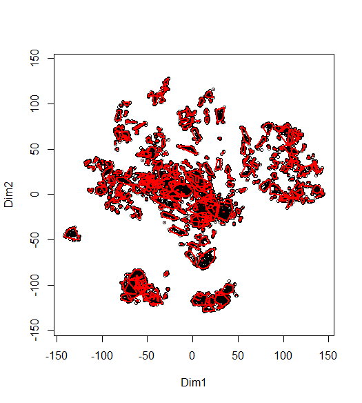
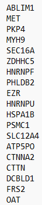
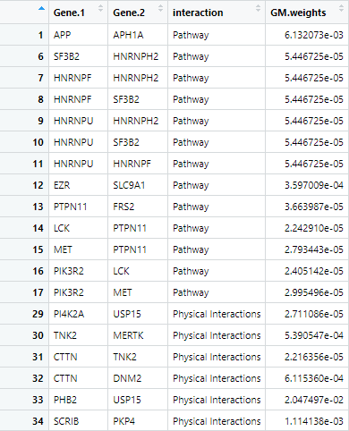
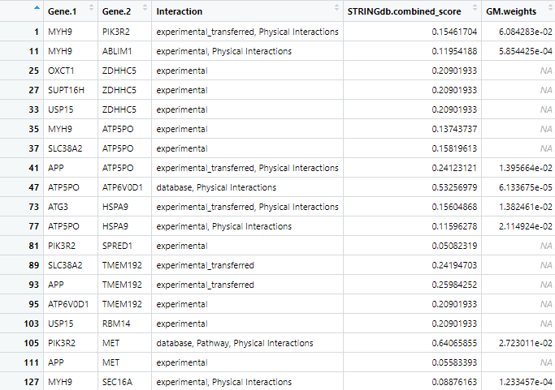
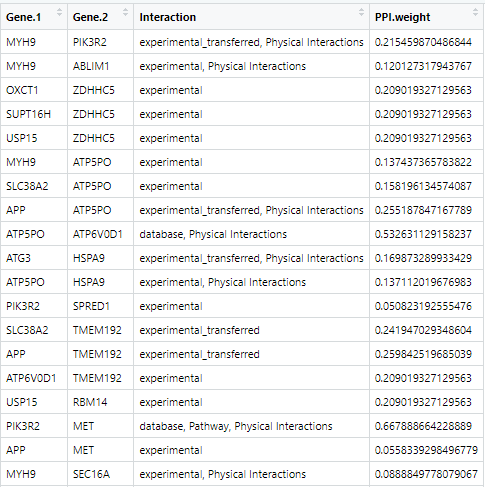

```{r setup, echo=FALSE}
knitr::opts_chunk$set(
  collapse = TRUE,
  comment = "#>",
  fig.path = "plots/",
  fig.width = 8,
  fig.height = 6,
  out.width = "100%",
  results = "hold"
)
```

# This Package  
The CCCN_CFN package takes experimental data of post-translational modifications based on experimental conditions and generates clusters of likely pathways. These pathways are generated based on analysis of which ptms cluster together (in their ptms based on the same environmental conditions) compared to how those proteins are known to interact (using the STRINGdb database).

**An important note about this package:** there are no returned outputs from any of the functions. All outputs listed are assigned to the Global Namespace in order to prevent loss of data and promote ease of use. Some functions also pull variables from the global namespace. Ensure that all data is loaded into the global environment especially if analysis is completed across multiple sessions.  

# This File  
This vignette is intended to be a step-by-step guide to walk users through the process of using the CCCN_CFN package. It includes an example pipeline demonstrating how to run the full analysis along with descriptions of each function. this pipeline must be run in order as subsequent steps require the data produced in previous steps. Estimated run-times are included with each description and are based on a preliminary dataset of \~9,000 post-translational modifications and 70 experimental conditions processed with a 12th Gen i5 processor and 8GB of RAM.  

# Pipeline  

## Step 1: Make Cluster List  

#### Code  

```{r eval = FALSE}
MakeClusterList(ptmtable, correlation.matrix.name = "ptm.correlation.matrix", list.name = "tsne.matrices", toolong = 3.5)
```

  
**Figure 1** Example plot produced by MakeClusterList calculated using Euclidean Distance  
  
  
**Figure 2** Output of MakeClusterList  

```{r echo = FALSE, eval = TRUE}
load('vig_figs/eu-clusters.rda')
head(eu_ptms_list, 1)
```
**Figure 3** First cluster created by Euclidean Distance  

#### Description  

Make Cluster List is the first step in the analyzing one's data. This function takes the post-translational modification table and runs it through three calculations of distance: Euclidean Distance, Spearman Dissimilarity (1 - |Spearman Correlation|), and the average of the two of these. These calculations find the 'distance' between ptms based upon under what conditions they occur. These matricies are then run through Tsne in order to put them into a 3-dimensional space. Please note: Tsne involves an element of randomness; in order to get the same results, set.seed(#) must be called. A correlation table is also produced based on the Spearman Correlation table.  

#### Input  
- ptmtable
  - A data frame with rows of ptms and columns of experimental conditions  
- correlation.matrix.name  
  - Desired name for the correlation matrix to be saved as; defaults to ptm.correlation.matrix
- list.name  
  - Desired name for the list of tsne data to be saved as; defaults to tsne.matrices
- toolong
  - Defaults to 3.5; threshold for cluster separation  

#### Output  
- ptm.correlation.matrix (or otherwise named by correlation.matrix.name)  
  - A data frame showing the correlation between ptms (as the rows and the columns). NAs are placed along the diagonal  
- tsne.matrices (or otherwise named by list.name)  
  - A list of three-dimensional data frames used to represent ptms in space to show relationships between them based on distances. Based on Euclidean Distance, Spearman Dissimilarity, and SED (the average between the two)  

#### Estimated run-time  
1hr 30mins

## Step 2: Make Correlation Network  

#### Code  

```{r eval = FALSE}
MakeCorrelationNetwork(tsne.matrices, ptm.correlation.matrix, keeplength = 2, common.clusters.name = "common.clusters", cccn.name = "cccn_matrix")
```

  
**Figure 4** First 17 rows and columns of the cccn_matrix produced by MakeCorrelationNetwork  

#### Description  

Make Correlation Network first finds the intersection between the Euclidian, Spearman, and SED Tsne matrices in order to find the intersection between the three groups. It then adds the Genes in these PTMs to a list of common clusters and turns it into an adjacency matrix. This adjacency matrix is used to filter relevant data --- clusters --- from the Spearman correlation matrix. The resultant cccn_matrix showing strength of relationships between proteins using the common clusters between the three distance metrics is returned a matrix.  

#### Input  
- tsne.matrices 
  - A list of three-dimensional data frames used to represent ptms in space to show relationships between them based on distances. Based on Euclidean Distance, Spearman Dissimilarity, and SED (the average between the two)  
- ptm.correlation.matrix  
  - A data frame showing the correlation between ptms (as the rows and the columns). NAs are placed along the diagonal. 
- keeplength  
  - Defaults to 2; MakeClusterList only saves subsets whose size is strictly *greater* than keeplength. (I.e. ['AARS', 'ABR'] will be discarded unless keeplength < 2)
- common.clusters.name  
  - Desired name for the common clusters output; defaults to common.clusters  
- cccn.name  
  - Desired name for the cocluster combined network matrix; defaults to cccn_matrix  

#### Output  
- common.clusters (or otherwise named by common.clusters.name)
  - The list of common clusters between all three distance metrics (Euclidean, Spearman, and SED)
- cccn_matrix (or otherwise named by cccn.name)  
  - A matrix showing strength of relationships between proteins using common clusters between the three distance metrics  

#### Estimated run-time  
2hrs 30mins  

## Pre-Step 3: Retrieve Alternate Edgefiles (OPTIONAL)  

### Description  

**NOTE:** This step is optional but provides more information for filtering data.  

This step requires more effort from the user than any other step but the package still attempts to simplify this process. First, the user runs make_db_input in order to produce a text file that has all of the gene names separated by new lines. This information can then be put into the user's choice of databases to find more interactions. If GeneMANIA on the Cytoscape app is the chosen database, another function (processGMedgefile) processes this file for the user. If other databases are used, the user of the package must process this data themselves. The file put into Step 3 should have three columns as follows: Gene.1, Gene.2, and the edgeweight of that specified database. Note that Gene.1 and Gene.2 are strict headers and must be named as such for proper integration with other PPI networks.

### Part 1: Get File for Database Input

#### Code  

```{r eval = FALSE}
MakeDBInput(cccn_matrix, file.path.name = "db_nodes.txt")
```

 
**Figure 5** First 15 lines from the produced text file  

#### Input   
- cccn_matrix  
  - A matrix showing strength of relationships between proteins using the common clusters between the three distance metrics  
- file.path.name  
  - Desired path for file to be saved as; defaults to db_nodes.txt  

#### Output  
- db_nodes.txt (or otherwise named by file.path.name)
  - A text file with the names of all of the genes   
  - Saved into the user's working directory unless otherwise stated in file.path.name  

#### Estimated run-time  
1s  

### Part 2 --- Process GeneMANIA File

#### Code  

```{r eval = FALSE}
ProcessGMEdgefile(gm.edgefile.path, gm.nodetable.path, nodenames, gm.network.name = "gm.network")
```

 
**Figure 6** First 44 rows of the GeneMANIA network 

#### Input   
- gm.edgefile.path  
  - Path to the GeneMANIA edgefile
- gm.nodetable.path  
  - Path to the GeneMANIA nodetable
- db_nodes.path  
  - Path to the nodenames file created in make_db_input
- gm.network.name  
  - Desired name for the output of the GeneMANIA network, defaults to gm.network

#### Output  
- gm.network (or otherwise named by gm.network.name)
  - A matrix consisting of the network between genes of study  
  - The user can use any database they'd like other than GeneMANIA, but the package processes only a GeneMANIA file  

#### Estimated run-time  
1min  

## Step 3: Find PPI Edges 

#### Code  

```{r eval = FALSE}
FindPPIEdges(cccn_matrix, db_file_paths = c(), ppi.network.name = "ppi.network")
```

  
**Figure 7** First 19 rows of the ppi_network produced by find_ppi_edges  

#### Description  

**Note:** Examples take about 5-10 minutes to run.

Protein-Protein Interaction (or PPI) networks are networks that show us how different proteins are known interact with each other. STRINGdb --- a database of these PPI networks --- is automatically consulted along with any other database files that are generated and entered by the user. It then gathers data from the PPI networks and filters them down to only examine the determined genes of interest. The data from STRINGdb and any provided files are then combined and returned. The returned data frame shows how strongly the proteins are known to interact.

#### Input  

- cccn_matrix  
  - A matrix showing strength of relationships between proteins using the common clusters between the three distance metrics  
- db_file_paths (optional pre-step 3)  
  - A vector of paths to the additional ppi network files. This is initialized to an empty vector  
- gm.network (optional pre-step 3)  
  - GeneMANIA network produced in optional pre-step 3; defaults to NA  
- ppi.network.name  
  - Desired name for the output of FindPPIEdges; defaults to ppi.network  

#### Output  
- ppi.network (or otherwise named by ppi.network.name)  
  - A dataframe representing how strongly proteins are known to interact  

#### Estimated run-time  
20mins (only using STRINGdb)

## Step 4: Cluster Filtered Network  

#### Code  

```{r eval = FALSE}
ClusterFilteredNetwork(cccn_matrix, ppi.network, cfn.name = "cfn")
```

  
**Figure 8** First 19 rows of the cfn_network produced by ClusterFilteredNetwork  

#### Description  

Cluster Filtered Network checks all of the edges in the PPI network to see ensure that both of the genes are within our cocluster correlation network and that its weight is nonzero. If either of these conditions are not met, then it will be removed from the list of PPI edges. This new, cluster filtered network is then returned.  

#### Input  
- cccn_matrix  
  - A matrix showing strength of relationships between proteins using the common clusters between the three distance metrics  
- ppi_network  
  - A dataframe representing how strongly proteins are known to interact  
- cfn.name  
  - Desired name for the output of ClusterFilteredNetwork; defaults to cfn  

#### Output  
- cfn (or otherwise named by cfn.name)
  - A version of ppi_network with only the edges that exist in cccn_matrix and have non-zero weights  
  - Note that the STRINGdb.combined_score is on a scale of 0-1000 while cor_weight (and GM.raw.weights) is on a scale of 0-1

#### Estimated run-time  
10mins

## Step 5: Pathway Crosstalk Network  

#### Code  

```{r eval = FALSE}
PathwayCrosstalkNetwork(file = "bioplanet.csv", clusterlist, PCN.jaccard.name = "pcn_jaccard_edges", PCN.CPE.name = "pcn_cpe_edges")
```

  
**Figure 9** Will exist at some point  

#### Description  

The final step in this pipeline is the PathwayCrosstalkNetwork.  

#### Input  
- file  
  - File path for the pathway data from Bioplanet  
- clusterlist  
  - List of clusters from MakeCorrelationNetwork  
- PCN.jaccard.name  
  - Desired name for an output of PathwayCrosstalkNetwork; defaults to pcn_jaccard_edges  
- PCN.CPE.name  
  - Desired name for an output of PathwayCrosstalkNetwork; defaults to pcn_cpe_edges  

#### Output  
- pcn_jaccard_edges (or otherwise named by PCN.jaccard.name)
  - output  
- pcn_cpe_edges (or otherwise named by PCN.CPE.name)
  - output  

#### Estimated run-time  
UNKNOWN


