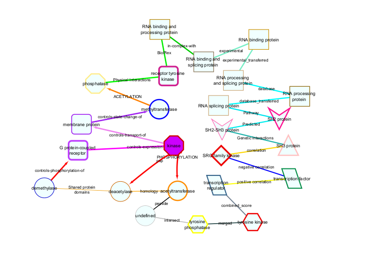

```{r setup, echo = FALSE}

knitr::opts_chunk$set(
  collapse = TRUE,
  comment = ">>",
  echo = TRUE,
  fig.align = "center",
  fig.path = "plots/",
  fig.width = 8,
  fig.height = 6,
  out.width = "100%",
  results = "hold"
)

```

The PTMsToPathways Package provides functions to aid in exploration of the resulting networks using the Cytoscape interface. If you have already run the steps in the [Creating Networks]("/GettingStarted.html"), you should already have all the data you need to visualize your networks. If not, we show how to access precomputed networks below. First, we describe some visualization choices and then give examples of using Cytoscape to explore data using a top down approach and a bottom up approach.

If you have not already libraried the package, do so now.

```{r eval = TRUE, echo = TRUE}
library(PTMsToPathways)
```

# Visualization Options

Cytoscape allows us to encode information in the visual network attributes node size, color, shape, and border and edge color, size, and arrow type. In this vignette, we use node attributes to represent the type of protein this gene is and edge attributes to represent different types of interactions from PPI databases, correlations, or links between proteins and their PTMs. Further details can be found by clicking to expand the following table.

<details>
<summary> Show Detailed Network Attribute Table </summary>
| Attribute | Options |
| --- | --- |
| Node Size | Greater the node size, larger the absolute value of the amount or ratio |
| Node Color | Blue: Negative ratio <br> Yellow: Positive ratio <br> Green: Approximately zero ratio |
| Node Shape | ELLIPSE: unknown <br> ROUND_RECTANGLE: Receptor Tyrosine Kinase <br> VEE: SH2 Protein or SH2-SH3 Protein <br> TRIANGLE: SH3 Protein <br> HEXAGON: Tyrosine Kinase <br> DIAMOND: SRC-family Kinase <br> OCTAGON: Kinase or Phosphatase <br> PARALLELOGRAM: Transcription Factor <br> RECTANGLE: RNA Binding Protein |
| Node Border Colors | Orange: Deacetylase or Acetyltransferase <br> Blue: Demethylase or Methyltransferase <br> Royal Purple: Membrane Protein <br> Red: Kinase, Tyrosine Kinase, or SRC-family Kinase <br> Yellow: Phosphatase or Tyrosine Phosphatase <br> Lilac: G Protein-Coupled Receptor <br> Grey: Default |
| Edge Colors | Red: Phosphorylation, pp, or Controls-Phosphorylation-of <br> Bright Magenta: Controls-Expression-of <br> Dull Magenta: Controls-Transport-of <br> Purple: Controls-state-change-of <br> Blood Orange: Acetylation <br> Lime Green: Physical Interactions <br> Green: BioPlex <br> Dull Green: In-Complex-With <br> Seafoam Green: Experiments or Experiments_Transferred <br> Cyan: Database or Database_Transferred <br> Teal: Pathway or Predicted <br> Dark Turquoise: Genetic Interactions <br> Yellow-Orange: Correlation <br> Royal Blue: Negative Correlation <br> Bright Yellow: Positive Correlation <br> Grey: Combined_Amount or Ratio <br> Dark Grey: Merged <br> Light Grey: Intersect <br> Black: Peptide <br> Orange: Homology <br> Dull Orange: Shared Protein Domains <br> White: Default |
| Arrow Types | Arrow: Phosphorylation, pp, Controls-Phosphorylation-of, Controls-Expression-of, Controls-Transport-of, Controls-State-Change-of, Acetylation <br> No Arrow: Default |
</details>  
<br>
To visualize the information in this table, [NodeEdgeKey](../reference/NodeEdgeKey.html) function generates an example network in Cytoscape like the one shown below.

```{r NodeEdgeKeyOutput, eval = TRUE, echo = FALSE}

```

Node information is based on a function key that maps gene names to a table of information regarding the gene. This may be provided by the user or PTMsToPathways provides an example dataset as [function_key](../reference/function_key.html).

```{r, label=visible-table, eval = FALSE, echo = TRUE}
head(function_key[1:3])
```

```{r, label=table-run, eval = TRUE, echo = FALSE}
knitr::kable(head(function_key[1:3]))
```

# Top-Down Approach

It is possible to graph the entire PCN, CFN, and CCCNs in their entirety, though
very large graphs take a long time to graph. One approach to navigating these
data structures is to select nodes from the large networks in Cytoscape (or in R
using `RCy3::selectNodes`) and select nearest neighbors or shortest paths and
create a subnetwork in a new window (see the [Cytoscape Manual](https://manual.cytoscape.org/en/stable/)).

The alternative approach described below is to identify pathways, genes, and
PTMs of interest in the R data objects, then make smaller, more interpretable
graphs in Cytoscape using RCy3.

We'll explore this approach using two different examples: investigating a pair of pathways and exploring signaling pathways that connect proteins.

## Investigate a Pair of Pathways

First, we read in Bioplanet pathways into `pathways.list` using the P2P function `ReadBioplanetFile`. Here, the name of each liist element is the name of a Bioplanet pathway that maps to a list of genes in that pathway.

```{r,  label = ReadBioPlanet, eval = TRUE}
bioplanet.path <- system.file("extdata", "bioplanet_pathway_June2025.csv", package = "PTMsToPathways")
pathways.list <- ReadBioplanetFile(bioplanet.file = bioplanet.path)
```

Next, we filter to the pathways that contain epidermal growth factor receptors (EGFRs).

```{r eval = TRUE}
egfr_pathways <- names(pathways.list)[sapply(1:length(pathways.list), function(x)
  {"EGFR" %in% pathways.list[[x]]})]
```

We expect 83 pathways that contain EGFR, so let's check:

```{r eval = TRUE}  
length(egfr_pathways)
```

Then, we want to find interactions between the pathway "Transmembrane transport of small molecules" and those pathways.
For now, we are manually adding an entry to `ex_pathway_crosstalk_network` so that the resulting filtered PCN has a row to work with.

```{r label = MakeEGFRTransporterPcn, eval = TRUE}
tempPcn = rbind(ex_pathway_crosstalk_network, data.frame(source = "Transmembrane transport of small molecules", target= "Endocytosis", Weight = 1, interaction = "PTM_cluster_evidence"))
egfr_transporter_pcn <- filter.edges.between(
  "Transmembrane transport of small molecules",
  egfr_pathways, tempPcn)
```

This filtered PCN can be passed into the function `cytoscape.graph.PCN.pathways` to visualize the resultant network.  
Note that this can go into Cytoscape because it has the Jaccard Similarity and Cluster Pathway Evidence (CPE) scores as distinct edges (rows). If you have Cytoscape installed and open, you can run the following code to visualize this new network.

```{r label = GraphEgfrPcn, eval = FALSE}
# Graph PCN
pcn.graph <- cytoscape.graph.PCN.pathways(
  PCN = egfr_transporter_pcn,
  net.name = "EGFR signaling and transmembrane transporters",
  Jaccard.edges = TRUE)
```

```{r GraphPCNOutput, eval = TRUE, echo = FALSE}
knitr::include_graphics("vig_figs/tempCytoscapePCN.png")
```

Let's zero in on interactions between proteins in the two pathways "EGF/EGFR signaling pathway" and "Transmembrane transport of small molecules" because they have no genes in common, yet the cluster evidence for their interaction is strong.

```{r label = ShowPathwayScores, eval = TRUE}
subset(tempPcn,
       source=="Transmembrane transport of small molecules" & target=="EGF/EGFR signaling pathway")
# should we check other direction?
```

First we extract a network of interactions between the genes in the two pathways. Then we generate a node file for Cytoscape. In the following case we include the data extracted from the ptmtable. This is optional, useful if node size and color is used later to indicate values in data.

```{r label = EGFRTransporter, eval = TRUE}
egfr_transporter.cfn <- filter.edges.0(c(
  pathways.list[["EGF/EGFR signaling pathway"]],
  pathways.list[["Transmembrane transport of small molecules"]]), ex_cfn)

egfr_transporter.nodes <- make.cytoscape.node.file(
  egfr_transporter.cfn, function_key, ex_small_ptm_table, include.gene.data = TRUE) 

```

### Generating the graph and setting node size and color

The function `GraphCfn` creates a graph using the cluster filtered network in the Cytoscape app. Cytoscape provides an interactive interface to view the data. This function requires the edge list file (`egfr_transporter.cfn` in the example), and node data file (`egfr_transporter.nodes`).

```{r label=GraphCfn, eval = FALSE}
GraphCfn(cfn.edges = egfr_transporter.cfn, cfn.nodes = egfr_transporter.nodes,
         Network.title = "CFN", Network.collection = "PTMsToPathways")
```

The following graph should then become visible in Cytoscape.
```{r label=Show2PathGraph, echo = FALSE, eval =TRUE}
knitr::include_graphics("vig_figs/TwoPathwaysCFN.png")
```

Let's color the nodes by the intensity of their response to Erlotinib. In general, we choose a ratio data column to show which proteins reacted to your study of choice.
```{r eval = FALSE}
setNodeColorToRatios(plotcol="PC9_ErlotinibRatio")
```

The existing cluster filtered networks retain parallel edges and self-loops. To consolidate these into a cleaner graph for the full cfn, you can run the following:
```{r eval = FALSE}
cfn.merged <- mergeEdges(ex_cfn)
```

Or just to the filtered cfn made above:
```{r eval = FALSE}
egfr_transporter.cfn.merged <- mergeEdges(egfr_transporter.cfn)
```

Let's look at the filtered cfn with merged edges in Cytoscape to compare:
```{r eval = FALSE}
GraphCfn(cfn.edges = egfr_transporter.cfn.merged,
         cfn.nodes = egfr_transporter.nodes,  Network.title = "CFN",
         Network.collection = "PTMsToPathways")
```

We again need to adjust the colors of the nodes to a specific interaction type as above.
```{r eval = FALSE}
setNodeColorToRatios(plotcol="PC9_ErlotinibRatio")
```

Note that within Cytoscape you can change the column for node size and color (two separate things) in the "Styles" tab.

## Exploring Signaling Pathways that Connect Proteins

Another example of how to use the network is to ask: What are the paths between two nodes (two proteins)? We use the function `connectNodes.all()` to identify all shortest paths between two nodes.

```{r eval = FALSE}
# SHOULD RUN WITH BIGGER DATASET
sp1 <- connectNodes.all(c("FYN", 'MET'), edgefile = cfn.merged)
```

Having identified the pathways, let's also zoom in further on PTMs to examine which PTMs co-cluster, as indicated by yellow edges between them. To include co-clustered PTMs in the network an extra step is necessary:

```{r eval = FALSE}
sp1_plus <- get.co.clustered.ptms(sp1)
sp1_plus.nodes <- make.cytoscape.node.file(sp1_plus, function_key, ptmtable,
                                           include.gene.data = TRUE,
                                           include.coclustered.PTMs = TRUE) 
```

As before, we can graph in Cytoscape and set the node color:

```{r eval = FALSE}
GraphCfn(cfn.edges = sp1_plus, cfn.nodes = sp1_plus.nodes,
         Network.title = "CFN/CCCN", Network.collection = "PTMsToPathways")

setNodeColorToRatios(plotcol = "H3122CrizotinibRatio")
```

# Bottom-Up Approach

## Example - Investigating how dasatinib affects proteins involved in focal adhesion

Dasatinib exhibits strong binding and inhibitory effects on multiple focal adhesion-associated genes from the BioPlanet list:

• SRC (proto-oncogene tyrosine-protein kinase Src)

• FYN (tyrosine-protein kinase Fyn)

• EGFR (epidermal growth factor receptor)

• ERBB2 (receptor tyrosine-protein kinase erbB-2)

All these genes are directly implicated in focal adhesion signaling regulation. We hypothesize that ptms on proteins involved in focal adhesion will be downregulated by dasatinib.

```{r eval = FALSE}
pt.sub <- ptmtable[, grep("DasatinibRatio", names (ptmtable))]
pt.sub$Sum.Dasat <- rowSums(pt.sub, na.rm = TRUE)
pt.sub <- pt.sub[order(pt.sub$Sum.Dasat, decreasing = FALSE), ]

pt.sub$Gene.Name <- sapply(rownames(pt.sub), function(x){
  unlist(strsplit(x, " ",  fixed=TRUE))[1]})

fa.genes <- pathways.list[["Focal adhesion"]]
pt.sub.fa <- pt.sub[pt.sub$Gene.Name %in% fa.genes,]
pt.sub.fa.topz <- pt.sub.fa[pt.sub.fa$Sum.Dasat < -2,]
ptms = rownames(pt.sub.fa.topz)

# Employ a helper function to derive a CFN starting with a list of PTMs
cfn.cccn <- ptms_to_cfn(ptms, cfn = cfn.merged, pepsep = ";")
cfn_cccn.nodes <- make.cytoscape.node.file(cfn.cccn, function_key, ptmtable,
                                           include.gene.data = TRUE,
                                           include.coclustered.PTMs = TRUE)

# Let's see what it looks like.
GraphCfn(cfn.edges = cfn.cccn, cfn.nodes = cfn_cccn.nodes,
         Network.title = "CFN/CCCN", Network.collection = "PTMsToPathways")

# Choose a ratio data column to show which proteins' PTMs were inhibited by a dasatinib
setNodeColorToRatios(plotcol="H366_DasatinibRatio")
setNodeColorToRatios(plotcol="H2286_DasatinibRatio")

# Note that within Cytoscape you can change the column for node size and color
# (two separate things) in the "Styles" tab
```
