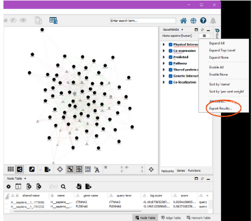

```{r setup, echo=FALSE}

knitr::opts_chunk$set(
  collapse = TRUE,
  comment = ">>",
  fig.align = "center",
  fig.path = "plots/",
  fig.width = 8,
  fig.height = 6,
  out.width = "100%",
  results = "hold"
)
```

This tutorial is
intended to be a step-by-step guide to walk users through the process of
using the P2P package. It includes descriptions of each
function and must be run in order as subsequent steps require the data
produced in previous steps. Example code and example outputs as well as
estimated run-times are included with each description and are based on
a preliminary dataset of \~9000 PTMs and 69 experimental conditions
processed with a 12th Gen i7 processor and 16GB of RAM.

**An important note:** The returned outputs from the functions are data
that may be saved in an RData object so that the user may reload the
data, which may take a while to generate, and pick up where they left
off later. See the bottom of this document for code to save your data
efficiently.

# Installing the Package

You will need to install the devtools package, which can be installed
with:

```{r eval=FALSE}
install.packages("devtools")
```

Next, install the package with:

```{r eval=FALSE}
devtools::install_github("UM-Applied-Algorithms-Lab/PTMsToPathways")
```
And load the package:
```{r}
library(PTMsToPathways)
```

# Starting Data

For the tutorial, we will be using two example datasets: a smaller
dataset consisting of 933 PTMs and 18 experimental conditions (the
example used in the [Raw Data Processing vignette](RawDataProcessing.html)) and a larger dataset
containing around 9000 PTMs and 69 experimental conditions. These
datasets are available with the package. Alternatively, the larger dataset can be
downloaded [here](https://github.com/UM-Applied-Algorithms-Lab/PTMsToPathways/raw/refs/heads/main/inst/extdata/AlldataPTMs.txt)
to be inspected locally.

To see all data that is provided with the package, run:

```{r eval = TRUE, echo = TRUE}
print(data(package = "PTMsToPathways"))
```

If you are using the smaller dataset, use the following code to view the
dimensions of the dataset and a small portion of it:

```{r eval = TRUE, echo = TRUE}
dim(ex_small_ptm_table)
ex_small_ptm_table[38:50, 1:2]
```

If you want to use the bigger dataset, the following code shows the
dimensions and a snippet of the dataset:

```{r eval = TRUE, echo = TRUE}
dim(ex_full_ptm_table)
ex_full_ptm_table[38:50, 1:2]
```

If you have downloaded the larger dataset locally, you can read it into
R using the following code:

```{r eval = FALSE, echo = TRUE}
allptmtable <- read.table("AlldataPTMs.txt", sep = "\t", skip = 0, header = TRUE,
                          blank.lines.skip = T, fill = T, quote = "\"", dec = ".",
                          comment.char = "", stringsAsFactors = F)
```

## Using Your Own Data

To use your own MS data, you will need
to transform it into a dataframe with PTMs and row names, experimental
conditions as column names, and numeric data as the entries.
Please refer to
the [Raw Data Processing vignette](RawDataProcessing.html) for a tutorial showing all steps needed
to transform an MS output file into a P2P package input dataframe.


# Step 1: Make Cluster List

`MakeClusterList` is the first step in the P2P process. This function
takes the dataframe `ptmtable` and runs it through three calculations of
statistical measures of distance: Euclidean Distance, Spearman
Dissimilarity (1- \|Spearman Correlation\|), and SED (the average of
both Spearman Dissimilarity (1- Spearman Correlation) and Euclidean
Distance). Combining the two dissimilarities leads to better resolution
of the data and is useful in pattern recognition. A correlation table---
`ptm.correlation.matrix`---is generated based on the distances
calculated for each pair of PTMs. The function then runs the matrices
through t-SNE to generate clusters based on the previously calculated
distance and provides you with a cluster list, `common.clusters`. The
returned `adj.consensus.matrix` (which identifies which PTMs cluster together
with a 'short distance' between them) and `ptm.correlation.matrix` are
also used in the next step to create co-cluster correlation networks
(CCCNs). These three outputs are returned as a list. 

The `keeplength` paramter defines the minimum number of PTMs that must be in a
cluster for it to be retained in the final output. The `toolong` parameter
defines the maximum distance between two PTMs for them to be considered
as clustering together.

`MakeClusterList` can be run like so:

```{r eval = TRUE, echo = TRUE}
set.seed(88)
clusterlist.data <- MakeClusterList(ex_small_ptm_table, keeplength = 2, toolong = 3.5)
```

The following unpacks the output into the separate objects discussed above:

```{r eval = TRUE, echo = TRUE}
common.clusters <- clusterlist.data[[1]]
adj.consensus.matrix <- clusterlist.data[[2]]
ptm.correlation.matrix <- clusterlist.data[[3]]
```

Now we can view the objects. First, here is an example of a cluster:

```{r eval = TRUE, echo = TRUE}
common.clusters[1]
```

Next, we look at a piece of the adjacency matrix. Ones represent a pair
that cluster and zeroes represent a pair that doesn't:

```{r eval = TRUE, echo = TRUE}
adj.consensus.matrix[7:10, 7:10]
```

Here is a part of the PTM correlation matrix. Values for pairs of PTMs
are Spearman correlation coefficients ranging from -1 to 1. If two PTMs had
no experimental conditions in common, their correlation value will be NA.

```{r eval = TRUE, echo = TRUE}
ptm.correlation.matrix[38:43, 1:2]
```

#### Estimated run-time (for large dataset)

\~60min

# Step 2: Make Co-Cluster Correlation Networks (PTM and Gene)

The data generated in the previous step is next used to create a
new network of PTMs that have strong associations called the Co-cluster
Correlation Network (CCCN). The Spearman correlations between
co-clustered PTMs are used as edge-weights in this network. The
MakeCorrelationNetwork function groups the PTM correlation matrices by
PTMs that co-cluster together to create a PTM CCCN. It then defines a
relationship between proteins modified by PTMs and creates a gene CCCN
with sum of the PTM correlations serving as edge weights. 

```{r eval = TRUE, echo = TRUE}
CCCN.data <- MakeCorrelationNetwork(adj.consensus.matrix, ptm.correlation.matrix)
ptm.cccn.edges <- CCCN.data[[1]]
gene.cccn.edges <- CCCN.data[[2]]
gene.cccn.nodes <- CCCN.data[[3]]
```
We can view a portion of the PTM CCCN edges:
```{r eval = TRUE, echo = TRUE}
ptm.cccn.edges[18:22,]
```
And a portion of the gene CCCN edges:
```{r eval = TRUE, echo = TRUE}
gene.cccn.edges[1:5,]
```
Finally, we can view a portion of the gene CCCN nodes, which are used
to map to external PPI databases in the next step:
```{r eval = TRUE, echo = TRUE} 
gene.cccn.nodes[1:5]
```

Because this step can take a long time to run on larger datasets, the output
may be saved as an RData object for later use. 

```{r eval = FALSE, echo = TRUE}
save.image(file = "filepath/name.RData") # All objects in the environment are saved
```

#### Estimated run-time (for large dataset)

\~10min

# Step 3: Retrieve Database Edgefiles

The third step of the P2P package is to gather data from multiple existing
protein-protein interaction (PPI) databases which will be integrated with
the data generated in steps 1 and 2. The P2P
package explicitly allows the users to integrate data from three
external databases: STRING, GeneMANIA, and PhosphoSite Plus. Other
databases can also be downloaded and added to the PPI network. All three
external databases have different interfaces for downloading data, so we show
how to retrieve data from each of them below.

### 1. STRINGdb

[STRINGdb](https://string-db.org/) can be queried directly from R using the `STRINGdb` package.
We wrap this query in a function called `GetSTRINGdb`, which queries only for the genes found in clusters 
in previous steps, and filters the returned by interaction type so only
`experimental`, `database`, `experimental_transferred`, and
`database_transferred` are retained. This ensures that only interactions
with more substantial evidence are used in this analysis.

```{r eval = TRUE, echo = TRUE}
stringdb.edges <- GetSTRINGdb(gene.cccn.edges, gene.cccn.nodes)
stringdb.edges[1:5,]
```

### 2. GeneMANIA

To our knowledge, no R package exists to programmatically query
[GeneMANIA](https://genemania.org/). Thus, we recommend using the GeneMANIA Cytoscape App
to retrieve PPI data as follows.

First, create an input file for GeneMANIA using the `MakeDBInput` function provided within P2P
(note that this creates a text file in your working directory):

```{r eval = TRUE, echo = TRUE}
MakeDBInput(gene.cccn.nodes, file.path.name = "db_nodes.txt")
```

Next, ensure that you have [Cystoscape](https://cytoscape.org/download.html) and the [GeneMANIA
extension](https://apps.cytoscape.org/apps/genemania) installed. 

Copy the contents of the `db_nodes.txt` file into the GeneMANIA App's "Genes of Interest" box and run query.

To save the results, click on the three lines in the upper right corner. This
should be under the GeneMANIA side window beside the species. Click "Export
Results". The path to this file is the gm.results.path:  

  
  

The `GetGeneMANIA.edges` function then processes the output file produced
by GeneMANIA itself. For example, we have saved `ex_gm_results.txt` as an
example output file from GeneMANIA within the package. The following code
shows how to use this file as input to the function. 

```{r eval = TRUE, echo = TRUE}
gm.results.path <- system.file("extdata", "ex_gm_results.txt", package = "PTMsToPathways")
genemania.edges <- GetGeneMANIA.edges(gm.results.path, gene.cccn.nodes)
```

We can see an example of the GeneMANIA edges below:
```{r eval = TRUE, echo = TRUE}
genemania.edges[1:5,]
```

### 3. Phosphosite Plus

The kinase-substrate data can be downloaded from [Phosphosite
Plus](https://www.phosphosite.org/staticDownloads) database. The users
will be required to create an account and sign in to download the data.
The `formatKinsubTable` function reads this downloaded data in and
formats it so that all the PPI edge data frames are in the same format
for the next step.

```{r eval = TRUE, echo = TRUE}
input.filename <- system.file("extdata", "Kinase_Substrate_Dataset.txt", package = "PTMsToPathways")
```

```{r eval = TRUE, echo = TRUE}
kinsub.edges <- formatKinsubTable(input.filename,
                                  gene.cccn.nodes)
```

# Step 4: Build PPI Network and Cluster Filtered Network

The `BuildClusterFilteredNetwork` function allows the users to filter
protein-protein interaction networks using the previously generated
co-cluster correlation networks. PPIs are retained in the cluster
filtered network (CFN) only if the interacting proteins share
statistically correlated PTMs identified via t-SNE clusters. The
`BuildClusterFilteredNetwork` function combines all the PPI data
downloaded in step 3 as efficiently as possible while retaining the
desired edge weights. It then normalizes the weights on a scale of 0-1
and gives an output cluster filter network that will only retain
interacting proteins whose genes are within the co-cluster correlation
network created in step 2.

We first run the function:

```{r eval = TRUE, echo = TRUE}
network.list <- BuildClusterFilteredNetwork(gene.cccn.edges, stringdb.edges,
                                            genemania.edges, kinsub.edges = NULL,
                                            db.filepaths = c())
```

And then unpack the outputs into separate variables:

```{r eval = TRUE, echo = TRUE}
combined.PPIs <- network.list[[1]]
cfn <- network.list[[2]]
```

To reduce clutter on graphs, the CFN edges can be merged:

```{r eval = TRUE, echo = TRUE}
cfn.merged <- mergeEdges(cfn)
```

# Step 5: Pathway Crosstalk Network

The final step is the creation of the Pathway Crosstalk Network (PCN). This
step requires input of an external database from [NCATS
BioPlanet](https://tripod.nih.gov/bioplanet/download/pathway.csv) that
contains groups of genes (proteins) involved in various cellular
processes known as pathways. `BuildPathwayCrosstalkNetwork` turns this data file into a list of
pathways and converts those pathways into a list of pathway-pathway edges, each of which is assigned
a Jaccard similarity and a Cluster-Pathway Evidence score based on the
common clusters found in the gene co-cluster correlation network.
Info about the
Cluster-Pathway Evidence score can be found
[here](https://journals.plos.org/ploscompbiol/article?id=10.1371/journal.pcbi.1010690)
For graphing in Cytoscape, the Cluster-Pathway Evidence and Jaccard
similarity edges are listed separately in the edgelist called
pathway.crosstalk.network.

```{r eval = TRUE, echo = TRUE}
bioplanet.file <- system.file("extdata", "pathway.csv", package = "PTMsToPathways")
```

```{r eval = TRUE, echo = TRUE}
PCN.data <- PathwayCrosstalkNetwork(common.clusters, bioplanet.file,
                                    createfile = FALSE)
pathway.crosstalk.network <- PCN.data[[1]]
PCNedgelist <- PCN.data[[2]]
pathways.list <- PCN.data[[3]]
```

# Saving Data

If you want to save your data to a file, all data structures can either
be exported with the save function and loaded later or saved to a csv
file with the write.csv function.

To save one object:
```{r eval = FALSE, echo = TRUE}
save(object, filename = "filepath/name.rda") # Saves object as an .rda
load("filepath/name.rda")                    # Loads object saved to a file
```

For multiple objects: Note the objects are saved as an .RData rather than an .rda

```{r eval = FALSE, echo = TRUE}
save(object1, object2, object.ect, filename="NewFile.RData")
```

To save one object as a csv:

```{r eval = FALSE, echo = TRUE}
utils::write.csv(object, file = "filepath/name.csv") # Saves object as a .csv
utils::read.csv(file = "filepath/name.csv")          # Loads object from .csv
```

You may also save your entire Global Environment namespace using the
save.image function as shown below:

```{r eval = FALSE, echo = TRUE}
save.image(file = "filepath/name.RData") # All objects in the environment are saved
```
