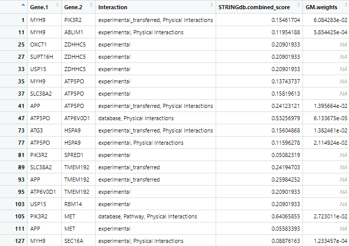

```{r setup, echo=FALSE}
knitr::opts_chunk$set(
  collapse = TRUE,
  comment = "#>",
  fig.align = "center",
  fig.path = "plots/",
  fig.width = 8,
  fig.height = 6,
  out.width = "100%",
  results = "hold"
)
```

<p> </p>

The PTMsToPathways package takes mass spectrometry data of
post-translational modifications under different experimental conditions
and implicates pathways that are involved. These pathways are generated
based on analysis of which ptms cluster together (based on the similar
reactiosn to the same environmental conditions) compared to how those
proteins are known to interact. This clustering information is also used
to find interactions between known, existing pathways.

**An important note about this package:** The returned outputs from
the functions are data that may be saved in an RData object so that the
user may reload the data, which may take a while to generate, and pick
up where they left off later.

<p> </p>

# Starting Data

This package provides an example data set using 497 ptms and 69
experimental conditions in the correct format for entry. Below is an
example selection of the input dataset:

```{r eval = TRUE, echo = TRUE}
dim(PTMsToPathways::ex.ptmtable)
PTMsToPathways::ex.ptmtable[38:50, 1:4]
```

Note that it is very important that the rownames are the names of
post-translational modifications. All of their respective columns are
the environmental conditions under which the post-translational
modifications occurred. NAs -- which are importantly not zeroes --
represent condition-PTM combinations that were not studied. The numeric
values are data output by the mass spectrometer. Ambigious PTMs, cases
where a PTM could be any one of several PTMs, should also be separated
by semicolons. (e.g. "AARS ubi k747; AMBLIL p U123").

<p> </p>

# Pre-Processing Data

For data that does not conform to the above structure, the data must be
converted. The following provides a set of general functions that may
assist in this process.

#### Importing the Dataframe

R supports many file types and can automatically convert them into a
data frame. For example, read.csv() will take a csv file and convert it
into a data frame. The csv file type is recommended for data storage.

```{r eval = FALSE, echo = TRUE}
ptmtable <- read.csv("Pathto/filename.csv")
View(ptmtable)
```

#### Turning Columns of PTMs into Rownames

If there is/are column(s) that contain parts of PTM names (e.g. the
first column may contain the protein, the second column may contain the
post-translational modification, and the third column may contain the
location), the following command concatenates those columns and converts
them into data frame. The vector "name.columns" is the indices of the
columns which contain names. For the example below, the strings in
columns 1, 2, and 3 will be concatenated in each row and then turned
into a rowname. It is also possible to have name.columns equal a vector
like c(2, 4, 6), which takes columns 2, 4, and 6.

```{r eval = FALSE, echo = TRUE}
name.columns <- 1:3 
rownames(ptmtable) <- sort(unlist(apply(ptmtable[name.columns], 1, paste, collapse=" ")))
ptmtable <- ptmtable[,-name.columns]
```

#### Replacing Patterns

If the list of PTMs possesses symbols that are unnecessary such as "AARS
\~K ubi K747", this command will remove all strings included in the
"patterns" vector from the rownames. Any pattern can be chosen so long
as the user ensures that any special character (such as \$ or \@) have a
"\\\\" in front of them.

```{r eval = FALSE}
patterns <- c(" ~K", "zzzz", "/", "\\$", "\\@")
patterns <- patterns[order(nchar(patterns), patterns, decreasing = TRUE)]
rownames(ptmtable) <- sapply(rownames(ptmtable), function(x) {for(p in patterns) x <- gsub(p, "", x); return(x)})
```

<p> </p>

# Pipeline

The following pipeline is intended to be a step-by-step guide to walk
users through the process of using the PTMsToPathways package. It
includes descriptions of each function. This pipeline must be run in
order as subsequent steps require the data produced in previous steps.
Example code and example outputs as well as estimated run-times are
included with each description and are based on a preliminary dataset of
\~9,000 post-translational modifications and 69 experimental conditions
processed with a 12th Gen i5 processor and 8GB of RAM.

<p> </p>

## Step 1: Make Cluster List

Make Cluster List is the first step in the analyzing one's data. This
function takes the post-translational modification table and runs it
through three calculations of distance: Euclidean Distance, Spearman
Dissimilarity (1 - \|Spearman Correlation\|), and the average of the two
of these. These calculations find the 'distance' between ptms based upon
under what conditions they occur. In other words, they found how
dissimilar each pair of PTMs are. These matricies are then run through
t-SNE in order to put them into a 3-dimensional space and the clusters
that are present in each present in each matrix are identified as well.
Please note: t-SNE involves an element of randomness due to pseudorandom
initialization or stochastic processes within the algorithm; in order to
get exactly the same results on multiple executions, set.seed(\#) must
be called (\# = any integer of choice). A correlation table is also
produced based on the Spearman Correlation values for each pair of PTMs.

#### Code

```{r eval = FALSE}
clusterlist.data <- MakeClusterList(ptmtable, keeplength = 2, toolong = 3.5)
common.clusters <- clusterlist.data[[1]]
adj.consensus <- clusterlist.data[[2]]
ptm.correlation.matrix <- clusterlist.data[[3]]
```

<center>

\

<p> </p>

**Figure 1** Example plot produced by MakeClusterList calculated using
Euclidean Distance. The Euclidean Distance between every PTM is
calculated and that information is put into a large matrix. This matrix
is then condensed using t-SNE to get coordinates in two-dimensional
space, which is what the above figure shows. These data points -- and
the PTMs they represent -- are put into clusters based on these
positions. This process is also undergone using Spearman Dissimilarity
and the average of Euclidean Distance and Spearman Dissimilarity.

<p> </p>

\

<p> </p>

**Figure 2** Output of MakeClusterList. Automatic print statements from
the function ordiplot from the package vegan.

<p> </p>


<p> </p>

**Figure 3** The second cluster created by Euclidean Distance. The left
column is the name of the PTM in this cluster. The right column is the
cluster number.

<p> </p>


<p> </p>

**Figure 4** The second common cluster. All six of these
post-translational modifications were clustered together whether
distance was calculated by Spearman, Euclidean, or the average.

<p> </p>


<p> </p>

**Figure 5** Coordinates of the t-SNE plot produced by Spearman
Dissimilarity. Each row is a ptm, and each column is its positional
location along the x, y, and z axes.

</center>

<p> </p>

#### Estimated run-time

2hrs 30mins

<p> </p>

## Step 2: Make Correlation Network

Next, Make Correlation Network is run to filter the correlation matrix
of PTMs by specific PTMs that cluster together or have react similarly
to the same conditions. It groups the PTM correlation matrix based on
the Genes of PTMs. By summing these submatrices, it produces a gene by
gene cocluster correlation network shows strength of relationships
between proteins using the common clusters between the three distance
metrics. The PTM version is also saved for analysis by the user.

#### Code

```{r eval = FALSE}
CCCN.data <- MakeCorrelationNetwork(common.clusters, ptm.correlation.matrix)
ptm.cccn.g <- CCCN.data[[1]]
gene.cccn.g <- CCCN.data[[2]]
ptm.cccn.edges <- CCCN.data[[3]]
gene.cccn.edges <- CCCN.data[[4]]
```

<center>


<p> </p>

**Figure 6** First 17 rows and columns of the ptm.cccn produced by
MakeCorrelationNetwork. PTMs that cluster together in all three distance
metrics have entries that represent how strongly they correlate, or how
alike their responses are under the same environment. PTMs that don't
cluster in all three distance metrics are correlated by an NA.
Self-correlations are also marked by an NA to prevent self-similarity
skewing.

<p> </p>


<p> </p>

**Figure 7** First 17 rows and columns of the genes.cccn produced by
MakeCorrelationNetwork. The ptm.cccn was condensed by combining all of
the scores between PTMs corresponding to one gene. These new summed
scores make up the scores of the genes.ccn. Self-correlations are marked
by an NA to prevent self-similarity skewing.

#### Estimated run-time

12hrs

<p> </p>

## Step 3: Retrieve Database Edgefiles

### Description

The third step of the PTMsToPathways pipeline is broken up into several
parts as there is a lot of choice for the user during each sub-step. PPI
(protein-protein interaction) databases are consulted in order to filter
the clusters by proteins that are known to interact with each other as
well as how strongly they are known to interact. The standard
recommended PPI database is STRINGdb; getting data from this database is
the first (optional) step. This is accomplished with the function
GetSTRINGdb. The function GetSTRINGdb requires the STRINGdb package to
be downloaded. Code for this is supplied with the code to run the
function itself. Please note, however, that the user may consult any
database that they choose. After getting STRINGdb data (or not), the
user runs MakeDBInput which produces a text file of all of their gene
names. This information can be copy and pasted into any database that
the user chooses in order to get data from other PPI networks. Step
three is getting a GeneMANIA network, which is also optional but
recommended. The user pastes their input data into GeneMANIA on the
Cytoscape app and saves the edgefile and the nodetable. These files are
then input into ProcessGMEdgefile in order to sort the data.

Note again that the database input can be used in any PPI database that
the user chooses, though this package only explicitly supports STRINGdb
and GeneMANIA. If another database is chosen, its file will have to be
filtered manually by the user before moving on to step 4. The file
should have four columns. Column one and two should strictly be labeled
"source" and "target" in order to integrate with other PPI databases.
Column three, "interaction", should name the interaction type between
the two proteins (these have different names in different PPI
databases). The fourth column, "Weight", should contain the edge weight
from the PPI databases. .

<p> </p>

### Part 1 --- Get STRINGdb Data

#### Code

```{r eval = FALSE}
if (!require("BiocManager", quietly = TRUE)) install.packages("BiocManager")
BiocManager::install("STRINGdb")

stringdb.edges <- GetSTRINGdb(gene.cccn)
```

<center>

\

<p> </p>

**Figure 8** First 18 rows of stringdb.edges produced by GetSTRINGdb.
The first two columns represent the genes that are known to interact.
The second column is the type of interaction. The GetSTRINGdb function
limits the interaction types to database, database_transferred (database
information from other species' that are homologous to humans),
experimental, and experimental_transferred (database information from
other species' that are homologous to humans). The final column is the
score associated with this interaction.

<p> </p>

\

<p> </p>

**Figure 9** First 18 rows of nodenames produced by GetSTRINGdb.
Nodenames is a data frame consisting of every gene in gene.cccn. This
represents all of the genes of the study (that cocluster).

</center>

<p> </p>

#### Estimated run-time

1hr

<p> </p>

### Part 2 --- Get File for Database Input

#### Code

```{r eval = FALSE}
MakeDBInput(gene.cccn, file.path.name = "db_nodes.txt")
```

<center>


<p> </p>

**Figure 10** First 15 lines from the produced text file named by
file.path.name. Lists all of the gene names separated by newlines with
no other extra characters for clean copy and pasting into a database
input.

</center>

<p> </p>

#### Estimated run-time

0s

<p> </p>

### Part 3 --- Process GeneMANIA File and read in Kinase Substrate Data from PhosphositePlus (<https://www.phosphosite.org/staticDownloads>)

#### Code

```{r eval = FALSE}
genemania.edges <- ProcessGMEdgefile(gm.edgefile.path, gm.nodetable.path, db_nodes.path)
kinsub.edges <- format.kinsub.table(kinasesubstrate.filename = "Kinase_Substrate_Dataset.txt")
```

<center>


<p> </p>

**Figure 11** The node table produced by the GeneMANIA query.

<p> </p>


<p> </p>

**Figure 12** The edge table produced by the GeneMANIA query.

<p> </p>


<p> </p>

**Figure 13** First 44 rows of the GeneMANIA network. The first two
columns represent the genes that are known to interact. The second
column is the type of interaction. The ProcessGmEdgefile function limits
the interaction types to Pathway and Physical Interactions. The final
column is the score associated with this interaction.

</center>

<p> </p>

#### Estimated run-time

10s

<p> </p>

## Step 4: Build PPI Network

The fourth step in the pipeline, BuildClusterFilteredNetwork, combines
the data of protein-protein interactions from each of the provided
databases. This package explicitly processes STRINGdb and GeneMANIA in
Step 3, but the user may consult as many databases as desired (the
processing for which is described in Step 3).
BuildClusterFilteredNetwork combines these databases as efficiently as
possible while retaining desired edgeweights from each database.
BuildClusterFilteredNetwork also normalizes the weights on a scale of
0-1 and removes duplicate rows from the data frame. The Cluster Filtered
Network, one of the final outputs of the package, checks all of the
edges in the PPI network to ensure that both of the genes are within the
cocluster correlation network created in step two and that its weight is
nonzero. If either of these conditions are not met, then it will be
removed from the list of PPI edges. This new, cluster filtered network
is then returned. The combined PPIs are all the PPIs for all genes in
the data. The cfn is about 12% of these filtered by PTM cluster data.

#### Code

```{r eval = FALSE}
network.list <- BuildClusterFilteredNetwork(stringdb.edges, genemania.edges, kinsub.edges, gene.cccn.edges, db.filepaths = c())
combined.PPIs <- network.list[[1]]
cfn <- network.list[[2]]
# To reduce clutter on graphs, the cfn edges can be merged:
cfn.merged <- mergeEdges(cfn)
```

<center>

\

<p> </p>

**Figure 14** First 19 rows of the ppi_network produced by
find_ppi_edges. The first two columns represent the two genes that
interact according to the consulted PPI databases. The third column is
all of the interaction types concatenated together from each database.
All subsequent columns (two, in the base case of just using STRINGdb and
GeneMANIA), show the weights of the interaction from the associated
database. These have been normalized to all be on a scale of 0-1.

</center>

<p> </p>

#### Estimated run-time

1hr (only using STRINGdb and GeneMANIA)

<p> </p>

<center>

\

<p> </p>

**Figure 15** First 19 rows of the cfn produced by
ClusterFilteredNetwork. The first two columns represent the two genes
that interact according to the consulted PPI databases. The third column
is all of the interaction types concatenated together from each
database. The final column is the sum of the weights from each inputted
database.

</center>

<p> </p>

#### Estimated run-time

10mins

<p> </p>

## Step 6: Pathway Crosstalk Network

**Note:** This step is directory sensitive. The user can check and set
the working directory in R using getwd() and setwd("yourdirectoryhere")
respectively. It needs a path to the bioplanet file and will put an
edgelist file in the working directory or the otherwise given path. If
the file cannot be found, please check the working directory first.

Step 6, our final analysis step, is the Pathway Crosstalk Network. This
step requires input of an external database, bioplanet, that contains
groups of genes (proteins) involved in various cellular processes known
as pathways. PCN turns this database into a list of pathways and
converts those pathways into a pathway x pathway edgelist (PCNedgelist)
that possesses multiple weights, a jaccard similarity, and a score. The
score is derived from Cluster-Pathway Evidence using the common clusters
found in Make Correlation Network. Info about the Cluster-Pathway
Evidence score can be found at:
<https://journals.plos.org/ploscompbiol/article?id=10.1371/journal.pcbi.1010690>.
For graphing in Cytoscape, the Cluster-Pathway Evidence and Jaccard
similarity edges are listed separately in the edgelist called
pathway.crosstalk.network.

#### Code

```{r eval = FALSE}
PCN.data <- PathwayCrosstalkNetwork(common.clusters, bioplanet.file = "bioplanet.csv", createfile = getwd())
pathway.crosstalk.network <- PCN.data[[1]]
PCNedgelist <- PCN.data[[2]]
pathways.list <- PCN.data[[3]]
```

<center>


<p> </p>

**Figure 16** The Pathway To Pathway Edgelist created by Pathway
Crosstalk Network. This table shows the relationships between each pair
of pathways represented in Bioplanet and the dataset as well as two
different scores for the strength of the interaction.

</center>

<p> </p>

#### Estimated run-time

UNKNOWN

<p> </p>

## Step 7: Graph Networks in Cytoscape

It is possible to graph the entire PCN, CFN, and CCCNs in their
entirety, though very large graphs take a long time to graph. One
approach to navigating these data structures is to select nodes from the
large networks in Cytoscape (or in R using RCy3::selectNodes()) and
select nearest neighbors or shortest paths and create a subnetwork in a
new window (see the Cytoscape Manual
<https://manual.cytoscape.org/en/stable/>).

The approach described below is to identify pathways, genes, and PTMs of
interest in the R data objects, then make smaller, more interpretable
graphs in Cytoscape using RCy3.

For example, we will find names of all pathways in Bioplanet that
contain EGFR. The data object 'pathways.list' is a list, where the name
of the list element is the name of a Bioplanet pathway and each element
is a character vector of the genes in that pathway. Then we want to find
interactions between the pathway "Transmembrane transport of small
molecules" and those pathways. The utility functions used below are in
CytoscapeGraphing.R

```{r eval = FALSE}
egfr_pathways <- names(pathways.list)[sapply(1:length(pathways.list),function(x){"EGFR" %in% pathways.list[[x]]})]
length(egfr_pathways) #83
egfr_transporter.pcn <- filter.edges.between("Transmembrane transport of small molecules", egfr_pathways, PCNedgelist)
egfr_transporter_pcn.cy <- filter.edges.between("Transmembrane transport of small molecules", egfr_pathways, pathway.crosstalk.network)
```

These two versions of the PCN show cluster evidence and Jaccard
smilarity in adjacent columns (the first case) or as distinct edges (the
second case, which can be used to plot this network in cytoscape).

```{r eval = FALSE}
# Graph PCN
pcn.graph.1 <- cytoscape.graph.PCN.pathways(PCN = egfr_transporter_pcn.cy, net.name="EGFR signaling and transmembrane transporters", Jaccard.edges=TRUE) 

```

Let's zero in on interactions between proteins in the two pathways
"EGF/EGFR signaling pathway" and "Transmembrane transport of small
molecules" because they have no genes in common. First we extract a
network of interactions between the genes in the two pathways. Then we
generate a node file for cytoscape. In the following case we include the
data extracted from the ptmtable. This is optional, useful if node size
and color is used later to indicate values in data.

```{r eval = FALSE}
egfr_transporter.cfn <- filter.edges.between(pathways.list[["EGF/EGFR signaling pathway"]], pathways.list[["Transmembrane transport of small molecules"]], cfn)
egfr_transporter.nodes <- make.cytoscape.node.file (egfr_transporter.cfn, funckey, ptmtable, include.gene.data = TRUE) 

```

The function GraphCfn creates a graph using the cluster filtered network
in the Cytoscape app. When graphed, Cytoscape provides an interactive
interface to view the data. This function requires the edge list file
(egfr_transporter.cfn in the example), and node data file
(egfr_transporter.nodes).

#### Code

```{r eval = FALSE}
GraphCfn(cfn.edges = egfr_transporter.cfn, cfn.nodes = egfr_transporter.nodes,  Network.title = "CFN", Network.collection = "PTMsToPathways")
# Choose a ratio data column to show which proteins' PTMs were inhibited by a drug
setNodeColorToRatios(plotcol="PC9.E3.ratio")
```

<center>

\

<p> </p>

**Figure 17** Default cytoscape graph. Nodes represent the genes of the
study. The score of each node is taken as the minimum value of the gene
in the ptmtable. Edges are the lines between the nodes and they
represent relationships. See the key below for a full description of
each characteristic.

</center>

<p> </p>

Let's now zoom in further on PTMs for a subset of proteins whose PTMs
were affected by the tyrosine kinase inhbitor.

```{r eval = FALSE}
egfr_ATP1A1 <- connectNodes.all(nodepair = c("EGFR", "ATP1A1"), ig.graph=NULL, edgefile=cfn, newgraph=TRUE)
# To include co-clustered PTMs in the network an extra step is necessary:
egfr_ATP1A1_plus <- get.co.clustered.ptms(egfr_ATP1A1)
egfr_ATP1A1.nodes <- make.cytoscape.node.file (egfr_ATP1A1_plus, funckey, ptmtable, include.gene.data = TRUE, include.PTM.data = TRUE) 

 # Now, graph in cytoscape
GraphCfn(cfn.edges = egfr_ATP1A1_plus, cfn.nodes = egfr_ATP1A1.nodes,  Network.title = "CFN/CCCN", Network.collection = "PTMsToPathways")
# Choose a ratio data column to show which proteins' PTMs were inhibited by a drug
setNodeColorToRatios(plotcol="PC9_ErlotinibRatio")
# Note that within Cytoscape you can change the column for node size and color (two separate tings) in the "Styles" tab
```

#### Dasatinib - focal adhesion

Dasatinib exhibits strong binding and inhibitory effects on multiple
focal adhesion-associated genes from your provided BioPlanet list: • SRC
(proto-oncogene tyrosine-protein kinase Src) • FYN (tyrosine-protein
kinase Fyn) • EGFR (epidermal growth factor receptor) • ERBB2 (receptor
tyrosine-protein kinase erbB-2) All these genes are directly implicated
in focal adhesion signaling regulation. We hypothesize that ptms on
proteins involved in focal adhesion will be downregulated by dasatinib.

```{r eval = FALSE}
pt.sub <- ptmtable[, grep("DasatinibRatio", names (ptmtable))]
pt.sub$Sum.Dasat <- rowSums(pt.sub, na.rm=TRUE)
pt.sub <- pt.sub[order(pt.sub$Sum.Dasat, decreasing=FALSE), ]
pt.sub$Gene.Name <- sapply(rownames(pt.sub),  function (x) unlist(strsplit(x, " ",  fixed=TRUE))[1])
fa.genes <- pathways.list[["Focal adhesion"]]
pt.sub.fa <- pt.sub[pt.sub$Gene.Name %in% fa.genes,]
pt.sub.fa.topz <- pt.sub.fa[pt.sub.fa$Sum.Dasat < -2,]
ptms = rownames(pt.sub.fa.topz)
# Employ a helper function to derive a cfn starting with a list of PTMs
cfn.cccn <- ptms_to_cfn(ptms, cfn = cfn.merged, pepsep = ";")
cfn_cccn.nodes <- make.cytoscape.node.file(cfn.cccn, funckey, ptmtable, include.gene.data = TRUE, include.coclustered.PTMs = TRUE)
# Let's see what it looks like.
GraphCfn(cfn.edges = cfn.cccn, cfn.nodes = cfn_cccn.nodes,  Network.title = "CFN/CCCN", Network.collection = "PTMsToPathways")
# Choose a ratio data column to show which proteins' PTMs were inhibited by a dasatinib
setNodeColorToRatios(plotcol="H366_DasatinibRatio")
setNodeColorToRatios(plotcol="H2286_DasatinibRatio")
# Note that within Cytoscape you can change the column for node size and color (two separate tings) in the "Styles" tab
```

#### Key

The thicker the edge is, the stronger the interaction between these two
genes. The border and shape of the node represent the type of protein
this gene is.

Node Size:

-   Greater the node size, larger the absolute value of the score

Node Color:

-   Blue Node
    -   Negative score\
-   Yellow Node
    -   Positive score\
-   Green Node
    -   Approximately zero score

Node Shapes:

-   "ELLIPSE"
    -   unknown\
-   "ROUND_RECTANGLE"
    -   receptor tyrosine kinase\
-   "VEE"
    -   SH2 protein\
    -   SH2-SH3 protein\
-   "TRIANGLE"
    -   SH3 protein\
-   "HEXAGON"
    -   tyrosine kinase\
-   "DIAMOND"
    -   SRC-family kinase\
-   "OCTAGON"
    -   kinase\
    -   phosphatase\
-   "PARALLELOGRAM"
    -   transcription factor\
-   "RECTANGLE"
    -   RNA binding protein

Node Border Colors:

-   Orange
    -   deacetylase\
    -   acetyltransferase\
-   Blue
    -   demethylase\
    -   methyltransferase\
-   Royal Purple
    -   membrane protein\
-   Red
    -   kinase\
    -   tyrosine kinase\
    -   SRC-family kinase\
-   Yellow
    -   phosphatase\
    -   tyrosine phosphatase\
-   Lilac
    -   G protein-coupled receptor\
    -   receptor tyrosine kinase\
-   Grey
    -   default

Edge Colors:

-   Red
    -   Phosphorylation\
    -   pp\
    -   controls-phosphorylation-of\
-   Bright Magenta
    -   controls-expression-of\
-   Dull Magenta
    -   controls-transport-of\
-   Purple
    -   controls-state-change-of\
-   Blood Orange
    -   Acetylation\
-   Lime Green
    -   Physical interactions\
-   Green
    -   BioPlex\
-   Dull Green
    -   in-complex-with\
-   Seafoam Green
    -   experiments\
    -   experiments_transferred\
-   Cyan
    -   database\
    -   database_transferred\
-   Teal
    -   Pathway\
    -   Predicted\
-   Dark Turquoise
    -   Genetic interactions\
-   Yellow-Orange
    -   correlation\
-   Royal Blue
    -   negative correlation\
-   Bright Yellow
    -   positive correlation\
-   Grey
    -   combined_score\
-   Dark Grey
    -   merged\
-   Light Grey
    -   intersect\
-   Black
    -   peptide\
-   Orange
    -   homology\
-   Dull Orange
    -   Shared protein domains\
-   White
    -   Default

Arrow Types:

-   Arrow

    -   Phosphorylation\
    -   pp\
    -   controls-phosphorylation-of\
    -   controls-expression-of\
    -   controls-transport-of\
    -   controls-state-change-of\
    -   Acetylation\

-   No Arrow

    -   Default

    These properties can be visualized in Cytoscape

    ```{r eval = FALSE, echo = TRUE}
    NodeEdgeKey()
    # The edges have different weights, large weights can be too thick and smaller weights can result in very thin lines
    setEdgeLineWidthMapping('Weight')
    # Edge widths can be adjusted using the following function. 
    setEdgeWidths(ffactor = 6, log=FALSE) #
    ```

#### Estimated run-time

Depends on the size of the network

<p> </p>

# Post-Processing Data

This is a completely optional step for users that want to visualize
their data in different ways or interact with it in a desktop
environment.

#### As an igraph Object

Most data structure outputs in this package are data frames or matrices
with columns of nodes and column(s) of weights. You will need to view
the data and manually set which two columns are the nodes and which
column is the edges. The following code creates an igraph named graph.

```{r eval = FALSE, echo = TRUE}
df <- yourdatastructure
nodecolumns <- c(1, 2)
edgecolumn <- 3

graph <- igraph::graph_from_data_frame( df[,nodecolumns], directed = FALSE )
igraph::E(graph)$weight <- df[,3]
```

#### Saving Data

If you want to save your data to a file, all data structures can either
be exported with the save function and loaded later or saved to a csv
file with the write.csv function.

```{r eval = FALSE, echo = TRUE}
save(object, filename = "filepath/name.rda") # Saves object as a .rda
load("filepath/name.rda")                    # Loads object saved to a file
# For multiple objects
save(object1, object2, object.ect, filename="NewFile.RData")
utils::write.csv(object, file = "filepath/name.csv") # Saves object as a .csv
utils::read.csv(file = "filepath/name.csv")          # Loads object from .csv
```

You may also save your entire Global Environment namespace using the
save.image function as shown below:

```{r eval = FALSE, echo = TRUE}
save.image(file = "filepath/name.RData")
```
