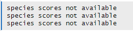

```{r setup, echo=FALSE}
knitr::opts_chunk$set(
  collapse = TRUE,
  comment = "#>",
  fig.align = "center",
  fig.path = "plots/",
  fig.width = 8,
  fig.height = 6,
  out.width = "100%",
  results = "hold"
)
```

# This Package  
The PTMsToPathways package takes mass-spectrometry data of post-translational modifications under different experimental conditions and implicates pathways that are involved. These pathways are generated based on analysis of which ptms cluster together (based on the same environmental conditions) compared to how those proteins are known to interact.

**An important note about this package:** there are no returned outputs from any of the functions. All outputs listed are assigned to the Global Namespace in order to prevent loss of data and promote ease of use.  

# This File  
This vignette is intended to be a step-by-step guide to walk users through the process of using the PTMsToPathways package. It includes an example pipeline demonstrating how to run the full analysis along with descriptions of each function. this pipeline must be run in order as subsequent steps require the data produced in previous steps. Estimated run-times are included with each description and are based on a preliminary dataset of \~9,000 post-translational modifications and 70 experimental conditions processed with a 12th Gen i5 processor and 8GB of RAM.  

# Starting Data  

Below is an example of the input dataset:  

```{r eval = TRUE, echo = FALSE}
PTMsToPathways::ex.ptmtable[38:50, 1:6]
```

Note that the rowname are not important and will not be used. The first column is the gene name associated with the protein. The second is the type of post-translational modification that occurred. The third column is the location of the post-translational modification. All of subsequent columns, regardless of how many there are, are the environmental conditions under which the post-translational modifications occurred. NAs -- which are importantly not zeroes -- represent condition-PTM combinations that were not studied while the numeric values are data output by the mass spectrometer.  

# Pipeline  

## Step 1: Make Cluster List  

#### Code  

```{r eval = FALSE}
MakeClusterList(ptmtable, correlation.matrix.name = "ptm.correlation.matrix", list.name = "clusters.list", toolong = 3.5)
```

<center>
  
**Figure 1** Example plot produced by MakeClusterList calculated using Euclidean Distance. The Euclidean Distance between every PTM is calculated and that information is put into a large matrix. This matrix is then condensed using t-SNE to get coordinates in two-dimensional space, which is what our figure shows. These data points -- and the PTMs they represent -- are put into clusters based on these positions. This process is also undergone using Spearman Dissimilarity and the average of Euclidean Distance and Spearman Dissimilarity.  
  
<p>&nbsp;</p>

  
**Figure 2** Output of MakeClusterList. This data is read as two rows: the top row represents the cluster number. This number isn't important in and of itself, it just differentiates between the different clusters. The second row represents the size, or how many PTMs are in that cluster.  

<p>&nbsp;</p>

```{r echo = FALSE, eval = TRUE}
load('vig_figs/eu-clusters.rda')
head(eu_ptms_list, 1)
```
**Figure 3** First cluster created by Euclidean Distance. The left column is the name of the PTM in this cluster. The right column is the cluster number.  

</center>
<p>&nbsp;</p>

#### Description  

Make Cluster List is the first step in the analyzing one's data. This function takes the post-translational modification table and runs it through three calculations of distance: Euclidean Distance, Spearman Dissimilarity (1 - |Spearman Correlation|), and the average of the two of these. These calculations find the 'distance' between ptms based upon under what conditions they occur. In other words, they found how dissimilar each pair of PTMs are. These matricies are then run through t-SNE in order to put them into a 3-dimensional space. Please note: t-SNE involves an element of randomness; in order to get the same results, set.seed(#) must be called. A correlation table is also produced based on the Spearman Correlation table.  

#### Input  
- ptmtable
  - A data frame of post-translational modifications. Formatted with numbered rows and the first column containing PTM names. The rest of the column names should be drugs (experimental conditions). Values of the table are numeric values that represent how much the PTM has reacted to the drug or NA if that PTM wasn't studied under that condition.  
- correlation.matrix.name  
  - Desired name for the correlation matrix to be saved as; defaults to ptm.correlation.matrix  
- list.name  
  - Desired name for the lists of clusters to be saved as; defaults to clusters.list  
- toolong
  - Threshold for cluster separation; defaults to 3.5  

#### Output  
- ptm.correlation.matrix (or otherwise named by correlation.matrix.name)  
  - A data frame showing the correlation between ptms (as the rows and the columns). NAs are placed along the diagonal so as to not skew the data with self-similarity  
- clusters.list (or otherwise named by list.name)  
  - A list of three-dimensional data frames used to represent ptms in space to show relationships between them based on distances. Based on Euclidean Distance, Spearman Dissimilarity, and SED (the average between the two)  

#### Estimated run-time  
1hr 30mins

## Step 2: Make Correlation Network  

#### Code  

```{r eval = FALSE}
MakeCorrelationNetwork(clusterlist, ptm.correlation.matrix, keeplength = 2, clusters.name = "clusters.common", filtered.ptm.cor.name = "filtered.cor.matrix", cccn.name = "cccn.matrix")
```

<center>
  
**Figure 4** First 17 rows and columns of the cccn_matrix produced by MakeCorrelationNetwork. PTMs that cluster together in all three distance metrics have entries that represent how strongly they correlate, or how alike their responses are under the same environment. PTMs that don't cluster in all three distance metrics are correlated by a 0. Self-correlations are also marked by a 0 to prevent self-similarity skewing.  

</center>
<p>&nbsp;</p>

#### Description  

Make Correlation Network first finds the intersection between the Euclidian, Spearman, and SED cluster matrices in order to find the intersection between the three groups. It then adds the Genes in these PTMs to a list of common clusters and turns it into an adjacency matrix with two variants, one at the PTM level and one at the gene level. This adjacency matrix is used to filter relevant data --- clusters --- from the Spearman correlation matrix. The resultant cocluster correlation network shows strength of relationships between proteins using the common clusters between the three distance metrics.  

#### Input  
- clusterlist 
  - A list of three-dimensional data frames used to represent ptms in space to show relationships between them based on distances. Based on Euclidean Distance, Spearman Dissimilarity, and SED (the average between the two)  
- ptm.correlation.matrix  
  - A data frame showing the correlation between ptms (as the rows and the columns). NAs are placed along the diagonal so as to not skew the data with self-similarity.  
- keeplength  
  - MakeClusterList only saves subsets whose size is strictly *greater* than keeplength; defaults to 2
  - example: ['AARS', 'ABR'] will be discarded unless keeplength < 2
- clusters.name  
  - Desired name for the common clusters output; defaults to common.clusters
- filtered.ptm.cor.name
  - Desired name for the correlation matrix that contains only PTMs found in common clusters
- cccn.name  
  - Desired name for the cocluster correlation network matrix; defaults to cccn.matrix  

#### Output  
- common.clusters (or otherwise named by common.clusters.name)
  - The list of common clusters between all three distance metrics (Euclidean, Spearman, and SED)  
- cccn.matrix (or otherwise named by cccn.name)  
  - A matrix showing strength of relationships between proteins using common clusters between the three distance metrics  

#### Estimated run-time  
2hrs 30mins  

## Step 3: Retrieve Database Edgefiles  

### Description  

PPI (protein-protein interaction) databases are consulted in order to filter the clusters by proteins that are known to interact with each other as well as how strongly they are known to interact. The standard PPI database that is used is STRINGdb, and getting data from this database is the first step. This is accomplished with the function GetSTRINGdb. Please note, however, that the user may consult any database that they choose. After getting STRINGdb data (or not), the user runs MakeDBInput which produces a text file of all of their gene names. This information can be copy and pasted into any database that the user chooses in order to get other PPI networks. Step three is getting a GeneMANIA network, which is also optional but recommended. The user pastes their input data into GeneMANIA on the Cytoscape app and saves the edgefile and the nodetable. These files are then input into ProcessGMEdgefile in order to sort the data.  

Note again that the database input can be used in any PPI database that the user chooses, though this package only explicitly supports STRINGdb and GeneMANIA. If another database is chosen, its file will have to be filtered manually by the user before moving on to step 4. The file should have three columns. Column one and two should strictly be labeled "Gene.1" and "Gene.2" in order to integrate with other PPI databases. The third column should contain the edgeweight and may be named however the user chooses. It is recommended, though, that the database is specified as well as the term 'weight' in the column name.  

### Part 1 --- Get STRINGdb Data

#### Code  

```{r eval = FALSE}
GetSTRINGdb(cccn.matrix, stringdb.name = "stringdb.edges", nodenames.name = "nodenames")
```

<center>
  
**Figure 5** First 18 rows of stringdb.edges produced by GetSTRINGdb  

<p>&nbsp;</p>

  
**Figure 6** First 18 rows of nodenames produced by GetSTRINGdb  

</center>
<p>&nbsp;</p>

#### Input   
- cccn.matrix  
  - A matrix showing strength of relationships between proteins using the common clusters between the three distance metrics  
- stringdb.name  
  - Desired name for STRINGdb data; defaults to stringdb.edges  
- nodenames.name  
  - Desired name for list of gene names; defaults to nodenames

#### Output  
- stringdb.edges (or otherwise named by STRINGdb.name)  
  - Data frame of consisting of the network of interactions from the genes of study pulled from the STRINGdb database  
- nodenames (or otherwise named by nodenames.name)  
  - List of gene names  

#### Estimated run-time  
30 mins  

### Part 2 --- Get File for Database Input

#### Code  

```{r eval = FALSE}
MakeDBInput(cccn.matrix, file.path.name = "db_nodes.txt")
```

<center>
  

**Figure 7** First 15 lines from the produced text file  

</center>
<p>&nbsp;</p>

#### Input   
- cccn.matrix  
  - A matrix showing strength of relationships between proteins using the common clusters between the three distance metrics (Euclidean, Spearman, and Combined (SED))  
- file.path.name  
  - Desired path for file to be saved as; defaults to db_nodes.txt  

#### Output  
- db_nodes.txt (or otherwise named by file.path.name)  
  - A text file with the names of all of the genes   
  - Saved into the user's working directory unless otherwise stated in file.path.name  

#### Estimated run-time  
1s  

### Part 3 --- Process GeneMANIA File

#### Code  

```{r eval = FALSE}
ProcessGMEdgefile(gm.edgefile.path, gm.nodetable.path, db_nodes.path, gm.network.name = "gm.network")
```

<center>
  

**Figure 8** First 44 rows of the GeneMANIA network  

</center>
<p>&nbsp;</p>

#### Input   
- gm.edgefile.path  
  - Path to the GeneMANIA edgefile
- gm.nodetable.path  
  - Path to the GeneMANIA nodetable
- db_nodes.path  
  - Path to the nodenames file created in make_db_input
- gm.network.name  
  - Desired name for the output of the GeneMANIA network, defaults to gm.network

#### Output  
- gm.network (or otherwise named by gm.network.name)
  - Data frame of consisting of the network of interactions from the genes of study

#### Estimated run-time  
10s  

## Step 4: Build PPI Network  

#### Code  

```{r eval = FALSE}
BuildPPINetwork(stringdb.edges = NA, gm.network = NA, db.filepaths = c(), ppi.network.name = "ppi.network")
```

<center>
  
**Figure 9** First 19 rows of the ppi_network produced by find_ppi_edges  

</center>
<p>&nbsp;</p>

#### Description  

**Note:** Examples take about 5-10 minutes to run.

The purpose of BuildPPINetwork is to combine the data about desired protein-protein interactions from each of the provided databases. This package explicitly processes STRINGdb and GeneMANIA in Step 3, but the user may consult as many databases as desired (the processing for which is described in Step 3). BuildPPINetwork combines these databases as efficiently as possible while retaining desired edgeweights from each database. BuildPPINetwork also removes duplicate rows from the data frame.  

#### Input  

- stringdb.edges (produced optionally in step 3)  
  - Data frame of consisting of the network of interactions from the genes of study pulled from the STRINGdb database; defaults to NA  
- gm.network (produced optionally in step 3)  
  - GeneMANIA network of protein-protein interactions from the genes of study; defaults to NA  
- db.filepaths (produced optionally in step 3)  
  - A vector of paths to the additional ppi network files; defaults to an empty vector  
- ppi.network.name  
  - Desired name for the output protein-protein interaction network using all entered database input; defaults to ppi.network  

#### Output  
- ppi.network (or otherwise named by ppi.network.name)  
  - A dataframe representing how strongly proteins are known to interact based on previous research contained within provided database networks

#### Estimated run-time  
1hr (only using STRINGdb and GeneMANIA)

## Step 5: Cluster Filtered Network  

#### Code  

```{r eval = FALSE}
ClusterFilteredNetwork(cccn.matrix, ppi.network, cfn.name = "cfn")
```

<center>
  
**Figure 10** First 19 rows of the cfn produced by ClusterFilteredNetwork  

</center>
<p>&nbsp;</p>

#### Description  

Cluster Filtered Network checks all of the edges in the PPI network to see ensure that both of the genes are within our cocluster correlation network and that its weight is nonzero. If either of these conditions are not met, then it will be removed from the list of PPI edges. This new, cluster filtered network is then returned.  

#### Input  
- cccn.matrix  
  - A matrix showing strength of relationships between proteins using the common clusters between the three distance metrics  
- ppi.network  
  - A dataframe representing how strongly proteins are known to interact  
- cfn.name  
  - Desired name for the output of ClusterFilteredNetwork; defaults to cfn  

#### Output  
- cfn (or otherwise named by cfn.name)
  - A version of ppi.network with only the edges that exist in cccn.matrix and have non-zero weights  

#### Estimated run-time  
10mins

## Step 6: Pathway Crosstalk Network  

#### Code  

```{r eval = FALSE}
PathwayCrosstalkNetwork(file = "bioplanet.csv", common.clusters, edgelist.name = "edgelist")
```

<center>

 

**Figure 12** Graph in Cytoscape - Didn't add cuz not good yet Will exist at some point  

</center>
<p>&nbsp;</p>

#### Description  

Note: This step is directory sensitive. You can check and set your directory in R using getwd() and setwd("yourdirectoryhere") respectively. It needs a path to the bioplanet file and will put an edgelist file in your working directory, or getwd(). If you cannot find a file, please check your directories first.  

Pathway Crosstalk Network is the final step in the pipeline. It requires input of an external database, bioplanet, which consists of groups of genes (proteins) involved in various cellular processes. The PCN turns this database into a list of pathways and converts those pathways into a pathway x pathway edgelist that possesses multiple weights, a jaccard similarity and a score derrived from Cluster-Pathway Evidence using common clusters found in Make Correlation Network.  

#### Input  
- file  
  - File path for the pathway data from Bioplanet (can also take in a data frame that is formatted correctly like the one found in the data directory, but this is not recommended as formatting must match sample data exactly)  
- common.clusters  
  - The list of common clusters between all three distance metrics (Euclidean, Spearman, and SED) made by MakeCorrelationNetwork  
- edgelist.name
  - Intended for use in Cytoscape.  
  - The desired name of the Pathway to Pathway edgelist file created ('.csv' will automatically be added to the end for you); defaults to edgelist  

#### Output  
- edgelist (or otherwise named by edgelist.name)  
  - An edgelist file that is created in the working directory. Contains pathway source-target columns, with edge weights of their jaccard similarity and their Cluster-Pathway Evidence score. Info about the Cluster-Pathway Evidence score can be found at: <https://journals.plos.org/ploscompbiol/article?id=10.1371/journal.pcbi.1010690>

#### Estimated run-time  
UNKNOWN

## Step 7: Graph Cluster Filtered Network  

#### Code  

```{r eval = FALSE}
GraphCfn(cfn, Network.title = "cfn", Network.collection = "PTMsToPathways",
                     background.color = '#fcf3cf', edge.label.color = '#17202a', edge.line.color = '#abb2b9', node.border.color = '#145a32',
                     node.label.color = '#145a32', node.fill.color = '#a9dfbf',
                     default.font = "Times New Roman", node.font.size = 12, edge.font.size = 8,
                     edge.line.style = 'SOLID', source.arrow = 'NONE', target.arrow = 'NONE', node.shape = "OCTAGON",
                     node.size = 50, edge.width = 2, border.width = 1,
                     edge.opacity = 175, edge.label.opacity = 255, border.opacity = 255, node.label.opacity = 255, node.fill.opacity = 255)
```

<center>
  
**Figure 13** Default cytoscape graph  

</center>
<p>&nbsp;</p>

#### Description  

This optional function GraphCfn creates a graph using the cluster filtered network in the Cytoscape app.

#### Input  
- cfn  
  - A version of ppi.network with only the edges that exist in cccn.matrix and have non-zero weights  
-Network.title  
  - Desired title for the created Cytoscape Network  
- Network.collection  
  - Desired name for the collection created on Cytoscape in which the network will reside  

- background.color  
  - Hex code of background color of graph; defaults to '#fcf3cf'  
- edge.label.color  
  - Hex code of edge label color of graph; defaults to '#17202a'  
- edge.line.color  
  - Hex code of edge line color of graph; defaults to '#abb2b9'  
- node.border.color  
  - Hex code of node border color of graph; defaults to '#145a32'  
- node.label.color  
  - Hex code of node label color of graph; defaults to '#145a32'  
- node.fill.color  
  - Hex code of node fill color of graph; defaults to '#a9dfbf'  

- default.font  
  - Font style of edge and node names; defaults to "Times New Roman"  
- node.font.size  
  - Font size of the node name; defaults to 12  
- edge.font.size  
  - Font size of the edge name; defaults to 8  

- edge.line.style  
  - Type of edge style; defaults to "SOLID"  
  - options include: "PARALLEL_LINES", "MARQUEE_EQUAL", "DOT", "EQUAL_DASH", "LONG_DASH", "CONTIGUOUS_ARROW", "MARQUEE_DASH", "DASH_DOT", "BACKWARD_SLASH", "FORWARD_SLASH", "VERTICAL_SLASH", "SOLID", "SEPARATE_ARROW", "MARQUEE_DASH_DOT", "ZIGZAG", "SINEWAVE"  
- source.arrow  
  - Type of arrow coming from the source gene; defaults to "NONE"  
  - options include: "DELTA", "DIAMOND", "OPEN_CIRCLE", "CIRCLE", "OPEN_HALF_CIRCLE", "CROSS_OPEN_DELTA", "DELTA_SHORT_1", "CROSS_DELTA", "OPEN_DELTA", "OPEN_DIAMOND", "DIAMOND_SHORT_1", "DELTA_SHORT_2", "OPEN_SQUARE", "NONE", "SQUARE", "DIAMOND_SHORT_2", "T", "HALF_BOTTOM", "HALF_TOP", "ARROW_SHORT", "HALF_CIRCLE"  
- target.arrow  
  - Type of arrow going to the target gene; defaults to "NONE"  
  - options include: "DELTA", "DIAMOND", "OPEN_CIRCLE", "CIRCLE", "OPEN_HALF_CIRCLE", "CROSS_OPEN_DELTA", "DELTA_SHORT_1", "CROSS_DELTA", "OPEN_DELTA", "OPEN_DIAMOND", "DIAMOND_SHORT_1", "DELTA_SHORT_2", "OPEN_SQUARE", "NONE", "SQUARE", "DIAMOND_SHORT_2", "T", "HALF_BOTTOM", "HALF_TOP", "ARROW_SHORT", "HALF_CIRCLE"  
- node.shape  
  - Shape of the node; defaults to "OCTAGON"  
  - options include: "RECTANGLE", "VEE", "OCTAGON", "ELLIPSE", "PARALLELOGRAM", "DIAMOND", "HEXAGON", "ROUND_RECTANGLE", "TRIANGLE"  

- node.size  
  - Size of the node; defaults to 50  
  - PLEASE NOTE: width and height can be changed independently using RCy3 directly  
    - first run lockNodeDimensions(FALSE) and then setNodeWidthDefault() and setNodeHeightDefault()  
- edge.width  
  - Width of the edge line; defaults to 2  
- border.width  
  - Width of the border of the node; defaults to 1  

- edge.opacity  
  - Opacity of the edge line on a scale of 0 - 255 with 0 being transparent; defaults to 175  
- edge.label.opacity  
  - Opacity of the edge label on a scale of 0 - 255 with 0 being transparent; defaults to 255  
- border.opacity  
  - Opacity of the node border on a scale of 0 - 255 with 0 being transparent; defaults to 255  
- node.label.opacity  
  - Opacity of the node label on a scale of 0 - 255 with 0 being transparent; defaults to 255  
- node.fill.opacity  
  - Opacity of the node fill on a scale of 0 - 255 with 0 being transparent; defaults to 255  
  
#### Output  
- No actual output or assignment  
- Creates a graph in the cytoscape interface

#### Estimated run-time  
UNKNOWN  


